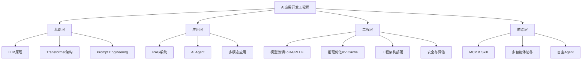

<div align="center">

# 🚀 AI 应用开发工程师面试宝典

**🎯 320+ 道高频面试题 | 24 个核心模块 | 从基础到进阶系统化学习**

[](https://opensource.org/licenses/MIT)
[](https://github.com/guocong-bincai/ai-interview-guide)
[](https://github.com/guocong-bincai/ai-interview-guide)
[](https://github.com/guocong-bincai/ai-interview-guide)
[](https://github.com/guocong-bincai/ai-interview-guide/pulls)

**适用岗位:** AI应用工程师 · LLM工程师 · AI Agent开发 · RAG系统开发
**版本:** v3.23 | **最后更新:** 2026-04-09

[📖 开始学习](#-学习路线) · [🔥 高频题库](#-核心面试题按难度分级) · [💡 实战案例](#-实战案例) · [🤝 贡献指南](#-贡献指南)

</div>

---

## 📖 项目简介

> 一个**系统化、实战化、面试友好**的 AI 应用开发工程师学习资源，涵盖从 LLM 基础到生产部署的完整技术栈。

### 🌟 核心特色

- **📚 系统化学习路径** - 18个模块从易到难，230+道题覆盖完整知识体系
- **🎯 高频题优先** - 基于真实面试数据，按出现频率排序
- **💡 实战导向** - 每道题配有生产级代码示例和性能优化方案
- **🔥 紧跟前沿** - Transformer架构、多模态、推理优化等2026热点技术
- **✅ 面试友好** - 包含"面试话术"模板和速记卡片，可直接背诵

### 📊 内容概览

| 维度 | 数据 |
|------|------|
| 📝 **总题数** | 320+ 道 |
| 📂 **核心模块** | 19 个 |
| 💻 **代码示例** | 90+ 个 |
| 📈 **难度分布** | ⭐⭐ ~ ⭐⭐⭐⭐⭐ |
| 🎓 **适用人群** | 初级 ~ 高级工程师 |

---

## 📚 目录

## 🔥 核心面试题（按难度分级）

### 🟢 Level 1: 基础必备（适合 0-1 年经验）

> 掌握这些是进入 AI 应用开发领域的门槛

| 序号 | 模块 | 核心内容 | 高频度 | 题数 |
|------|------|----------|--------|------|
| 01 | [📌 LLM 基础概念](docs/01-basic-concepts/) | Token、Temperature、Context Window、长文本处理 | 🔥🔥🔥🔥🔥 | 15 |
| 02 | [✍️ Prompt Engineering](docs/02-prompt-engineering/) | CoT、Self-Consistency、ToT、结构化输出、Temperature调参实战 | 🔥🔥🔥🔥🔥 | 13 |

**学习重点:** LLM工作原理、基本调参、提示词工程
**预计时间:** 1-2周

---

### 🟡 Level 2: 应用开发（适合 1-2 年经验）

> 能够独立开发 RAG 系统和简单 Agent

| 序号 | 模块 | 核心内容 | 高频度 | 题数 |
|------|------|----------|--------|------|
| 03 | [📚 RAG 系统](docs/03-rag-system/) | RAG流程、GraphRAG知识图谱、Agentic RAG多跳推理、幻觉解决 | 🔥🔥🔥🔥🔥 | 17 |
| 04 | [💼 项目实战经验](docs/04-project-experience/) | **RAG/Agent项目、成本优化、冷启动、STAR法则** | 🔥🔥🔥🔥🔥 | 5 |
| 05 | [🏗️ Transformer架构](docs/05-transformer-architecture/) | Self-Attention、Multi-Head、BERT vs GPT、Q K V计算 | 🔥🔥🔥🔥 | 9 |
| 06 | [🤖 AI Agent基础](docs/06-ai-agent-basics/) | ReAct、记忆/规划、Human-in-the-Loop、Token优化、上下文重写 | 🔥🔥🔥🔥🔥 | 19 |

**学习重点:** RAG完整流程、项目经验总结、向量检索、Agent基本模式
**预计时间:** 2-3周

---

### 🟠 Level 3: 工程优化（适合 2-3 年经验）

> 能够优化系统性能、降低成本、保证质量

| 序号 | 模块 | 核心内容 | 高频度 | 题数 |
|------|------|----------|--------|------|
| 07 | [⚙️ 向量索引优化](docs/07-vector-index-optimization/) | HNSW、IVF、混合检索、RRF融合 | 🔥🔥🔥🔥 | 9 |
| 08 | [🎓 模型微调与训练](docs/08-model-training/) | LoRA、RLHF、DPO、数据准备、标注策略 | 🔥🔥🔥🔥 | 13 |
| 09 | [⚡ 推理优化](docs/09-inference-optimization/) | KV Cache、量化、投机采样、Continuous Batching、vLLM | 🔥🔥🔥🔥🔥 | 13 |
| 10 | [🛡️ AI 安全与评估](docs/10-ai-safety-evaluation/) | 幻觉缓解、Prompt注入防御、评估指标、RAGAS | 🔥🔥🔥🔥🔥 | 14 |

**学习重点:** 性能优化、成本控制、质量保障、安全防护
**预计时间:** 3-4周

---

### 🔴 Level 4: 架构设计（适合 3+ 年经验）

> 能够设计复杂系统、处理生产问题

| 序号 | 模块 | 核心内容 | 高频度 | 题数 |
|------|------|----------|--------|------|
| 11 | [🏛️ 工程架构与部署](docs/11-production-deployment/) | 流式输出、缓存、监控、MLOps、CI/CD | 🔥🔥🔥🔥🔥 | 14 |
| 12 | [🎨 多模态应用](docs/12-multimodal-ai/) | CLIP、BLIP、LLaVA、图文检索、生图Agent、评估方案 | 🔥🔥🔥 | 13 |
| 13 | [🔧 框架与工具](docs/13-frameworks-tools/) | LangChain、LlamaIndex、AutoGPT | 🔥🔥🔥🔥 | 8 |
| 10 | [🏛️ 工程架构与部署](docs/10-production-deployment/) | 流式输出、缓存、监控、高并发 | 🔥🔥🔥🔥🔥 | 12 |
| 11 | [🎨 多模态应用](docs/11-multimodal-ai/) | CLIP、BLIP、图文检索、多模态RAG | 🔥🔥🔥 | 8 |
| 12 | [🔧 框架与工具](docs/12-frameworks-tools/) | LangChain、Coze、Dify、Function Calling、Streaming | 🔥🔥🔥🔥🔥 | 12 |

**学习重点:** 系统架构、生产部署、多模态集成
**预计时间:** 4-5周

---

### 🟣 Level 5: 前沿技术（适合资深工程师）

> 掌握最新技术、引领团队创新

| 序号 | 模块 | 核心内容 | 高频度 | 题数 |
|------|------|----------|--------|------|
| 14 | [🎯 多智能体协作](docs/14-multi-agent-systems/) | AutoGen、CrewAI、Agent通信、任务编排 | 🔥🔥🔥🔥 | 10 |
| 15 | [🔌 MCP & Skill系统](docs/15-mcp-skill-systems/) | MCP协议、Skill设计、OpenClaw框架、沙箱技术 | 🔥🔥🔥 | 13 |
| 16 | [🚀 前沿技术与趋势](docs/16-advanced-topics/) | 自主Agent、产品思维、调试优化 | 🔥🔥🔥 | 10 |
| 17 | [🔥 AI 编程工具与 Coding Agent](docs/17-ai-coding-tools/) | AI 编程工具对比、自主 Coding Agent、CWM、SWE-bench、FIM | 🔥🔥🔥 | 10 |

**学习重点:** 前沿技术、系统创新、团队领导
**预计时间:** 持续学习

---

### 📄 附录与特色模块

| 序号 | 模块 | 内容 | 高频度 | 题数 |
|------|------|------|--------|------|
| 18 | [📝 简历与面试技巧](docs/18-resume-interview-tips/) | 简历模板、面试技巧、常见问题 | 🔥🔥🔥 | - |
| 19 | [🏢 国内大厂真题集](docs/19-big-tech-interview-questions/) | **字节/阿里/美团/百度真实面经** | 🔥🔥🔥🔥🔥 | 10+ |

**高频度说明:**
🔥🔥🔥🔥🔥 = 90%+ 面试会问
🔥🔥🔥🔥 = 70%+ 面试会问
🔥🔥🔥 = 50%+ 面试会问

---

## 📖 学习路线

### 🎯 按岗位分类

<details>
<summary><b>🔹 RAG 系统工程师</b>（点击展开）</summary>

**必学路径:**
```
01.LLM基础 → 03.RAG系统 → 06.向量索引优化 → 09.AI安全与评估
```

**推荐路径:**
```
+ 02.Prompt Engineering
+ 08.推理优化
+ 10.工程架构与部署
```

**学习时间:** 6-8周
**核心技能:** 向量检索、Embedding、混合检索、Rerank

</details>

<details>
<summary><b>🔹 AI Agent 工程师</b>（点击展开）</summary>

**必学路径:**
```
01.LLM基础 → 02.Prompt → 05.AI Agent → 13.多智能体协作
```

**推荐路径:**
```
+ 03.RAG系统（知识库集成）
+ 14.MCP & Skill系统
+ 15.前沿技术与趋势
```

**学习时间:** 6-8周
**核心技能:** ReAct、Function Calling、多Agent协作、规划推理

</details>

<details>
<summary><b>🔹 LLM 应用工程师</b>（点击展开）</summary>

**必学路径:**
```
01.LLM基础 → 04.Transformer → 07.模型微调 → 08.推理优化
```

**推荐路径:**
```
+ 03.RAG系统
+ 10.工程架构与部署
+ 11.多模态应用
```

**学习时间:** 8-10周
**核心技能:** LoRA微调、RLHF对齐、推理优化、模型部署

</details>

### ⏱️ 按时间分类

<details>
<summary><b>📅 1周冲刺</b>（核心20题）</summary>

**Day 1-2:** LLM基础 (5题) + Prompt (3题)
**Day 3-4:** RAG系统 (5题) + Agent (3题)
**Day 5-6:** 高频题复习 + 速记卡片
**Day 7:** 模拟面试练习

</details>

<details>
<summary><b>📅 2周充分准备</b>（核心50题）</summary>

**Week 1:**
- LLM基础 + Prompt + RAG (25题)
- 每天4-5题，理解+记忆

**Week 2:**
- Agent + 微调 + 推理 (25题)
- 模拟面试 + 实战演练

</details>

<details>
<summary><b>📅 1月系统学习</b>（全部137+题）</summary>

**Week 1:** Level 1 基础必备 (22题)
**Week 2:** Level 2 应用开发 (25题)
**Week 3:** Level 3 工程优化 (39题)
**Week 4:** Level 4-5 架构设计 + 前沿技术 (51题)
**每周末:** 复习 + 刷题 + 模拟面试

</details>

---

## 💡 实战案例

> 真实项目经验，从问题到解决方案的完整复盘

### 🏆 高分案例

| 案例 | 挑战 | 解决方案 | 效果 |
|------|------|----------|------|
| [📄 复杂PDF解析](cases/pdf-parsing.md) | 跨页表格、OCR噪声 | Layout-Parser + GPT-4V | 准确率 65% → 94% |
| [💰 成本优化](cases/cost-optimization.md) | Token消耗过高 | 语义缓存 + 模型路由 | 成本降低 60% |
| [🚀 生产部署](cases/production-deployment.md) | 并发卡顿、流式中断 | Continuous Batching + 连接池 | 200 QPS 稳定 |
| [🔍 检索优化](cases/retrieval-optimization.md) | 召回率低 | 混合检索 + Rerank | Recall@5: 65% → 85% |

### 📊 技术栈对比

| 技术选型 | 适用场景 | 优势 | 劣势 |
|----------|----------|------|------|
| **RAG vs 微调** | 知识库问答 vs 风格定制 | RAG可更新、有溯源 | 微调效果更好 |
| **Milvus vs Pinecone** | 自部署 vs 云服务 | Milvus开源免费 | Pinecone易用 |
| **GPT-4 vs Claude** | 复杂推理 vs 长文本 | GPT-4能力强 | Claude上下文大 |

---

## 📊 技术栈全景图



---

## 🚀 快速开始

### 1️⃣ 选择学习路径

```bash
# 克隆仓库
git clone https://github.com/guocong-bincai/ai-interview-guide.git
cd ai-interview-guide

# 根据岗位选择模块
# RAG工程师: 01 → 03 → 06 → 09
# Agent工程师: 01 → 02 → 05 → 13
# LLM工程师: 01 → 04 → 07 → 08
```

### 2️⃣ 每日学习计划

- **周一至周五:** 每天2-3道题，深度理解原理
- **周末:** 复习速记卡片，模拟面试练习
- **每周总结:** 整理笔记，建立知识网络

### 3️⃣ 学习技巧

- ✅ 先看问题，自己思考3分钟
- ✅ 对比答案，理解核心概念
- ✅ 背诵"面试话术"和速记卡片
- ✅ 运行代码示例，加深理解
- ✅ 结合项目，实战应用

---

## 📦 仓库结构

```
ai-interview-guide/
├── 📂 docs/                    # 16个核心模块（按难度排序）
│   ├── 01-basic-concepts/           # ⭐⭐ LLM基础
│   ├── 02-prompt-engineering/       # ⭐⭐ Prompt工程
│   ├── 03-rag-system/               # ⭐⭐⭐ RAG系统
│   ├── 04-transformer-architecture/ # ⭐⭐⭐⭐ Transformer
│   ├── 05-ai-agent-basics/          # ⭐⭐⭐⭐ Agent基础
│   ├── 06-vector-index-optimization/# ⭐⭐⭐⭐ 向量索引
│   ├── 07-model-training/           # ⭐⭐⭐⭐ 模型微调
│   ├── 08-inference-optimization/   # ⭐⭐⭐⭐⭐ 推理优化
│   ├── 09-ai-safety-evaluation/     # ⭐⭐⭐⭐ 安全评估
│   ├── 10-production-deployment/    # ⭐⭐⭐⭐⭐ 生产部署
│   ├── 11-multimodal-ai/            # ⭐⭐⭐⭐ 多模态
│   ├── 12-frameworks-tools/         # ⭐⭐⭐ 框架工具
│   ├── 13-multi-agent-systems/      # ⭐⭐⭐⭐ 多智能体
│   ├── 14-mcp-skill-systems/        # ⭐⭐⭐ MCP协议
│   ├── 15-advanced-topics/          # ⭐⭐⭐⭐⭐ 前沿技术
│   └── 16-resume-interview-tips/    # 简历面试
├── 📂 cases/                   # 实战案例
│   ├── pdf-parsing.md              # PDF解析案例
│   ├── cost-optimization.md        # 成本优化案例
│   ├── retrieval-optimization.md   # 检索优化案例
│   └── production-deployment.md    # 生产部署案例
└── 📂 assets/                  # 资源文件
    ├── images/                     # 架构图、流程图
    └── code/                       # 完整代码示例
```

---

## 🤝 贡献指南

我们欢迎所有形式的贡献！

### 🌟 如何贡献

1. **报告问题** - [提交 Issue](https://github.com/guocong-bincai/ai-interview-guide/issues)
2. **补充内容** - [提交 PR](https://github.com/guocong-bincai/ai-interview-guide/pulls)
3. **分享经验** - 评论区分享面试经历
4. **Star 支持** - 帮助更多人看到这个项目

### 📝 贡献规范

- 遵循现有的 Markdown 格式
- 包含详细解释和代码示例
- 提供"面试话术"模板
- 标注难度和高频度

### 🏆 贡献者

感谢所有贡献者的付出！

<a href="https://github.com/guocong-bincai/ai-interview-guide/graphs/contributors">
  
</a>

---

## 📜 开源协议

本项目采用 [MIT License](LICENSE) 开源协议

---

## 🔗 相关资源

### 📚 推荐学习资源

- **官方文档**
  - [OpenAI API](https://platform.openai.com/docs)
  - [LangChain](https://python.langchain.com/)
  - [LlamaIndex](https://docs.llamaindex.ai/)

- **优质教程**
  - [DeepLearning.AI 短课程](https://www.deeplearning.ai/short-courses/)
  - [Hugging Face Course](https://huggingface.co/learn)

- **技术博客**
  - [OpenAI Blog](https://openai.com/blog)
  - [Anthropic Research](https://www.anthropic.com/research)

### 🛠️ 推荐工具

| 工具 | 用途 | 链接 |
|------|------|------|
| **ChatGPT** | AI对话助手 | [chat.openai.com](https://chat.openai.com) |
| **Claude** | AI助手（长文本） | [claude.ai](https://claude.ai) |
| **Cursor** | AI编程工具 | [cursor.sh](https://cursor.sh) |
| **Perplexity** | AI搜索引擎 | [perplexity.ai](https://perplexity.ai) |

---

## 📞 联系方式

- **GitHub**: [@guocong-bincai](https://github.com/guocong-bincai)
- **Email**: guocong.bincai@example.com
- **Issues**: [提问/建议](https://github.com/guocong-bincai/ai-interview-guide/issues)

---

## 📈 项目统计


---

<div align="center">

### 🌟 如果这个项目对你有帮助，请点个 Star！

**让更多人受益于系统化的 AI 学习资源**

[](https://github.com/guocong-bincai/ai-interview-guide)
[](https://github.com/guocong-bincai/ai-interview-guide/fork)
[](https://github.com/guocong-bincai/ai-interview-guide)

---

**📅 最后更新:** 2026-04-09 | **📝 版本:** v3.23 | **👨‍💻 维护者:** 二狗子 🐕

Made with ❤️ for the AI Community

</div>

---

## 📚 新增模块（v3.0）

| 序号 | 模块 | 内容 | 高频度 | 题数 |
|------|------|------|--------|------|
| 🚀 | [🔥 大模型推理框架（vLLM / SGLang / TensorRT-LLM）](docs/19-inference-frameworks/) | PagedAttention、RadixAttention、Continuous Batching、量化优化、选型对比 | 🔥🔥🔥🔥🔥 | 15 |
| 🆕 | [🔥 多模态Agent（Vision-Language Agent）](docs/21-multimodal-agents/) | GPT-4V、Gemini、LLaVA、视觉Agent、Document AI、Video Agent、企业级多模态架构 | 🔥🔥🔥🔥 | 18 |
| 🆕 | [🤖 AI Agent基础（新增Q18）](docs/05-ai-agent-basics/) | 2026 Agent岗位分化、算法向vs工程向、GAIA/WebArena评估、国产框架选型 | 🔥🔥🔥🔥 | +1 |

*版本: v3.21 | 更新: 2026-04-04 | by 二狗子 🐕*

---

## 📚 新增模块（v3.0 - 第二批）

| 序号 | 模块 | 内容 | 高频度 | 题数 |
|------|------|------|--------|------|
| 🚀 | [🔥 RAG 高级优化（GraphRAG / HyDE / Semantic Chunking）](docs/20-rag-advanced-optimization/) | RAG-Fusion、HyDE、GraphRAG、Semantic Chunking、Context Cliff、Rerank、LLMLingua、RAGAS评估 | 🔥🔥🔥🔥 | 11 |

*版本: v3.21 | 更新: 2026-04-04 | by 二狗子 🐕*

---

## 📚 新增模块（v3.11 - 2026-04-06 更新）

| 序号 | 模块 | 新增内容 | 高频度 | 题数 |
|------|------|----------|--------|------|
| 🆕 | [🔌 MCP协议（新增Q13-Q14）](docs/14-mcp-skill-systems/) | MCP Apps交互式UI能力、MCP捐赠Linux Foundation意义、A2A协议对比、企业级MCP架构 | 🔥🔥🔥🔥 | +2 |
| 🆕 | [🔥 AI编程工具（新增Q8-Q9）](docs/17-ai-coding-tools/) | Windsurf/Trae/通义灵码/CoPaw横评、Cursor Rules企业级配置、AI工具组合使用策略 | 🔥🔥🔥🔥 | +2 |
| 🆕 | [🛡️ AI安全与评估（新增Q7-Q8）](docs/09-ai-safety-evaluation/) | RAGAS vs TruLens vs DeepEval vs UpTrain深度对比、RAG评估Pipeline与迭代优化实战 | 🔥🔥🔥🔥🔥 | +2 |

*版本: v3.11 | 更新: 2026-04-06 | by 二狗子 🐕*

---

## 📚 新增模块（v3.12 - 2026-04-06 更新）

| 序号 | 模块 | 新增内容 | 高频度 | 题数 |
|------|------|----------|--------|------|
| 🆕 | [🤖 多Agent系统（新增Q12-Q13）](docs/13-multi-agent-systems/) | 企业级AI四层黄金架构(RAG→Agents→MCP→A2A)、A2A协议核心架构(Agent Card/Registry/Gateway)、任务委托与发现流程 | 🔥🔥🔥🔥🔥 | +2 |
| 🆕 | [🚀 AI应用高级专题（新增Q8）](docs/15-advanced-topics/) | 企业级AI四层黄金架构详解、RAG→Agents→MCP→A2A协同关系、落地路径与避坑指南 | 🔥🔥🔥🔥 | +1 |
| 🆕 | [🔥 AI编程工具（更新Q10）](docs/17-ai-coding-tools/) | 2026年3月SWE-bench最新基准(Claude Code 80.8%)、工具选型决策树、组合使用方案 | 🔥🔥🔥🔥 | +1 |

*版本: v3.12 | 更新: 2026-04-06 | by 二狗子 🐕*

---

## 📚 新增模块（v3.13 - 2026-04-06 更新）

| 序号 | 模块 | 新增内容 | 高频度 | 题数 |
|------|------|----------|--------|------|
| 🆕 | [🔥 AI编程工具（新增Q11，更新Q3）](docs/17-ai-coding-tools/) | Claude Code 2026最新功能(Multi-Agent/Scheduled Tasks/Auto Mode/Voice/Hooks/Skills)、三大工具设计哲学对比表(11维度)、Power Stack组合策略 | 🔥🔥🔥🔥🔥 | +2 |
| 🆕 | [🔌 MCP协议（新增Q15）](docs/14-mcp-skill-systems/) | Google Antigravity与MCP Store、MCP在Cursor/Claude Code/Antigravity中的配置对比、Rube MCP上下文优化 | 🔥🔥🔥 | +1 |

*版本: v3.13 | 更新: 2026-04-06 | by 二狗子 🐕*

---

## 📚 新增模块（v3.14 - 2026-04-06 更新）

| 序号 | 模块 | 新增内容 | 高频度 | 题数 |
|------|------|----------|--------|------|
| 🆕 | [🤖 多Agent系统（新增Q13）](docs/13-multi-agent-systems/) | Agent成熟度L1-L5分级框架(L1被动执行→L5团队协调者)、Gartner预测2028年70%应用达L5、Coze/Dify/n8n横评、LangChain vs LlamaIndex定位 | 🔥🔥🔥🔥 | +1 |
| 🆕 | [🔌 MCP协议（新增Q16）](docs/14-mcp-skill-systems/) | AI协议三件套(MCP+A2A+AG-UI)、AG-UI标准事件类型(HTTP/SSE)、三件套协同工作流、AG-UI vs 传统REST | 🔥🔥🔥🔥 | +1 |
| 🆕 | [🔥 AI编程工具（新增Q12）](docs/17-ai-coding-tools/) | Claude Code vs Cursor实测基准(5.5倍Token差距、30%返工率、12%速度差)、上下文窗口实际对比(200K vs 70-120K)、复杂度阈值选型 | 🔥🔥🔥🔥 | +1 |

*版本: v3.14 | 更新: 2026-04-06 | by 二狗子 🐕*

---

## 📚 新增模块（v3.15 - 2026-04-06 更新）

| 序号 | 模块 | 新增内容 | 高频度 | 题数 |
|------|------|----------|--------|------|
| 🆕 | [📈 RAG高级优化（新增Q11+Q12）](docs/20-rag-advanced-optimization/) | Chunk冲突检测与解决(时间优先/权威优先/投票/仲裁四策略)、企业知识库权限隔离四层模型(Query过滤/Chunk标签/生成脱敏/审计日志)、"工资泄露"经典案例 | 🔥🔥🔥🔥 | +2 |

*版本: v3.15 | 更新: 2026-04-06 | by 二狗子 🐕*

---

## 📚 新增模块（v3.21 - 2026-04-07 更新）

| 序号 | 模块 | 新增内容 | 高频度 | 题数 |
|------|------|----------|--------|------|
| 🆕 | [🔌 MCP协议（新增Q20）](docs/14-mcp-skill-systems/) | Streamable HTTP(无状态+K8s水平扩缩)、OAuth 2.1+PKCE+Resource Indicators企业安全标准、HITL/Elicitation原语(高风险操作人类审批)、无状态化K8s部署 | 🔥🔥🔥 | +1 |
| 🆕 | [🔌 MCP协议（新增Q19）](docs/14-mcp-skill-systems/) | 企业级MCP分布式部署(负载均衡+动态节点感知)、JWT鉴权完整实现、Session/多租户隔离设计、Nacos+Spring AI Alibaba MCP Gateway | 🔥🔥🔥 | +1 |
| 🆕 | [🔌 MCP协议（新增Q18）](docs/14-mcp-skill-systems/) | Stdio vs SSE传输层5维度深度对比、MCP协议生命周期管理(Initialize/Ping/Shutdown完整状态机)、Sampling原语(Server反向请求Client生成)、去中心化AI计算原理 | 🔥🔥🔥 | +1 |
| 🆕 | [🔥 AI编程工具（新增Q21）](docs/17-ai-coding-tools/) | SWE-bench Multimodal(视觉+代码联合理解)、Terminal-Bench(DevOps能力评测)、2026年3月最新数据(GPT-5.3-Codex 77.3%)、SWE-Rebench"假通过"问题解决 | 🔥🔥🔥 | +1 |

*版本: v3.21 | 更新: 2026-04-07 | by 二狗子 🐕*

---

## 📚 新增模块（v3.16 - 2026-04-06 更新）

| 序号 | 模块 | 新增内容 | 高频度 | 题数 |
|------|------|----------|--------|------|
| 🆕 | [🔌 MCP协议（新增Q17）](docs/14-mcp-skill-systems/) | A2A完整8状态任务机(input-required/人机协作关键)、MCP Tasks原语 vs 工具调用对比、2024-2026演进时间线(A2A v0.3→v1.0/MCP Tasks/MCP Apps)、完整Agent Card JSON结构 | 🔥🔥🔥🔥 | +1 |

*版本: v3.16 | 更新: 2026-04-06 | by 二狗子 🐕*

---

## 📚 新增模块（v3.21 - 2026-04-07 第二批）

| 序号 | 模块 | 新增内容 | 高频度 | 题数 |
|------|------|----------|--------|------|
| 🆕 | [🧠 Agent规划与反思深度（ReAct优化/Reflexion/LATS）](docs/22-agent-planning-reflection/) | ReAct三大缺陷(上下文漂移/高延迟/规划执行耦合)、Plan-and-Solve vs REWOO vs ReAct对比、Generator-Evaluator反思架构、Reflexion跨任务记忆机制、LATS树搜索与Reflexion区别、动态重规划触发条件、生产级五大工程挑战 | 🔥🔥🔥🔥🔥 | 10 |

*版本: v3.21 | 更新: 2026-04-07 | by 二狗子 🐕*

---

## 📚 新增模块（v3.22 - 2026-04-08 更新）

| 序号 | 模块 | 新增内容 | 高频度 | 题数 |
|------|------|----------|--------|------|
| 🆕 | [🔥 大模型推理框架（新增Q18-Q19）](docs/19-inference-frameworks/) | vLLM 0.5 PagedAttention动态调整/FP8 KV Cache量化/MoE增强、TGI 2.0万亿参数/gRPC流式优化/AWQ量化40%提升、TensorRT-LLM 1.8全链路编译/FlashAttention 3.0/7620 tok/s吞吐量、DeepSpeed-MII 0.9自动优化/零代码部署 | 🔥🔥🔥🔥🔥 | +2 |
| 🆕 | [🔥 大模型推理框架（新增Q19）](docs/19-inference-frameworks/) | 2026年H100统一基准测试(vLLM 0.5 95.3%显存利用率/TensorRT-LLM 1.8 7620 tok/s并发128)、四大框架选型决策树(极致性能→TRT-LLM/高并发稳定→vLLM/快速部署→DeepSpeed-MII/多轮对话→SGLang) | 🔥🔥🔥🔥🔥 | +1 |
| 🆕 | [🔥 多模态Agent（新增Q22）](docs/21-multimodal-agents/) | Qwen3-VL核心突破(256K交错上下文/MoE架构235B-A22B/DeepStack推理/MMMU超Gemini 2.5 Pro)、全系列对比(2B/4B/8B/32B/30B-A3B/235B-A22B)、企业应用场景(发票识别/GUI Agent) | 🔥🔥🔥🔥 | +1 |

*版本: v3.22 | 更新: 2026-04-08 | by 二狗子 🐕*

---

## 📚 新增模块（v3.23 - 2026-04-09 更新）

| 序号 | 模块 | 新增内容 | 高频度 | 题数 |
|------|------|----------|--------|------|
| 🆕 | [🔥 Agent 可观测性与生产监控（新增专题）](docs/23-agent-observability/) | LangSmith/Arize Phoenix/OpenTelemetry/Prometheus 可观测性架构、Agent 异常检测(循环/幻觉/上下文膨胀)、Token 成本监控与优化策略、SLA 设计/告警规则/A/B 测试实战 | 🔥🔥🔥🔥 | 7 |
| 🆕 | [🔧 框架与工具（新增Q11）](docs/12-frameworks-tools/) | Dify/Coze/n8n/OpenClaw 四大平台2026年深度对比(11维度)、选型决策树、OpenClaw个人助理 vs Dify企业级 vs Coze零代码 vs n8n自动化 | 🔥🔥🔥 | +1 |

*版本: v3.23 | 更新: 2026-04-09 | by 二狗子 🐕*
