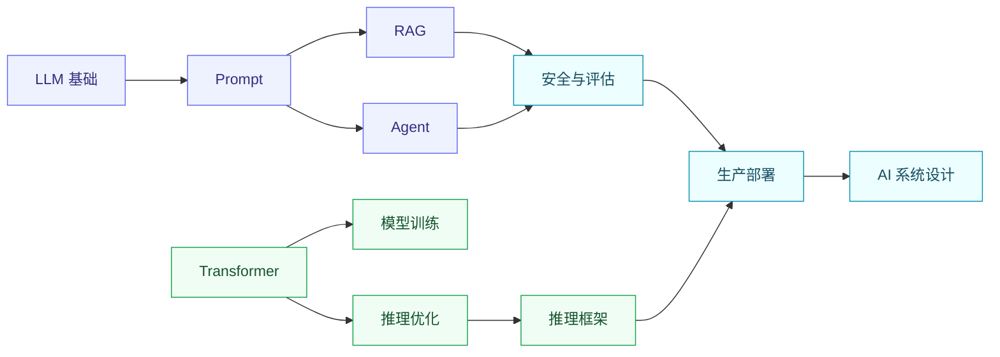

<p align="center">
  
</p>

<p align="center">
  <a href="#quick-start"><b>快速开始</b></a> ·
  <a href="#roadmap"><b>学习路线</b></a> ·
  <a href="#catalog"><b>题库导航</b></a> ·
  <a href="CONTENT_QUALITY.md"><b>质量规范</b></a>
</p>

<p align="center">
  <a href="https://github.com/guocong-bincai/ai-interview-guide/stargazers"></a>
  <a href="https://github.com/guocong-bincai/ai-interview-guide/network/members"></a>
  <a href="https://github.com/guocong-bincai/ai-interview-guide/commits/main"></a>
  <a href="LICENSE"></a>
</p>

> [!TIP]
> **第一次来？** 如果时间有限，从 [LLM 基础](docs/01-basic-concepts/) → [RAG 系统](docs/03-rag-system/) → [Agent 基础](docs/05-ai-agent-basics/) → [AI 系统设计](docs/25-system-design-ai/) 开始。不要逐字背答案，先练习说清结论、原理和工程取舍。

## ✨ 这份指南有什么不同

<table>
  <tr>
    <td width="33%" valign="top">
      <h3>🎯 面向真实岗位</h3>
      <p>覆盖 AI 应用、LLM、RAG、Agent、模型训练与推理岗位，不做脱离场景的概念堆砌。</p>
    </td>
    <td width="33%" valign="top">
      <h3>⚖️ 强调工程取舍</h3>
      <p>回答不止“是什么”，还要解释质量、延迟、成本、安全、复杂度和替代方案。</p>
    </td>
    <td width="33%" valign="top">
      <h3>🧪 可以持续校验</h3>
      <p>538 道题按 26 个专题组织，并用自动审计检查链接、重复题和缺少条件的数据。</p>
    </td>
  </tr>
</table>

<a id="quick-start" name="quick-start"></a>

## 🚀 快速开始

根据你的目标选择入口：

- **第一次系统学习**：先看下方岗位路线，按顺序完成核心专题。
- **面试前快速查漏**：直接进入 [面试题来源整理](docs/18-big-tech-interview-questions/)，再回到薄弱专题。
- **准备项目深挖**：重点练习 [项目经验](docs/04-project-experience/) 与 [AI 系统设计](docs/25-system-design-ai/)。
- **参与内容维护**：阅读 [内容质量规范](CONTENT_QUALITY.md)，运行 `python3 scripts/content_audit.py`。

每道题建议练成三个回答版本：

1. **30 秒版**：先给结论和核心判断；
2. **3 分钟版**：补充原理、方案比较与工程取舍；
3. **追问版**：说明如何验证、失败如何处理、为什么不用另一种方案。

<a id="roadmap" name="roadmap"></a>

## 🗺️ 岗位学习路线


```mermaid
flowchart LR
    A["LLM 基础"] --> B["Prompt"]
    B --> C["RAG"]
    B --> D["Agent"]
    C --> E["安全与评估"]
    D --> E
    E --> F["生产部署"]
    F --> G["AI 系统设计"]

    H["Transformer"] --> I["模型训练"]
    H --> J["推理优化"]
    J --> K["推理框架"]
    K --> F

    classDef core fill:#eef2ff,stroke:#6366f1,color:#312e81;
    classDef engineering fill:#ecfeff,stroke:#0891b2,color:#164e63;
    classDef model fill:#f0fdf4,stroke:#16a34a,color:#14532d;
    class A,B,C,D core;
    class E,F,G engineering;
    class H,I,J,K model;
```

<details>
<summary><b>AI 应用开发工程师</b> · 从模型能力走到可上线的业务系统</summary>
<br>

[LLM 基础](docs/01-basic-concepts/) → [Prompt Engineering](docs/02-prompt-engineering/) → [RAG 系统](docs/03-rag-system/) → [Agent 基础](docs/05-ai-agent-basics/) → [生产部署](docs/10-production-deployment/) → [AI 系统设计](docs/25-system-design-ai/)

</details>

<details>
<summary><b>RAG 工程师</b> · 从召回链路走到评测与生产治理</summary>
<br>

[LLM 基础](docs/01-basic-concepts/) → [RAG 系统](docs/03-rag-system/) → [向量索引优化](docs/06-vector-index-optimization/) → [RAG 高级优化](docs/20-rag-advanced-optimization/) → [安全与评估](docs/09-ai-safety-evaluation/) → [Agent 可观测性](docs/23-agent-observability/)

</details>

<details>
<summary><b>Agent 工程师</b> · 从工具调用走到规划、协作与治理</summary>
<br>

[Prompt Engineering](docs/02-prompt-engineering/) → [Agent 基础](docs/05-ai-agent-basics/) → [规划与反思](docs/22-agent-planning-reflection/) → [多 Agent 系统](docs/13-multi-agent-systems/) → [MCP 与 Skills](docs/14-mcp-skill-systems/) → [Agent 可观测性](docs/23-agent-observability/)

</details>

<details>
<summary><b>模型训练与推理工程师</b> · 从架构原理走到吞吐与部署</summary>
<br>

[Transformer 架构](docs/04-transformer-architecture/) → [模型训练](docs/07-model-training/) → [推理优化](docs/08-inference-optimization/) → [推理框架](docs/19-inference-frameworks/) → [生产部署](docs/10-production-deployment/)

</details>

<a id="catalog" name="catalog"></a>

## 📚 题库导航

共 **26 个专题、538 道题**。点击分类展开完整目录。

<details open>
<summary><b>🧠 基础与模型</b> · 6 个专题 / 136 道题</summary>
<br>

- [01 · LLM 基础](docs/01-basic-concepts/) — Token、解码、Embedding、训练阶段、模型结构基础
- [02 · Prompt Engineering](docs/02-prompt-engineering/) — Prompt、上下文设计、结构化输出与评测
- [Transformer 架构](docs/04-transformer-architecture/) — Attention、位置编码、归一化与架构演进
- [07 · 模型训练](docs/07-model-training/) — LoRA、数据、训练、对齐与评估
- [08 · 推理优化](docs/08-inference-optimization/) — KV Cache、量化、批处理与推测解码
- [19 · 推理框架](docs/19-inference-frameworks/) — vLLM、SGLang、TensorRT-LLM 与基准方法

</details>

<details>
<summary><b>🔎 RAG 与检索</b> · 3 个专题 / 62 道题</summary>
<br>

- [03 · RAG 系统](docs/03-rag-system/) — 文档处理、检索、生成与常见问题
- [06 · 向量索引优化](docs/06-vector-index-optimization/) — ANN 索引、混合检索、Rerank 与调参
- [20 · RAG 高级优化](docs/20-rag-advanced-optimization/) — 自适应检索、评估、权限和生产治理

</details>

<details>
<summary><b>🤖 Agent 与协议</b> · 5 个专题 / 125 道题</summary>
<br>

- [05 · Agent 基础](docs/05-ai-agent-basics/) — 工具调用、状态、记忆、循环与人工确认
- [13 · 多 Agent 系统](docs/13-multi-agent-systems/) — 协作模式、任务分配、通信与故障处理
- [14 · MCP 与 Skills](docs/14-mcp-skill-systems/) — MCP 原语、能力发现、授权与协议安全
- [22 · Agent 规划与反思](docs/22-agent-planning-reflection/) — 规划、重规划、验证、反思和终止
- [23 · Agent 可观测性](docs/23-agent-observability/) — Trace、指标、评估、告警与成本归因

</details>

<details>
<summary><b>🏗️ 工程与系统设计</b> · 6 个专题 / 102 道题</summary>
<br>

- [04 · 项目经验](docs/04-project-experience/) — 项目说明、指标、取舍和事故复盘
- [09 · 安全与评估](docs/09-ai-safety-evaluation/) — 内容安全、Prompt 注入、隐私、红队和评测
- [10 · 生产部署](docs/10-production-deployment/) — 网关、限流、流式输出、可靠性与发布
- [12 · 框架与工具](docs/12-frameworks-tools/) — 框架抽象、选型、测试和迁移
- [24 · Python 工程](docs/24-python-engineering/) — 异步、类型、测试、重试和性能排查
- [25 · AI 系统设计](docs/25-system-design-ai/) — 客服、知识库、网关、任务系统和审核系统

</details>

<details>
<summary><b>🔭 多模态与前沿方向</b> · 4 个专题 / 99 道题</summary>
<br>

- [11 · 多模态 AI](docs/11-multimodal-ai/) — 图像、音频、视频与多模态检索
- [15 · 高级专题](docs/15-advanced-topics/) — 尚未完全稳定的研究和工程方向
- [17 · AI 编程工具](docs/17-ai-coding-tools/) — Coding Agent、代码评测、上下文和团队治理
- [21 · 多模态 Agent](docs/21-multimodal-agents/) — GUI、文档、视频和视觉工具调用

</details>

<details>
<summary><b>💼 面试准备</b> · 2 个专题 / 14 道结构化训练题</summary>
<br>

- [16 · 简历与面试技巧](docs/16-resume-interview-tips/) — 简历、项目表达、行为面试与追问
- [18 · 面试题来源整理](docs/18-big-tech-interview-questions/) — 按公司整理面试考点，使用时注意来源可信度

</details>

> [!NOTE]
> `04-project-experience` 与 `04-transformer-architecture` 存在历史编号重复。为避免破坏已有外部链接，当前保留目录名，以本页显示的模块名称为准。

## 🧭 高效使用这套题库

- **先说判断，再讲知识**：面试官通常更关心你如何选择，而不是能否背出定义。
- **用真实数据替换示例**：延迟、吞吐、成本和准确率必须来自你的实验或项目记录。
- **主动补充边界条件**：说明方案何时有效、何时失效，以及如何监控和回滚。
- **检查时效性信息**：产品版本、论文数据和性能结论可能变化，优先核对官方文档与原论文。

## 🤝 内容质量与贡献

本项目坚持“**题目质量优先于数量**”。新增或修改题目前，请先阅读 [内容质量规范](CONTENT_QUALITY.md)。本仓库不接受无来源的精确效果数字、虚构的一线面试标签或第一人称项目战绩。

```bash
python3 scripts/content_audit.py
```

发现错误，欢迎提交 [Issue](https://github.com/guocong-bincai/ai-interview-guide/issues)；想补充考点或优化答案，欢迎提交 [Pull Request](https://github.com/guocong-bincai/ai-interview-guide/pulls)。

如果这个项目对你有帮助，欢迎点一个 **Star**，也欢迎把你的真实面试反馈沉淀回来，让题库持续变好。

## 📄 License

[MIT](LICENSE)
