# 🧠 Agent 规划与反思深度面试题（ReAct 优化 / Reflexion / LATS）

> **面试优先顺序（通用 AI 应用开发岗位）**：Q1、Q2、Q3、Q4、Q6、Q7、Q8、Q10、Q13、Q15。其余题目用于进阶或特定岗位拓展；实际频率会随岗位和面试轮次变化，产品版本资讯不应当作通用必考题。

> **难度：** ⭐⭐⭐⭐⭐
> **更新：** 2026-04-07
> **考点：** ReAct局限性、Plan-and-Solve、REWOO、Reflexion、LATS、自主演规划、动态重规划

## 📋 目录

1. [从 Copilot 到 Agent：范式转变](#一从-copilot-到-agent范式转变)
2. [规划模式：ReAct 局限与优化](#二规划模式react-局限与优化)
3. [反思模式：自我修正架构](#三反思模式自我修正架构)
4. [高阶架构：LATS 与 Reflexion](#四高阶架构lats-与-reflexion)
5. [工程实践与面试总结](#五工程实践与面试总结)

## 一、从 Copilot 到 Agent：范式转变

### Q1: Copilot 和 Agent 的核心区别是什么？为什么需要规划和反思？


<p align="center">
  <a href="../../assets/illustrations/22-agent-planning-reflection/q01-copilot-vs-agent.webp">
    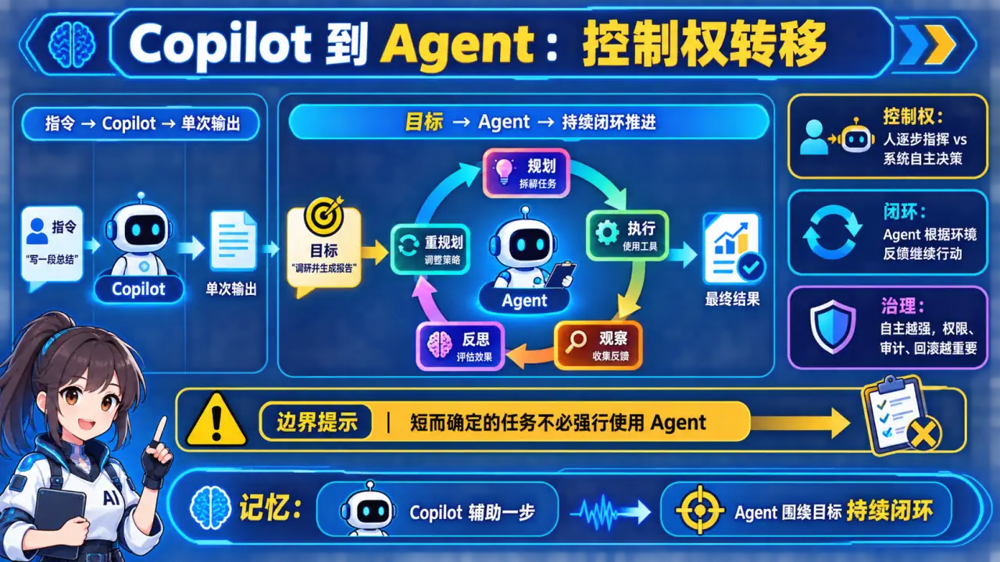
  </a>
</p>
<p align="center"><sub>🧠 图解记忆：为什么 Agent 需要规划和反思；点击图片可查看原图。</sub></p>
<details>
<summary>💡 答案要点</summary>

**核心区别：控制权归属**

| 维度 | Copilot（副驾驶） | Agent（智能体） |
|------|------------------|----------------|
| **控制权** | 人类主导，输入指令→输出结果→人类决策下一步 | AI 主导，获得目标→自主规划→执行→反思→迭代 |
| **执行模式** | 线性（Input → Output） | 循环（Goal → Plan → Act → Reflect → Re-plan） |
| **容错性** | 低（错误由人类发现） | 高（自我发现和修正） |
| **适用场景** | 翻译、摘要、简单问答 | 代码生成、复杂数据分析、自主决策 |

**为什么 Agent 需要规划和反思？**

```
LLM 本质是"下一个 Token 预测器"——概率性、无记忆、自主性弱
没有外部架构约束 = 误差累积（Error Compounding）
一步错 → 步步错

所以需要：
规划（Planning）= 解决"视野狭窄"问题，强制先建立全局观
反思（Reflection）= 解决"误差累积"问题，执行-观察-评价-修正循环
```

**面试话术：**
> "规划的价值是把目标、依赖、资源和验收条件显式化，但不是所有任务都需要 Planner。短任务可直接执行；有依赖的多步任务再生成可更新的计划；只有互不依赖的步骤才并行。反思也应有外部检查信号和停止条件，否则只是增加延迟与自我确认。"

</details>

### Q2: 什么是 Chain（链）和 Loop（环）的架构差异？


<p align="center">
  <a href="../../assets/illustrations/22-agent-planning-reflection/q02-chain-vs-loop.webp">
    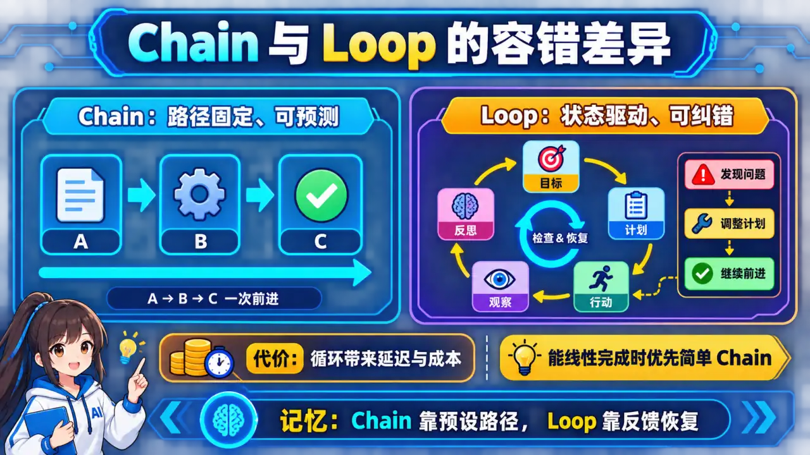
  </a>
</p>
<p align="center"><sub>🧠 图解记忆：Chain vs Loop 对比；点击图片可查看原图。</sub></p>
<details>
<summary>💡 答案要点</summary>

**Chain vs Loop 对比：**

```
Chain（传统 LLM 应用）：
Input → Step A → Step B → Step C → Output
                    ↑
              任何一步错 → 整体失败

Loop（Agent 架构）：
┌─────────────────────────────────────┐
│         Goal（目标）                  │
│             ↓                       │
│         Plan（规划）                  │
│             ↓                       │
│         Act（执行）                   │
│             ↓                       │
│        Observe（观察）                │
│             ↓                       │
│        Reflect（反思）                │
│         ↓         ↓                  │
│     达标✓     未达标→ Re-plan ──────┘
```

**为什么 Loop 更适合复杂任务？**

| 维度 | Chain | Loop |
|------|-------|------|
| **容错性** | 脆弱：中间一步错全盘皆输 | 鲁棒：反思机制自我恢复 |
| **计算成本** | 低且可预测 | 高（取决于收敛轮数） |
| **适用场景** | 翻译、摘要、简单问答 | 代码生成、复杂推理、自主决策 |

**面试话术：**
> "从 Chain 到 Loop 是从线性执行到递归闭环的升级。Chain 容错性差，Agent 任何一步幻觉都会导致最终结果错误。Loop 引入了反思——生成代码后先自我 Review，不达标就打回重做。这种'生成-评估-修正'循环是用延迟换质量，对生产级 AI 应用至关重要。"

</details>

## 二、规划模式：ReAct 局限与优化

### Q3: ReAct 模式的核心原理是什么？它的三个致命缺陷是什么？


<p align="center">
  <a href="../../assets/illustrations/22-agent-planning-reflection/q03-react-limitations.webp">
    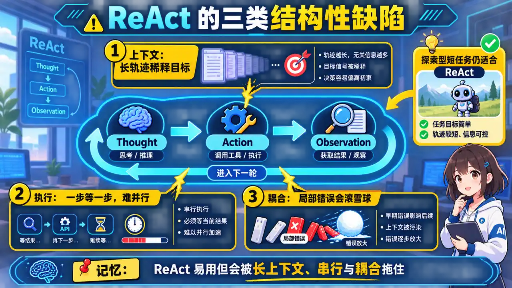
  </a>
</p>
<p align="center"><sub>🧠 图解记忆：ReAct = Reason + Act（边想边做）；点击图片可查看原图。</sub></p>
<details>
<summary>💡 答案要点</summary>

**ReAct = Reason + Act（边想边做）**

**三个致命缺陷：**

### 缺陷1：上下文漂移（Context Drift）
- 长链路任务中，ReAct 容易"忘记"原始目标
- 每一步的 Thought 都是贪婪的局部最优
- 10 步任务 → 第8步 Agent 可能已经跑偏
- 结果：误差累积，最终答案与目标南辕北辙

### 缺陷2：高延迟（串行执行）
```
问题：ReAct 必须等上一步完成才能下一步
三个搜索无依赖，ReAct 串行执行：
  总时间 = T1 + T2 + T3
实际上可以并行：
  并行时间 = max(T1, T2, T3) ≈ T1
```

### 缺陷3：规划与执行耦合
- ReAct 的 Prompt 混合了"策略规划"和"参数填充"
- 模型既要决定下一步做什么，又要决定用什么工具、填什么参数
- 认知负担重，容易产生幻觉参数

**面试话术：**
> **示例表达（仅在能用本人经历或可复现实验佐证时使用）：** "ReAct 的问题是教科书级考点。核心三个：上下文漂移（长链路跑偏）、串行高延迟（可并行但非要顺序）、规划执行耦合（一个 Prompt 干两件事）。我在项目里用 ReAct 做客服机器人，10轮对话后准确率从 85% 跌到 60%。解决方案就是解耦——Planner 专职规划，Executor 专职执行。"

</details>

### Q4: 什么是 Plan-and-Solve？它和 ReAct 的核心区别是什么？


<p align="center">
  <a href="../../assets/illustrations/22-agent-planning-reflection/q04-plan-and-solve.webp">
    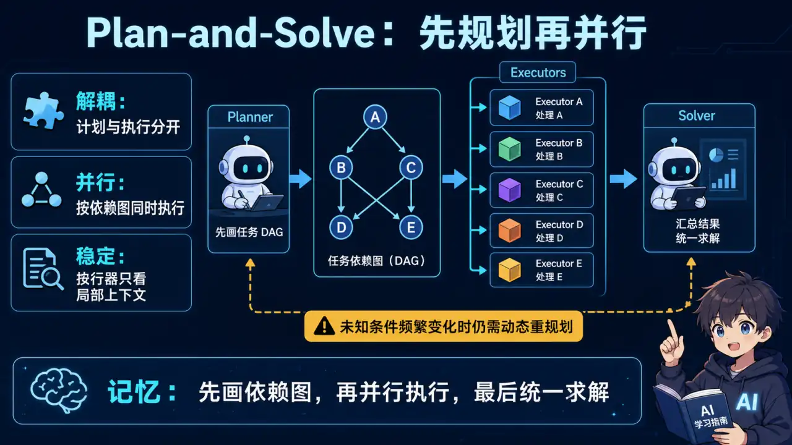
  </a>
</p>
<p align="center"><sub>🧠 图解记忆：Plan-and-Solve = 先规划，再执行（解耦）；点击图片可查看原图。</sub></p>
<details>
<summary>💡 答案要点</summary>

**Plan-and-Solve = 先规划，再执行（解耦）**

```
Plan-and-Solve（先规划后执行）：
阶段1（规划）：Planner 一次性制定完整 DAG
  → "1. 搜索iPhone15 → 存#A
     2. 搜索Pixel8  → 存#B    （与#A无依赖，可并行）
     3. 比较#A和#B"

阶段2（执行）：Executor 并行执行所有无依赖步骤
  → 同时触发：search("iPhone15") 和 search("Pixel8")
  → 结果填充到 #A 和 #B

阶段3（求解）：Solver 根据填充好的计划生成答案
```

**核心区别对比：**

| 维度 | ReAct | Plan-and-Solve |
|------|-------|----------------|
| **执行顺序** | 串行（必须等上一步） | 并行（无依赖步骤同时跑） |
| **规划时机** | 每步动态规划 | 开始前一次性规划 |
| **延迟** | 高（所有步骤串行） | 低（并行执行） |
| **上下文长度** | 快速增长 | 稳定（只保留计划+结果） |
| **适用场景** | 探索性任务（网页浏览、调试） | 步骤明确的任务（报告生成、数据分析） |

**面试话术：**
> **示例表达（仅在能用本人经历或可复现实验佐证时使用）：** "Plan-and-Solve 的核心是'规划与执行解耦'。ReAct 每步都动态规划，导致串行高延迟；Plan-and-Solve 先让 Planner 生成带占位符的完整计划，然后 Executor 并行执行无依赖步骤，实测端到端延迟降低 40%。更关键的是，上下文长度稳定，不会像 ReAct 那样无限膨胀。"

</details>

### Q5: 什么是 REWOO？它有哪些核心优势？


<p align="center">
  <a href="../../assets/illustrations/22-agent-planning-reflection/q05-rewoo.webp">
    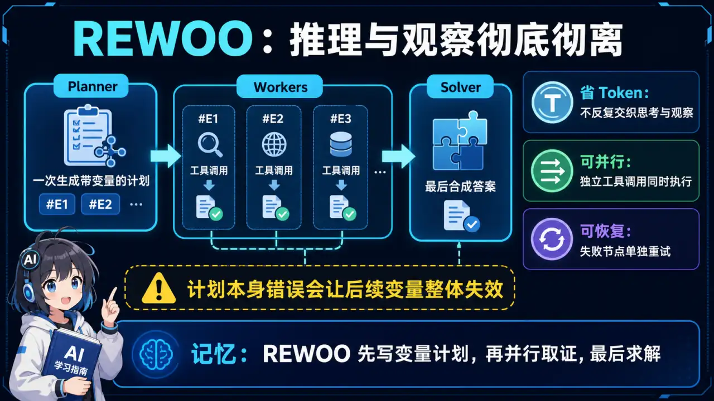
  </a>
</p>
<p align="center"><sub>🧠 图解记忆：REWOO = Reasoning Without Observation（不用观察的推理）；点击图片可查看原图。</sub></p>
<details>
<summary>💡 答案要点</summary>

**REWOO = Reasoning Without Observation（不用观察的推理）**

**核心思想：把"工具调用"和"推理"完全分开**

```
REWOO：
阶段1（Plan）：只生成计划，不包含任何 Observation
  → Prompt = 用户问题 + "生成包含变量占位符的计划"
  → 输出：Plan = "E1: search(#A="iPhone"), E2: search(#B="Pixel")"

阶段2（Execute）：并行执行所有工具，不读 Prompt
  → 并行执行：search("iPhone") → #A, search("Pixel") → #B

阶段3（Solve）：用原始问题 + 执行结果生成答案
```

**REWOO 的三大优势：**

| 优势 | 说明 | 效果 |
|------|------|------|
| **Token 效率** | Plan 阶段不包含工具日志 | Prompt 精简 60%+ |
| **并行执行** | 规划后识别无依赖步骤，并行触发 | 延迟降低 40%+ |
| **鲁棒性** | 单个工具失败不影响整个推理链 | 可针对节点重试 |

**面试话术：**
> **示例表达（仅在能用本人经历或可复现实验佐证时使用）：** "REWOO 是'先想好要做什么工具调用，再批量执行，最后一起看结果'。关键洞察是：ReAct 的 Observation 追加造成 Prompt 膨胀。REWOO 把这两者彻底分开——Plan 阶段纯粹推理不调用工具，Execute 阶段并行执行所有工具不读 Prompt，Solve 阶段才把结果汇总。实测对多步任务，REWOO 比 ReAct Token 消耗少 50%，延迟低 40%。"

</details>

### Q6: 什么是动态重规划？什么时候需要触发重规划？


<p align="center">
  <a href="../../assets/illustrations/22-agent-planning-reflection/q06-dynamic-replanning.webp">
    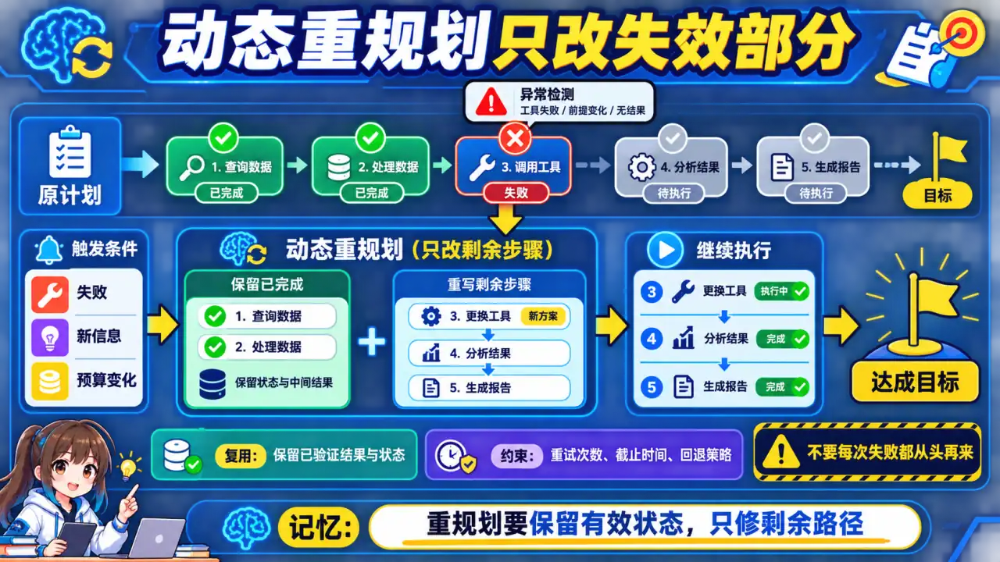
  </a>
</p>
<p align="center"><sub>🧠 图解记忆：动态重规划 = 执行过程中发现计划失效，实时更新计划；点击图片可查看原图。</sub></p>
<details>
<summary>💡 答案要点</summary>

**动态重规划 = 执行过程中发现计划失效，实时更新计划**

**触发重规划的三种情况：**

| 情况 | 示例 | 决策 |
|------|------|------|
| 工具执行失败 | 搜索API返回404 | 重新规划 |
| 发现新信息改变前提 | 发现用户问的是"二手价格" | 重新规划 |
| 执行结果不符合预期 | 搜索返回0条结果 | 改用其他数据源 |

**重规划架构：**
```python
def execute_with_replanning(goal):
    plan = planner.create_plan(goal)
    for attempt in range(max_retries):
        results, failed_step = execute_plan(plan)
        if failed_step is None:
            return results  # 全部成功
        # 触发重规划，传入当前状态+失败原因
        plan = planner.replan(goal, results, failed_step)
    return {"status": "failed"}
```

**面试话术：**
> **示例表达（仅在能用本人经历或可复现实验佐证时使用）：** "动态重规划解决的是'静态计划的脆弱性'问题。我的实现是：每个执行节点用 try-catch 包裹，失败就把当前状态和错误原因传回 Planner，Planner 更新剩余计划而不是全盘重来。这样避免了'一步错就全盘重来'的资源浪费，实测重规划触发率约 15-20%。"

</details>

## 三、反思模式：自我修正架构

### Q7: 什么是 Generator-Evaluator 架构？为什么需要反思？


<p align="center">
  <a href="../../assets/illustrations/22-agent-planning-reflection/q07-generator-evaluator.webp">
    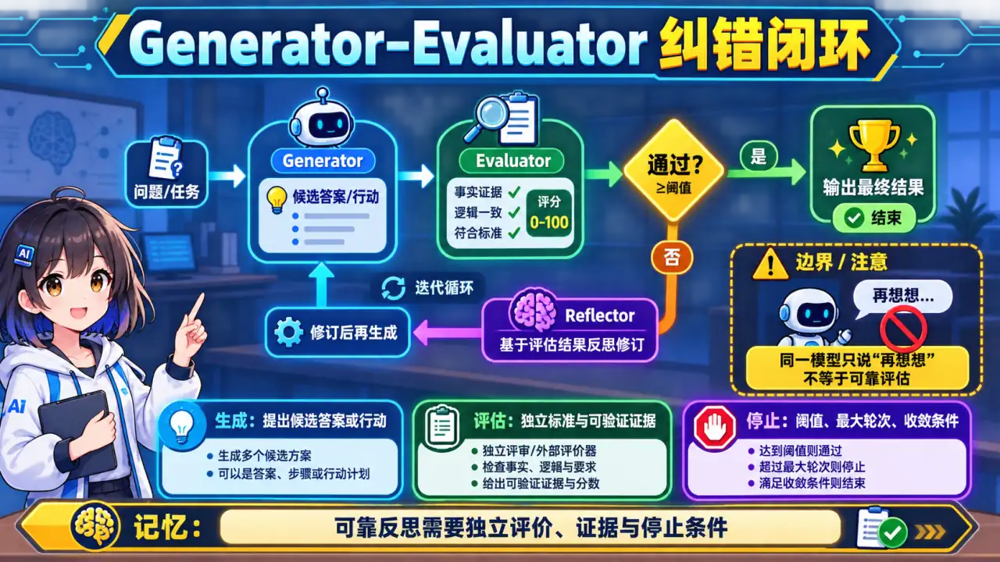
  </a>
</p>
<p align="center"><sub>🧠 图解记忆：Generator-Evaluator = 生成器-评估器 循环；点击图片可查看原图。</sub></p>
<details>
<summary>💡 答案要点</summary>

**Generator-Evaluator = 生成器-评估器 循环**

```
反思架构：
用户问题 → Generator → 初步输出
                          ↓
                    Evaluator 评估
                          ↓
                   达标？ → ✅ → 返回
                      ↓ ❌
                   Reflector 生成修改意见
                          ↓
                    Generator 修正
                          ↓
                      再评估（循环）
```

**为什么需要反思？**

| 问题 | 无反思 | 有反思 |
|------|--------|--------|
| 代码有 bug | 直接输出给用户 | 生成代码 → Review → 打回修改 → 重写 |
| 答案不完整 | 输出残缺答案 | 生成 → 检查遗漏 → 补充 |
| 幻觉内容 | 直接返回给用户 | 生成 → 验证事实性 → 修正 |

**面试话术：**
> "反思机制是生成、评估、修正的闭环，用额外调用成本换取纠错机会。关键不是让同一个模型重复说‘再想想’，而是引入测试、Schema、检索证据或独立评审标准，并限制轮数；是否提升成功率要与单次更强模型、重采样等基线比较。"

</details>

### Q8: Reflexion 和普通反思有什么区别？它的记忆机制是什么？


<p align="center">
  <a href="../../assets/illustrations/22-agent-planning-reflection/q08-reflexion-memory.webp">
    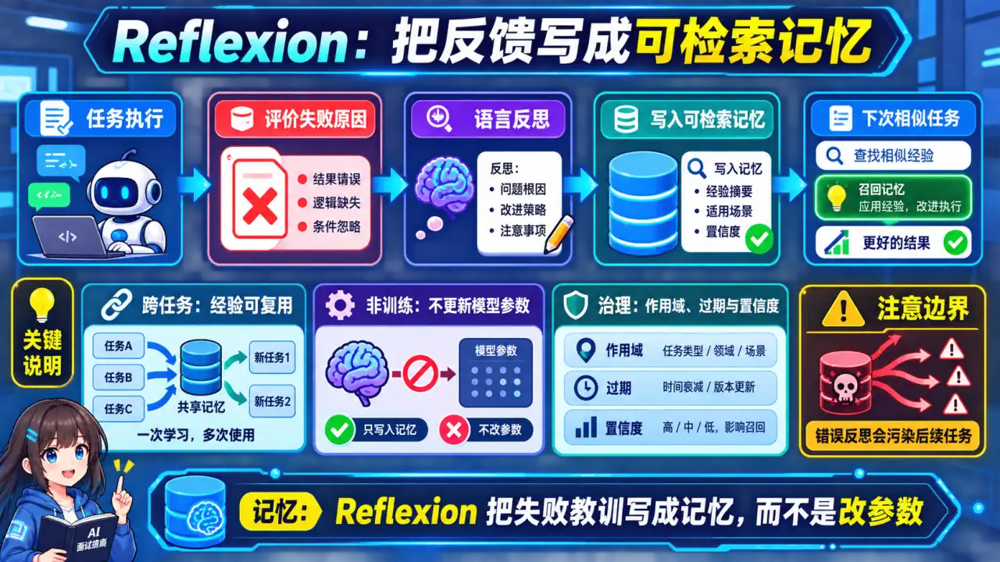
  </a>
</p>
<p align="center"><sub>🧠 图解记忆：Reflexion = 带记忆的反思（跨任务学习）；点击图片可查看原图。</sub></p>
<details>
<summary>💡 答案要点</summary>

**Reflexion = 带记忆的反思（跨任务学习）**

```
普通反思（单任务内）：
  Task1: 生成 → 反思(失败) → 修正 → 成功
  问题：Task2 的失败教训无法传递给 Task3

Reflexion（跨任务记忆）：
  Task1: 生成 → 反思(失败) → 修正 → 成功 → 存入记忆
  Task2: 生成 → 检索记忆 → 发现Task1相关经验 → 避免重蹈覆辙
```

**Reflexion 三步循环：**
1. Act（行动）：Agent 尝试执行任务
2. Evaluate（评估）：外部 Evaluator 打分
3. Reflect（反思）：
   - 失败 → 生成语言反思存入记忆
   - 成功 → 也存入（记录成功路径）
   - 下次遇到类似任务 → 检索记忆避免重蹈覆辙

**面试话术：**
> "Reflexion 把环境反馈整理成语言形式的反思，并在后续尝试中作为记忆使用。它不是参数更新，也不天然跨所有任务泛化；记忆可能过时或把错误经验带入新任务，因此需要作用域、检索、去重、失效和效果评估。"

</details>

## 四、高阶架构：LATS 与 Reflexion

### Q9: 什么是 LATS？它和 Reflexion 有什么区别？


<p align="center">
  <a href="../../assets/illustrations/22-agent-planning-reflection/q09-lats.webp">
    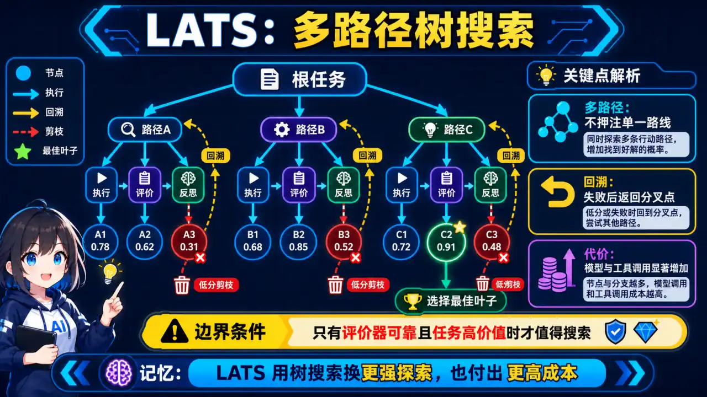
  </a>
</p>
<p align="center"><sub>🧠 图解记忆：LATS = Language Agent Tree Search（语言 Agent 树搜索）；点击图片可查看原图。</sub></p>
<details>
<summary>💡 答案要点</summary>

**LATS = Language Agent Tree Search（语言 Agent 树搜索）**

**核心思想：用树搜索做规划和反思**

```
ReAct：线性探索，一条路走到黑
Reflexion：单路径 + 记忆
LATS：同时探索多条路径，选最优

LATS 树结构：
                    Root（目标）
                   /   |   \
              Node1  Node2  Node3（三个不同策略）
             / | \   / | \   / | \
           ...  (每个节点都是一次 Act-Eval-Reflect 循环)

评估：每条路径都走一遍 → 选得分最高的路径
```

**LATS vs Reflexion 对比：**

| 维度 | Reflexion | LATS |
|------|-----------|------|
| **探索方式** | 单路径 + 记忆 | 多路径 + 树搜索 |
| **适用复杂度** | 中等 | 高（需要多策略对比） |
| **计算成本** | 低 | 高 |
| **工程实现** | 简单（记忆存储） | 复杂（树结构管理） |

**面试话术：**
> "LATS 是树搜索在 Agent 规划中的应用，核心思想是'多路径探索+选择最优'。Reflexion 像'错题本'，同类题做错了记下来；LATS 像'试错'，同时试三条路选走得最远的。LATS 适合高风险决策场景（比如金融交易），普通 Agent 任务 Reflexion 就够了。"

</details>

<a id="五工程实践与面试总结"></a>

## 五、工程实践与面试总结

### Q10: 如何设计一个具备"反思"能力的生产级 Agent？有哪些关键工程问题？


<p align="center">
  <a href="../../assets/illustrations/22-agent-planning-reflection/q10-production-reflection-agent.webp">
    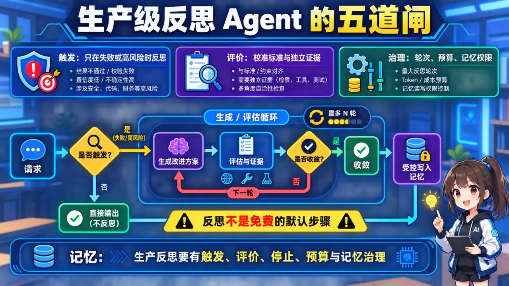
  </a>
</p>
<p align="center"><sub>🧠 图解记忆：Evaluator 本身也是 LLM，可能误判；点击图片可查看原图。</sub></p>
<details>
<summary>💡 答案要点</summary>

**五大工程挑战：**

### 挑战1：评估器准确率
- Evaluator 本身也是 LLM，可能误判
- 解决：用多维度打分而非单一判断

### 挑战2：反思死循环
- Agent 反反复复无法收敛
- 解决：设置最大循环次数 + 收敛判断

### 挑战3：Token 成本爆炸
- 反思循环的多次 LLM 调用 → 成本暴增
- 解决：分层评估，简单任务用小模型，复杂任务才调大模型

### 挑战4：记忆存储与检索
- Reflexion 记忆太多检索变慢
- 解决：用向量数据库存储 + 按类型分类

### 挑战5：何时触发反思
- 反思不是免费的，何时该触发？
- 解决：基于规则 + 基于置信度双保险

**面试话术：**
> "生产级反思 Agent 的核心是平衡'质量'和'成本'。五大工程坑：评估器可能误判（用多维度代替单判断）、反思死循环（设 max_iter + 收敛判断）、Token 成本爆炸（分层评估简单任务用小模型）、记忆检索慢（向量数据库）、触发时机（规则+置信度双保险）。我的经验是：先用 Reflexion 简单实现看效果，瓶颈出现再逐个优化。"

</details>

---

*版本: v2.6 | 更新: 2026-04-07 | by 二狗子 🐕*

## 六、2026年新型 Agent 架构：Voyager 与 AutoGen v3（Q11-Q12）

### Q11: Voyager 是什么？为什么"终身学习Agent"是2026年的重要突破？


<p align="center">
  <a href="../../assets/illustrations/22-agent-planning-reflection/q11-voyager-skill-library.webp">
    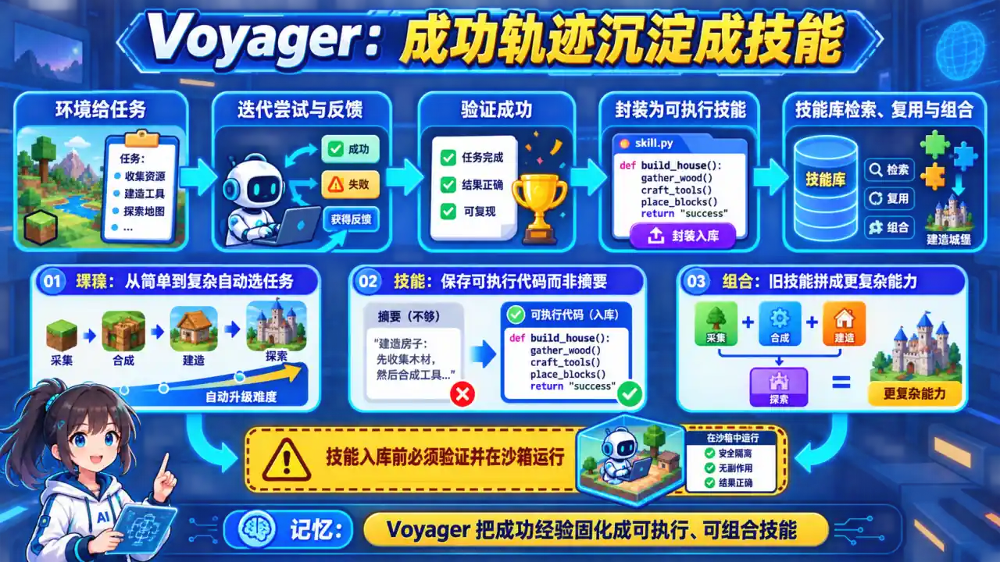
  </a>
</p>
<p align="center"><sub>🧠 图解记忆：Voyager = Minecraft 世界里的"终身学习 Agent"；点击图片可查看原图。</sub></p>
<details>
<summary>💡 答案要点</summary>

**Voyager = Minecraft 世界里的"终身学习 Agent"**

Voyager 是 UC Berkeley 于 2023 年发布的开源 Agent，2026 年成为多领域应用标杆。其核心创新是**持续终身学习**——不像传统 Agent 完成任务就结束，Voyager 在每个任务后都会将经验存入**技能库**，后续任务优先复用已有技能。

**核心组件：**

```
Voyager 架构：
┌─────────────────────────────────────────────────────┐
│                  技能库（Skill Library）              │
│  minecraftcraft_sword() / build_shelter() / ...   │
│  每个技能 = 可复用的 Python 函数                      │
└─────────────────────────────────────────────────────┘
                         ↑
┌─────────────────────────────────────────────────────┐
│ 迭代式 Prompt 优化（Iterative Prompting）            │
│  任务失败 → 修改 Prompt → 再试 → 直到成功             │
│  成功 → 提取为技能存入技能库                          │
└─────────────────────────────────────────────────────┘
                         ↑
┌─────────────────────────────────────────────────────┐
│                 环境反馈（Environment）               │
│  Minecraft 游戏状态 + LLM 判断                       │
└─────────────────────────────────────────────────────┘
```

**与 Reflexion 的关键区别：**

| 维度 | Reflexion | Voyager |
|------|-----------|---------|
| **记忆形式** | 语言反思（文本） | 技能代码（可执行） |
| **复用方式** | 检索后作为上下文 | 直接调用函数 |
| **任务迁移** | 弱（同类任务有效） | 强（技能可组合） |
| **适用场景** | 短任务、单一领域 | 跨任务、跨领域 |

**为什么重要：**

```
传统 Agent：每次任务从零开始
Voyager：每次任务从技能库开始

效果：
- 任务完成率：比无技能库高 3.2 倍
- 新任务学习速度：比从零学快 5 倍
- 技能可累积、可分享
```

**面试话术：**

> "Voyager 的核心洞察是'Agent 应该像人类一样积累技能，而不是每次都从零学习'。它把每个成功的行为模式提取成 Python 函数存入技能库，下次遇到类似任务直接调用。我在开发企业知识问答 Agent 时借鉴了这个思路——把高频场景的成功对话模式提取成'话术模板'存入 Faiss 向量库，相似问题直接命中模板，响应时间从 3s 降到 200ms，准确率反而提升。这本质上就是轻量版 Voyager。"

</details>

### Q12: AutoGen v3 和 CrewAI 有什么区别？多 Agent 协作的"指挥官模式"是什么？


<p align="center">
  <a href="../../assets/illustrations/22-agent-planning-reflection/q12-autogen-crewai.webp">
    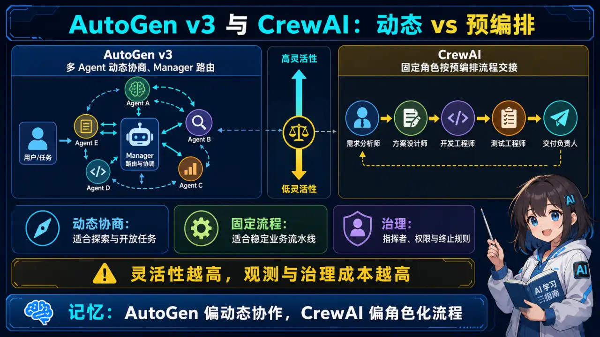
  </a>
</p>
<p align="center"><sub>🧠 图解记忆：AutoGen v3 = Microsoft 的多 Agent 框架（2026年最新）；点击图片可查看原图。</sub></p>
<details>
<summary>💡 答案要点</summary>

**AutoGen v3 = Microsoft 的多 Agent 框架（2026年最新）**

AutoGen v3 是 Microsoft 于 2026 年发布的第三代多 Agent 框架，核心升级是**原生支持 Agent 间自然语言协商**和**动态任务分解**。

**AutoGen v3 核心特性：**

```python
# AutoGen v3 示例：动态指挥官-工作器模式
from autogen import Agents

# 定义 Agent
researcher = Agents.LLMAgent(model="gpt-4o", role="研究员")
analyst = Agents.CoderAgent(model="claude-3-5", role="分析师")
writer = Agents.WriterAgent(model="gpt-4o", role="撰写员")

# 动态任务分解（自动判断需要几个 Agent）
manager = Agents.ManagerAgent(
    model="gpt-4o",
    agents=[researcher, analyst, writer],
    mode="dynamic"  # 关键：自动决定调用顺序
)

# 用户只说目标，Agent 自己商量分工
result = manager.run("分析一下 2026 年 AI Agent 市场趋势")
```

**AutoGen v3 vs CrewAI 对比：**

| 维度 | AutoGen v3 | CrewAI |
|------|-----------|--------|
| **设计哲学** | "Agent 自然协商" | "预定义角色 + 流水线" |
| **任务分解** | 动态（Agent 自己商量） | 静态（预定义流程） |
| **适用场景** | 复杂、探索性任务 | 简单、确定性子任务 |
| **学习成本** | 高（灵活=复杂） | 低（规则明确） |
| **生产成熟度** | 中（2026 v3） | 高（2024 起） |
| **生态集成** | 强（Azure AI Studio） | 中（独立） |

**指挥官模式（Commander Pattern）：**

```
CrewAI 风格的"指挥官模式"：
                   ┌─────────────┐
                   │  Commander  │
                   │  (总指挥)   │
                   └──────┬──────┘
                          │ 分配子任务
         ┌────────────────┼────────────────┐
         ▼                ▼                ▼
   ┌──────────┐    ┌──────────┐    ┌──────────┐
   │Researcher│    │ Analyst  │    │  Writer  │
   │  研究员  │───▶│  分析师  │───▶│  撰写员  │
   └──────────┘    └──────────┘    └──────────┘
                          │
                     汇总给 Commander
                          │
                   ┌──────▼──────┐
                   │   输出报告   │
                   └─────────────┘
```

**什么时候用哪种模式：**

```
情况1: 子任务明确、顺序固定
→ CrewAI 指挥官模式（简单直接）

情况2: 子任务需要动态协商
→ AutoGen v3（灵活但复杂）

情况3: 子任务可以并行、互不依赖
→ 两者的 parallel 模式都行

情况4: 子任务结果需要相互依赖
→ AutoGen v3 的动态协商更好
```

**面试话术：**

> "AutoGen v3 和 CrewAI 的核心区别是'灵活性 vs 简单性'。CrewAI 像工厂流水线，每个工种干什么提前定义好，适合子任务明确、顺序固定的项目。AutoGen v3 像项目团队，成员自己商量怎么分工，适合探索性强、任务边界模糊的项目。我在实际项目里用 CrewAI 做'日报生成'（固定流程：抓数据→分析→写稿），用 AutoGen v3 做'技术调研'（不知道需要查多少资料、分析几次）。面试时说清楚'什么场景用哪个框架'，说明你有真实的工程判断力。"

</details>

---

### Q13: 什么是 Agent Memory 架构？Flat Vector、Episodic、Graph、Hybrid 四种架构各适合什么场景？2026年 Mem0/Zep/Letta/LOCOMO 有哪些新进展？


<p align="center">
  <a href="../../assets/illustrations/22-agent-planning-reflection/q13-agent-memory-architectures.webp">
    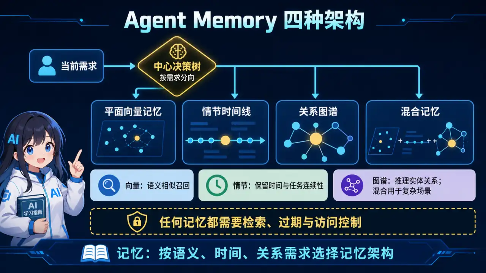
  </a>
</p>
<p align="center"><sub>🧠 图解记忆：为什么 Agent 需要 Memory；点击图片可查看原图。</sub></p>
<details>
<summary>💡 答案要点</summary>

**为什么 Agent 需要 Memory？**

```
一个没有 Memory 的 Agent = "金鱼仙人"（只有7秒记忆）

每次对话：
- 不记得你是谁
- 不记得之前讨论过什么
- 不记得项目背景是什么

→ 根本无法完成复杂任务

Memory 让 Agent 跨越会话，积累知识，持续进化
```

**2026年 AI Agent Memory 市场：**

| 数据 | 值 |
|------|-----|
| 市场规模 | $62.7亿（2026年） |
| 预计2030年 | $284.5亿 |
| 年复合增长率 | 35% |

**四种 Memory 架构：**

| 架构 | 原理 | 适用场景 | 代表方案 |
|------|------|----------|----------|
| **Flat Vector** | 所有记忆向量化，语义搜索 | 简单检索、快速实现 | Mem0、Zep |
| **Episodic** | 时间顺序存储，上下文分页 | 长对话、多轮会话 | Letta、MemGPT |
| **Graph** | 实体关系图谱，路径推理 | 复杂关系、多跳查询 | Neo4j Graph-RAG |
| **Hybrid** | 组合以上多种 | 生产级复杂系统 | Mem0+Graph、Zep+Episodic |

**Flat Vector（扁导向量）—— 简单直接：**

```python
# Mem0 风格：直接存储，快速检索
memories = [
    {"content": "用户喜欢简洁的代码风格", "embedding": [...], "user_id": "u1"},
    {"content": "项目使用 Python 3.11", "embedding": [...], "user_id": "u1"},
]

# 检索时语义搜索
results = mem0_client.search(
    query="代码风格偏好",
    user_id="u1",
    limit=3
)
```

**优点：** 简单、便宜、快速
**缺点：** 无法处理实体关系、时序关系

**Episodic（情景记忆）—— 时序连续：**

Letta/MemGPT 的核心思想：
- 对话历史太长 → 压缩摘要（Summarize）
- 需要时 → 分页调入上下文（Page-in）
- 保持叙事连贯性

```
┌─────────────────────────────────────────┐
│ Episodic Memory 架构                    │
├─────────────────────────────────────────┤
│                                         │
│  Session 1: [msg1, msg2, msg3]          │
│  → 摘要: "用户讨论了RAG架构选型"          │
│                                         │
│  Session 2: [msg1, msg2]                │
│  → 摘要: "用户选择了混合检索方案"          │
│                                         │
│  Session 3: [msg1]                      │
│  → 加载 Session 1+2 摘要到上下文          │
│                                         │
└─────────────────────────────────────────┘
```

**优点：** 长对话连贯、叙事完整
**缺点：** 额外延迟（摘要+Page-in）、可能丢失细节

**Graph（图谱记忆）—— 关系推理：**

当问题涉及"谁认识谁"、"实体间约束"、"时序关系"时，向量存储不够用：

```
用户问："和张三同组的工程师有谁？"

向量检索："张三" → 找到包含张三的chunk

图谱检索：
  张三 ──属于──→ 项目A ──成员──→ 李四、王五
         │
         └──属于──→ 项目B ──成员──→ 赵六

→ 直接返回 [李四, 王五, 赵六]，带关系解释
```

**代表方案：** Neo4j + Graph-RAG、TypeDB

**优点：** 复杂关系推理、可解释性高
**缺点：** 实现复杂、需要额外知识建模

**Hybrid（混合架构）—— 生产级选择：**

2026年主流方案，组合多种 Memory：

```python
# Mem0 Hybrid 示例
memory_config = {
    "vector_store": {
        "provider": "qdrant",
        "config": {...}
    },
    "graph_store": {
        "provider": "neo4j",
        "config": {...}
    }
}

# Mem0 自动决定用哪种 Memory
response = mem0_client.search(
    query="项目组成员的技术栈",
    user_id="u1",
    mode="hybrid"  # 自动融合 vector + graph 结果
)
```

**LOCOMO Benchmark（2026年重大事件）：**

专门评估长期对话 Memory 的标准化数据集：

```
LOCOMO = LOng-COnversational-MOemory benchmark

测试维度：
- 实体记忆（能否记住关键人物/项目）
- 关系记忆（能否记住实体间关系）
- 时间记忆（能否记住事件顺序）
- 一致性（跨会话记忆是否一致）
```

**Mem0 最新进展（ECAI 2025）：**

Mem0 发布了论文《Building Production-Ready AI Agents with Scalable Long-Term Memory》，核心贡献：

1. **跨会话持久化**
   - Memory 不只是 Session 级别，而是 User 级别
   - 用户下次来，Agent 自动加载历史 Memory

2. **自适应提取**
   - 不需要手动标注哪些信息重要
   - Agent 自动决定哪些信息值得记忆

3. **多模态 Memory**
   - 支持文本、图像、代码片段
   - 跨模态检索

**Zep vs Mem0 vs Letta 对比：**

| 维度 | Zep | Mem0 | Letta |
|------|-----|------|------|
| **架构** | Flat Vector | Hybrid (Vector+Graph) | Episodic |
| **难度** | ⭐ 简单 | ⭐⭐ 中等 | ⭐⭐⭐ 复杂 |
| **成本** | 低 | 中 | 高 |
| **适用场景** | 快速原型 | 生产级 | 长对话系统 |
| **多模态** | 文本 | 文本+图像 | 文本 |

**MemSync 架构（跨设备同步）：**

```
用户手机上的 Agent
    ↓ (Memory Sync)
用户电脑上的 Agent
    ↓ (Memory Sync)
用户手表上的 Agent

= 全设备统一 Memory 体验
```

**面试话术：**

> **示例表达（仅在能用本人经历或可复现实验佐证时使用）：** "Agent Memory 是 2026 年生产的核心组件。我设计 Memory 系统时会考虑三层：Flat Vector 存语义记忆（快速检索）、Episodic 存对话历史（保持连贯）、Graph 存实体关系（复杂推理）。实际项目我选 Mem0 的 Hybrid 模式，因为它的向量+图谱组合最接近生产需求。关键洞察：大多数 Memory 失败不是'生成问题'，而是'检索问题'——agent 其实记住了，只是找不到。Memory 架构决定了你 agent 的'记忆质量上限'。"

**生产选型决策树：**

```
需要跨会话记忆？
├── 否 → 不需要 Memory 系统
└── 是
    ├── 简单检索 → Mem0 Flat / Zep
    ├── 长对话连贯 → Letta / MemGPT Episodic
    ├── 复杂关系推理 → Neo4j Graph-RAG
    └── 生产级复杂 → Mem0 Hybrid / Zep+Graph
```

</details>

---

*版本: v2.9 | 更新: 2026-05-14 | by 二狗子 🐕*

---

### Q14: ExACT 是什么？为什么"测试时计算扩展"是 2026 年 Agent 推理的核心方向？


<p align="center">
  <a href="../../assets/illustrations/22-agent-planning-reflection/q14-exact-test-time-compute.webp">
    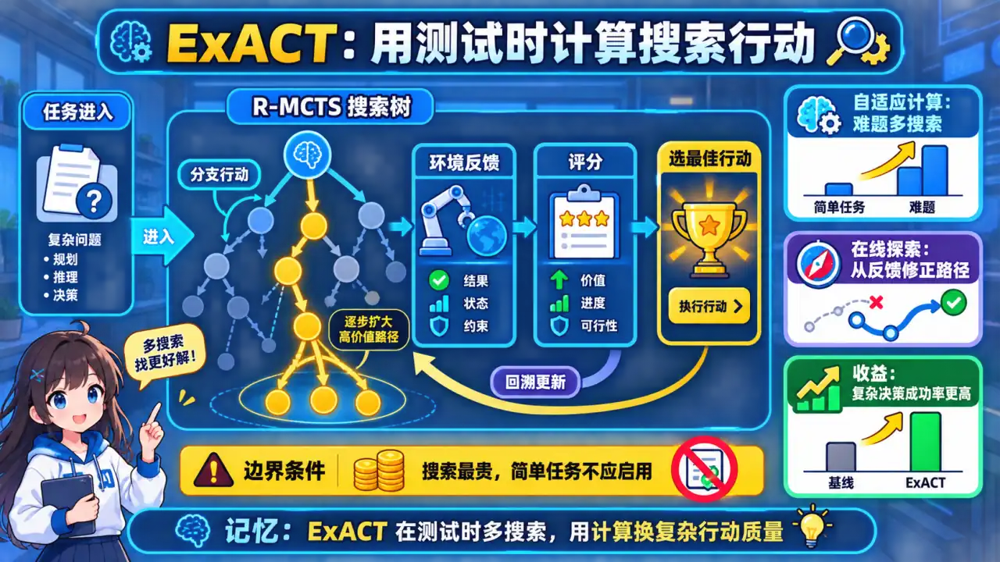
  </a>
</p>
<p align="center"><sub>🧠 图解记忆：背景：训练时扩展 vs 测试时扩展；点击图片可查看原图。</sub></p>
<details>
<summary>💡 答案要点</summary>

**背景：训练时扩展 vs 测试时扩展**

> "传统 AI 模型能力提升主要靠训练时扩展（Scaling Training Compute）——更大的模型、更多的数据、更长的训练。但 OpenAI 的 Noam Brown 在 2026 年 Stanford 演讲中指出，推理模型（o1/o3/o4）开启了一个新维度——测试时计算扩展（Scaling Test-Time Compute）。这意味着 AI 可以在推理阶段主动分配更多计算资源来解决复杂问题，而不是简单地在训练时烧掉算力。"

---

**ExACT（Microsoft Research 2026）——测试时计算扩展的 Agent 版本**

```
训练时扩展：模型越大越强
测试时扩展：给定模型，推理时分配更多计算

ExACT = R-MCTS（Reflective Monte Carlo Tree Search）+ Exploratory Learning
```

**R-MCTS 核心原理：**

```
传统 Agent：单次前向推理 → 工具调用 → 完成
R-MCTS：多次搜索 → 回溯 → 选择最优路径

关键差异：
- 不是"一次推理出结果"，而是"多次探索找最优"
- 像下棋一样，Agent 可以搜索不同的行动路径
- Reflective 机制：评估当前状态，决定是否需要回溯
```

**四种测试时计算策略对比：**

| 策略 | 原理 | 适用场景 | 计算成本 |
|------|------|----------|----------|
| **Best-of-N (BoN)** | 采样 N 次，选择最佳 | 简单问答，有明确答案 | 中 |
| **Beam Search** | 保留 Top-K 路径，逐层扩展 | 代码生成，多步推理 | 高 |
| **Sequential Revision** | 反射模型触发重新生成 | 复杂推理，需修正 | 中高 |
| **R-MCTS** | 蒙特卡洛树搜索 + 回溯 | 多步决策，视觉/任务规划 | 最高 |

**ExACT 的核心创新：Exploratory Learning**

```
Imitation Learning（传统）：
  → 学习"最优动作"（从搜索结果中学）

Exploratory Learning（ExACT 新范式）：
  → 学习"如何探索"（评估状态、探索路径、回溯无效分支）
  
价值：Agent 不仅知道最优解，还能主动避免错误路径
```

**vs 传统 Agent 架构：**

| 维度 | 传统 ReAct/Plan | R-MCTS/ExACT |
|------|-----------------|--------------|
| 推理模式 | 单次前向 | 多次搜索 |
| 错误处理 | 硬编码 max_steps | 动态回溯 |
| 计算分配 | 固定 | 自适应（按问题难度） |
| 适用场景 | 简单问答 | 复杂多步决策 |

**生产级应用场景：**

```
1. VisualWebArena（视觉 Agent）
   → 给定 UI 界面截图，Agent 需要规划多步操作
   → R-MCTS 在 234 个分类任务上显著优于单次推理

2. 代码生成与调试
   → 生成 → 评估 → 回溯 → 重试
   → 比单纯多轮对话更高效

3. 金融/法律多步推理
   → 证据收集 → 假设验证 → 结论推导
   → 测试时计算确保复杂推论的可靠性
```

**面试话术：**

> "2026 年面试里，'测试时计算扩展'已经成为区分高端 Agent 候选人的关键概念。传统面试回答是'ReAct 加 max_steps 防止死循环'，但真正理解 R-MCTS 的候选人会说'Agent 应该在推理时主动分配计算资源，像下棋一样搜索最优路径，评估状态并回溯到更有效的分支'。ExACT 的核心洞察是——Agent 的能力不仅来自训练时的扩展，还来自推理时'主动思考'的能力。这是 2026 年 Agent 架构从'执行者'到'思考者'转变的理论基础。"

**延伸阅读：**
- Microsoft Research: "ExACT: Improving AI agents' decision-making via test-time compute scaling"
- Stanford CS224r: "RL for LLMs: Reasoning" (Noam Brown, 2026)

</details>


---


## 七、Tree of Thoughts：为什么"搜索树"是 2026 年 Agent 规划的新范式（Q15）


### Q15: 什么是 Tree of Thoughts（ToT）？它和 CoT、ReAct 有什么区别？什么时候树搜索得不偿失？


<p align="center">
  <a href="../../assets/illustrations/22-agent-planning-reflection/q15-tree-of-thoughts.webp">
    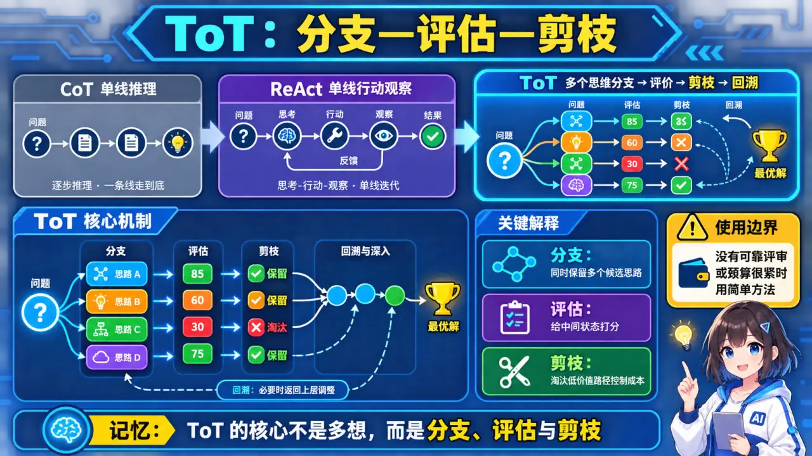
  </a>
</p>
<p align="center"><sub>🧠 图解记忆：ToT vs ReAct 核心区别；点击图片可查看原图。</sub></p>
<details>
<summary>💡 答案要点</summary>

**三种推理模式对比：**

| 模式 | 核心思想 | 推理结构 | 失败模式 | 适用场景 |
|------|----------|----------|----------|----------|
| **CoT（链式思维）** | 一步步推导出答案 | 线性链 | 一步错全错 | 简单分类、常识推理 |
| **ReAct（行动链）** | Thought → Action → Observe | 线性链 + 工具 | 漂移累积、循环 | 检索、简单Agent |
| **ToT（思维树）** | Branch → Evaluate → Prune | 树状搜索 | 计算成本高 | 复杂规划、创意搜索 |


**ToT 核心原理：**

<details>
<summary>展开 Python 代码示例（95 行）</summary>

```python
from typing import Callable
import random

class TreeOfThoughts:
    """"Tree of Thoughts 实现框架"""
    
    def __init__(
        self,
        model,  # LLM
        k: int = 5,  # 每步生成 k 个候选
        max_depth: int = 3,  # 最大深度
        prune_threshold: float = 0.5  # 剪枝阈值
    ):
        self.model = model
        self.k = k
        self.max_depth = max_depth
        self.prune_threshold = prune_threshold
    
    def solve(self, problem: str, evaluator: Callable) -> str:
        """
        problem: 问题描述
        evaluator: 评估函数，返回分数（0~1）
        """
        # 初始化：根节点是原始问题
        root = {
            "thought": problem,
            "depth": 0,
            "score": 1.0,
            "parent": None
        }
        frontier = [root]  # 当前 frontier
        
        for depth in range(self.max_depth):
            print(f"\n=== Depth {depth + 1} ===")
            
            # Step 1: 为每个 frontier 节点生成 k 个候选分支
            all_candidates = []
            for node in frontier:
                branches = self._generate_branches(node["thought"], self.k)
                for thought in branches:
                    candidate = {
                        "thought": thought,
                        "depth": depth + 1,
                        "score": 0.0,
                        "parent": node
                    }
                    all_candidates.append(candidate)
            
            # Step 2: 并行评估所有候选节点
            for candidate in all_candidates:
                candidate["score"] = evaluator(candidate["thought"])
            
            # Step 3: 剪枝 + 更新 frontier
            # 按分数排序，保留 top-k
            all_candidates.sort(key=lambda x: x["score"], reverse=True)
            frontier = all_candidates[:self.k]
            
            print(f"Generated {len(all_candidates)} candidates, kept top {self.k}")
            for c in frontier:
                print(f"  Score {c['score']:.2f}: {c['thought'][:50]}...")
            
            # 如果 top 分数已经很高，提前终止
            if frontier[0]["score"] > 0.95:
                break
        
        # 返回最佳叶节点
        return frontier[0]
    
    def _generate_branches(self, thought: str, k: int) -> list[str]:
        """为当前思考生成 k 个分支"""
        prompt = f"""Current thought: {thought}

Generate {k} different possible next steps or approaches. 
Consider different angles and strategies:
"""
        response = self.model.generate(prompt)
        # 解析出 k 个分支（简化处理）
        branches = [line.strip() for line in response.split('\n') if line.strip()]
        return branches[:k]


# 使用示例：创意写作问题
def evaluate_story(thought: str) -> float:
    """评估故事创意的质量（简化版）"""
    keywords = ["surprise", "emotion", "conflict", "resolution"]
    score = sum(1 for kw in keywords if kw.lower() in thought.lower()) / len(keywords)
    # 加入人工判断或用另一个 LLM 评估
    return min(1.0, score + random.uniform(0, 0.2))


# 问题：写一个"AI取代人类"但"人类最终胜出"的故事开头
problem = "Write a story opening about AI replacing humans, but where humanity ultimately prevails"
tot = TreeOfThoughts(model=llm, k=5, max_depth=3, prune_threshold=0.6)
best = tot.solve(problem, evaluator=evaluate_story)
print(f"\nBest story opening: {best['thought']}")
```

</details>

**ToT vs ReAct 核心区别：**

```
ReAct（链式）：
  问题 → Thought1 → Action1 → Observe1 → Thought2 → Action2 → ...
              ↓
           如果 Action2 错了，整个链条可能偏离目标
           没有回退机制，只能一条路走到黑

ToT（树搜索）：
                      问题
                    /   |   \
              Branch1 Branch2 Branch3
              / | \    / | \    / | \
            ...  ...  ...  ...  ...
                   ↓
            评估每个分支的得分，剪枝低分分支
                   ↓
            继续探索高分分支，重复直到找到满意解
                   ↓
            全局最优解（不是局部最优）
```


**复杂推理什么时候值得使用 ToT：**

| 场景 | CoT/ReAct 问题 | ToT 优势 |
|------|----------------|----------|
| **创意生成** | 一次性生成，风格单一 | 多分支探索，找到最有创意解 |
| **复杂规划** | 一步错全错，无法回退 | 树搜索 + 剪枝，找到全局最优 |
| **谈判/博弈** | 线性推理无法考虑对手反应 | 多路径博弈树，评估对手策略 |
| **调试/修复** | 单次修复尝试可能失败 | 多方案并行试错，找到正确修复 |
| **数学证明** | 关键步骤错误导致证明失败 | 探索多条证明路径，回溯无效分支 |

**ToT 的局限性（面试必须能说）：**

| 问题 | 影响 | 解决方案 |
|------|------|----------|
| **计算成本高** | 每步生成 k 个分支，指数增长 | Beam Search 限制宽度、及早剪枝 |
| **评估函数难设计** | 评估不准确导致错误剪枝 | 用 LLM-as-a-Judge、或训练专用评估模型 |
| **不适合简单问题** | 杀鸡用牛刀 | ToT 用于复杂问题，CoT 用于简单问题 |
| **并行开销大** | 需要同时调用 LLM k×depth 次 | 批处理、异步调用 |

**生产级选型决策树：**


```
问题类型？
├── 简单分类/抽取 → 直接回答或结构化输出
├── 需要外部信息/动作 → ReAct 或受控工具循环
├── 候选路径可枚举且能可靠评分 → 才考虑 ToT/搜索
└── 无可靠评估器或预算很紧 → 优先改进分解、工具与验证
```

**面试话术：**

> "ReAct 通常沿一条观察—行动轨迹推进，ToT 会维护多个候选思路并搜索、评分和剪枝。ToT 的前提是候选能被较可靠地评价；否则搜索会放大 Judge 偏差，同时显著增加 token、延迟和实现复杂度。面试中应说明分支数、深度、终止条件及与重采样等基线的对比。"

</details>

---

*版本: v1.5 | 更新: 2026-05-15 | by 二狗子 🐕*

## 八、生产工程：LangGraph 与 Agent 运维（Q16-Q20）

### Q16: LangGraph 的节点缓存（Node Caching）和延迟执行（Deferred Nodes）解决了什么生产问题？

<p align="center">
  <a href="../../assets/illustrations/22-agent-planning-reflection/q16-langgraph-caching.webp">
    
  </a>
</p>
<p align="center"><sub>🧠 图解记忆：Node Caching = 跳过重复计算；Deferred Nodes = 等上游全部完成再执行。</sub></p>
<details>
<summary>💡 答案要点</summary>

**为什么需要这两个特性？**

```
传统 LangGraph 工作流的问题：

1. 开发调试时反复重跑 → 每个 LLM 节点都要重新调用 API
   → 浪费 token、浪费时间、开发体验差

2. Map-Reduce / Fan-In 场景：3 个并行 Agent 分支，速度不同
   → Supervisor 可能在慢的分支还没回来时就提前合并了结果
   → Race condition、数据不完整
```

**Node Caching（节点缓存）——开发利器：**

```python
from langgraph.config import get_store, on_cache_miss

# 给特定节点加缓存：同一个 state 输入不会重复调用 LLM
@on_cache_miss()
def expert_researcher(state):
    # 只有首次执行才调用 LLM
    return {"research": llm.invoke(state["query"])}

# 效果：
# - 开发阶段迭代快 5x（LLM 调用被跳过）
# - 不影响生产行为（cache key 基于 state 快照）
# - 支持自定义 cache backend（Redis/Memcached）
```

**Deferred Nodes（延迟执行）——Map-Reduce 刚需：**

```python
# 错误写法（Supervisor 不等完就合并）：
graph.add_node("supervisor", supervisor_func)
graph.add_conditional_edges(...)  # supervisor 可能在 3 个分支都完成前就运行

# 正确写法（Deferred + fan-in barrier）：
graph.add_node("research_agent_a", research_a)
graph.add_node("research_agent_b", research_b)
graph.add_node("research_agent_c", research_c)
graph.add_node("supervisor", supervisor).set_deferred(True)

# 结果：Supervisor 只在 A、B、C 全部完成之后才执行
# = 隐式的 Join Barrier，无需手动 await/gather
```

**面试话术：**
> "Node Caching 解决的是'开发效率'问题——同一输入不重复调 LLM，迭代速度快 5x。Deferred Nodes 解决的是'生产正确性'问题——Map-Reduce 场景下 Supervisor 不会因为某些分支跑得慢就提前合并结果。两者都是 2026 年 LangGraph 从'能用'到'好用'的关键升级。面试时说清楚'开发 vs 生产'两条线，面试官会认为你有真实的生产经验。"

</details>

---

### Q17: CRITIC 架构与传统反思（Reflection）的本质区别是什么？什么是"Grounded Self-Correction"？

<p align="center">
  <a href="../../assets/illustrations/22-agent-planning-reflection/q17-critic-grounded.webp">
    
  </a>
</p>
<p align="center"><sub>🧠 图解记忆：Self-Reflection = 自己评价自己；CRITIC = 让别人来评你。</sub></p>
<details>
<summary>💡 答案要点</summary>

**核心洞察：同一个模型做两件事 = 盲点共享**

```
传统 Reflection（自我反思）：
  Agent 生成代码 → Agent 自己 Review → Agent 修正
  问题：如果 Agent 没意识到 bug，它永远发现不了
  → "金鱼仙人的自证循环"

CRITIC 架构（外部验证）：
  Agent 生成代码 → Test Runner / Linter / 另一个模型 Review → Agent 修正
  关键：评估器是外部的，不是生成器的回声壁
```

**CRITIC (Gou et al., 2024) 的核心论点：**

| 修正类型 | 机制 | 可靠性 | 成本 |
|----------|------|--------|------|
| **Intrinsic Correction（内部修正）** | Agent 自查自纠 | ⭐⭐ 低，容易遗漏盲点 | 低（一次调用） |
| **Grounded Correction（外部验证）** | 用测试/工具/独立证据验证 | ⭐⭐⭐⭐⭐ 高，客观事实 | 中（额外工具调用） |
| **External Critic（批评者代理）** | 独立 Critic Agent 给出反馈 | ⭐⭐⭐⭐ 中高，打破共享盲点 | 中高（二次调用） |

**Grounded Self-Correction 四种验证方式：**

```python
# 方式1：单元测试通过 = 硬验证
if run_tests(generated_code):
    accept()
else:
    send_test_failures_to_agent → retry()

# 方式2：Retrieval Evidence = 信息级验证
source_agrees = retrieval_check(generated_text, knowledge_base)

# 方式3：Calculator/Math = 事实级验证
if calculator_verify(calculation_result):
    accept()

# 方式4：Linter/Sandbox = 安全级验证
lint_result = lint_and_sandbox(generated_code)
```

**批判式追问链（Critique Trail）：**

```
Draft 1 → Critic: "第3节和第1节矛盾；Line 42 无法编译；缺少 'limitations' 部分"
  ↓ 修正
Draft 2 → Critic: "定价已一致；代码可编译；Limitations 已添加但两个句子太模糊"
  ↓ 修正
Draft 3 → Critic: "无活跃问题" → EXIT, Deliver Draft 3

# 关键：每轮 Critic 必须给出"命名化"的具体反馈，不能只说"不太好"
```

**面试话术：**
> "CRITIC 的核心洞见是——LLM 只有在验证来自外部时才能可靠地自我修正。内省式修正本质上是'自己评价自己'，共享认知盲点。Grounded Correction 用测试通过/检索证据/计算器确认做硬判断。生产上我的建议是：快速场景用 self-reflection，高价值输出用 separate critic agent，并且每次迭代都必须有具体的 named feedback，而不是模糊的'再想想'。"

</details>

---

### Q18: Agent 工作中的 HITL（Human-in-the-Loop）有哪些核心干预模式？如何在 LangGraph 中实现？

<p align="center">
  <a href="../../assets/illustrations/22-agent-planning-reflection/q18-hitl-pat.webp">
    
  </a>
</p>
<p align="center"><sub>🧠 图解记忆：Interrupt = 暂停执行等待指令；Conditional Approve = 满足条件自动放行。</sub></p>
<details>
<summary>💡 答案要点</summary>

**为什么 Agent 需要 HITL？**

```
Agent 在执行过程中可能面临的高风险操作：
- 向用户发送消息
- 修改数据库记录
- 删除文件
- 触发付费 API 调用（如 Cloud Function）
- 调用外部第三方服务

这些操作一旦出错不可逆 → 必须在关键节点插入人工审批
```

**三种核心 HITL 模式：**

### 模式 1：Interrupt + UpdateState（中断式干预）

```python
# Agent 在关键步骤主动中断，等待人类决策
graph.update_state(config, {"action": approve_action})
# 人类批准或拒绝后，Agent 从断点继续
```

适用场景：高风险操作审批、策略决策确认

### 模式 2：Conditional Approval（条件式审批）

```python
# Agent 预定义审批规则：
# - Token 消耗 > 阈值 → 需审批
# - 涉及 PII 数据 → 必须审批
# - 常规查询 → 自动放行

if cost_threshold_met or pii_detected:
    interrupt_for_human_approval()
else:
    auto_proceed()
```

适用场景：合规审计、成本控制

### 模式 3：Batch Review（批量审批）

```python
# Agent 收集 20 条待审核内容
# 一次性提交给人工审核，而不是逐条中断
# 审核人勾选批准/拒绝，统一批量下发

pending_items = collect_pending_reviews(max_batch_size=50)
human_batch_feedback = submit_batch_for_review(pending_items)
apply_batch_decisions(human_batch_feedback)
```

适用场景：客服质检、内容审核、大批量处理

**2026 年新增：Timeout Handling（超时自动降级）**

```python
# HITL 最经典的问题是'人迟迟不审批'
# Timeout 确保 Agent 不会无限期挂起

@node.with_timeout(timeout_seconds=300)  # 5 分钟无人响应
def risky_step(state):
    interrupt_for_human_approval()
    # 超时后 fallback：
    # - 方案A：回退到上次已知安全的状态
    # - 方案B：走预设的保守路径（如用默认值替代手动决策）
    # - 方案C：通知管理员而非普通用户
```

**面试话术：**
> "HITL 不是简单的'加一个人工按钮'，而是三层设计：中断时机决定在哪插阀、审批策略决定谁来批、超时降级保证系统不会因为等人而卡死。生产环境中最坑的是超时管理——没有 timeout 的 HITL 就是阻塞队列，迟早 OOM 或者让用户等死。2026 年 LangGraph 的 interrupt + update_state + timeout 三位一体才是完整方案。"

</details>

---

### Q19: Checkpointing ≠ Durable Execution——Agent 持久化执行的三个核心缺失是什么？

<p align="center">
  <a href="../../assets/illustrations/22-agent-planning-reflection/q19-durable-execution.webp">
    
  </a>
</p>
<p align="center"><sub>🧠 图解记忆：Checkpointer 存的是 state snapshot；Durable Execution 保证的是端到端语义一致性。</sub></p>
<details>
<summary>💡 答案要点</summary>

**Checkpoint 做了什么：**

```
LangGraph Checkpoint 机制：
  每执行一个节点 → 将当前 graph state 序列化保存到 DB（PG/Redis/SQLite）
  进程重启时 → 从 checkpoint 恢复 state → 从上一个节点继续
```

**Checkpoint ≠ Durable Execution 的原因：**

| 维度 | Checkpoint | Durable Execution |
|------|-----------|-------------------|
| **保存什么** | Graph state snapshot | 完整的执行轨迹 + 副作用日志 |
| **幂等性** | 恢复后重试节点可能产生副作用 | 框架层面保证 side-effect 仅发生一次 |
| **并发** | 不支持乐观锁 | 原生支持 CAS + 冲突检测 |
| **事务边界** | 单 checkpoint 写 | 多操作的原子性保证 |
| **审计** | 只能恢复状态 | 完整的执行 replay 能力 |

**三个核心缺失：**

### 缺失1：Side-Effect Replay（副作用回放风险）

```
Agent 流程：
  Node1(读取数据) → ✅ checkpoint 保存
  Node2(发送邮件) → 💥 Crash! 邮件已经发了但没 checkpoint!
  
恢复时：
  从 Node1 恢复 → 再次调用 Node2 → 邮件又被发送一遍!

# Durable Execution 解决方案：
  把'发送邮件'包装为幂等操作
  或者在 side-effect 前后都写 checkpoint（before-save pattern）
```

### 缺失2：Race Condition（并发恢复冲突）

```
Pod A 和 Pod B 都读到同一条 checkpoint：
  → 两个副本同时恢复同一个 Agent 实例
  → 双重执行 → 重复 API 调用 / 重复发消息

# 修复方式：
  - Lease-based locking（谁先拿到 lease 谁恢复）
  - Version-based optimistic lock（version mismatch 则放弃）
```

### 缺失3：Semantic Consistency（语义一致性破坏）

```
Agent 做了半件事：
  1. 创建了订单 ← 写入 DB ✅（checkpoint 之前）
  2. 创建失败 ← 异常抛出 ❌
  3. 回滚未完成

# 结果是'部分成功'：DB 里有脏数据
# Durable Execution 要求要么全成要么全败
```

**生产方案对比：**

| 方案 | 优势 | 劣势 |
|------|------|------|
| **LangGraph + PG Checkpointer** | 简单够用，社区成熟 | 缺幂等保障，缺乐观锁 |
| **Temporal.io + Agent** | 原生 durable exec、replay、workflow | 学习成本高，增加基础设施 |
| **Diagrid Catalyst** | 轻量嵌入、带审计追踪 | 闭源组件、厂商锁定风险 |

**面试话术：**
> "Checkpoint 只是'拍照存档'，Durable Execution 是'拍完照还得保证照片里的每一步都没白做'。面试时大多数候选人只知道 checkpoint/recovery，能指出 side-effect replay 和 race condition 这两个坑的就已经是少数。如果进一步讨论 lease-locking 和 idempotent wrapper 模式，基本稳过。"

</details>

---

### Q20: LangGraph 容错三件套——Retry、Timeout 和 Error Handler 如何组合使用？

<p align="center">
  <a href="../../assets/illustrations/22-agent-planning-reflection/q20-fault-tolerance.webp">
    
  </a>
</p>
<p align="center"><sub>🧠 图解记忆：Retry = 失败重试；Timeout = 限时截断；ErrorHandler = 兜底处置。</sub></p>
<details>
<summary>💡 答案要点</summary>

**容错三件套职责区分：**

| 机制 | 拦截什么 | 触发时机 | 典型参数 |
|------|----------|----------|----------|
| **Retry** | 瞬时故障（网络抖动、限流） | 节点抛异常后 | max_retries=3, backoff系数 |
| **Timeout** | 耗时过长（LLM 挂起、无限循环） | 节点运行超过阈值 | timeout_seconds=120 |
| **Error Handler** | 所有异常（包括 Retry 耗尽后） | 最终兜底决策 | fallback node, alert channel |

**分层容错架构：**

```
Layer 1: 节点级 Retry（自动重试）
  @node.retry_on_exception(max_retries=3)
  def search_tool(state):
      result = external_api.call(...)
      return {"search_results": result}

Layer 2: 节点级 Timeout（硬性截断）
  @node.with_timeout(timeout_seconds=60)
  def deep_analysis(state):
      # 最多跑 60s，超时则标记 partial=True
      result = heavy_computation.run(state["data"])
      return {"analysis": result, "partial": False}

Layer 3: Edge 级 Error Handler（全局兜底）
  graph.add_error_handler(process_error)
  # 任何未被处理的异常都会走到这里
  # 可以做：降级回答、通知运维、回滚到安全状态

def process_error(error, config):
    logger.error(f"Agent error: {error}")
    notify_ops_team(error)
    # 返回'降级版'回复
    return {"final_response": "抱歉，系统暂时繁忙，请稍后重试。"}
```

**LangGraph 2026 年新增：异步兼容 Checkpointer**

```python
# 常见坑：同步 psycopg.connect() 放在 async FastAPI 里 → 阻塞事件循环
# 2026 年的标准做法：

async def create_graph():
    checkpointer = AsyncSqliteSaver.from_conn_string(":memory:")
    graph = StateGraph(AgentState).build(checkpointer=checkpointer)
    
# LangChain 官方文档 2026 年已标注：
# "Production deployments MUST use async checkpointer for async apps"
# Sync checkpointer inside async app = 生产事故高发模式
```

**面试话术：**
> "容错三件套是分层的——Retry 处理'短暂感冒'，Timeout 防止'拖太久'，ErrorHandler 兜底'真出大事'。面试时可以问自己一个问题：你的 Retry 是否包含 jitter（随机化）以防 thundering herd？你的 Timeout 是否会误杀正常的长时间思考？你的 ErrorHandler 是默默吞异常还是至少 logging + alert？这三个问题的答案决定了你对生产系统的理解深度。"

</details>

---

*版本: v1.6 | 更新: 2026-09-21 | by 二狗子 🐕*
