# 🔥 Agent 可观测性与生产监控面试题

> **面试优先顺序（通用 AI 应用开发岗位）**：Q1、Q3、Q4、Q6、Q7、Q8、Q11、Q12、Q14、Q15、Q17。其余题目用于进阶或特定岗位拓展；实际频率会随岗位和面试轮次变化，产品版本资讯不应当作通用必考题。

> **难度：** ⭐⭐⭐⭐
> **更新：** 2026-04-09
> **考点：** LangSmith、Arize Phoenix、OpenTelemetry、Prometheus、可观测性架构、指标设计、成本监控

---

## 📋 目录

1. [为什么 Agent 可观测性是必考题](#why-observability)
2. [核心监控指标体系](#metrics)
3. [面试高频追问](#follow-ups)
4. [速记卡片](#quick-reference)
5. [面试话术模板](#answer-template)
6. [Voice Agent 评估](#voice-evaluation)
7. [可观测性平台与生产实践](#platform-comparison)

---

<a id="why-observability"></a>

## 一、为什么 Agent 需要独立的可观测性体系？

2026年，Agent 应用从"能跑通"升级到"能运维"。面试中 **15-20% 的问题围绕生产可观测性展开**，考察维度包括：

- **正确性监控**：任务成功率、幻觉率、工具调用准确率
- **性能监控**：TTFT、端到端延迟、Token 消耗
- **成本监控**：每次任务成本、ROI 分析
- **安全监控**：Prompt 注入、越狱攻击、数据泄露

> "光会搭 LangChain Demo 已经完全不够用了。面试官最想听的是：线上遇到过什么问题，怎么权衡解决的。" —— 2026 面经总结

---

<a id="metrics"></a>

## 二、核心监控指标体系

### Q1: 如何建立 Agent 的可观测性体系？有哪些核心指标？


<p align="center">
  <a href="../../assets/illustrations/23-agent-observability/q01-observability-system.webp">
    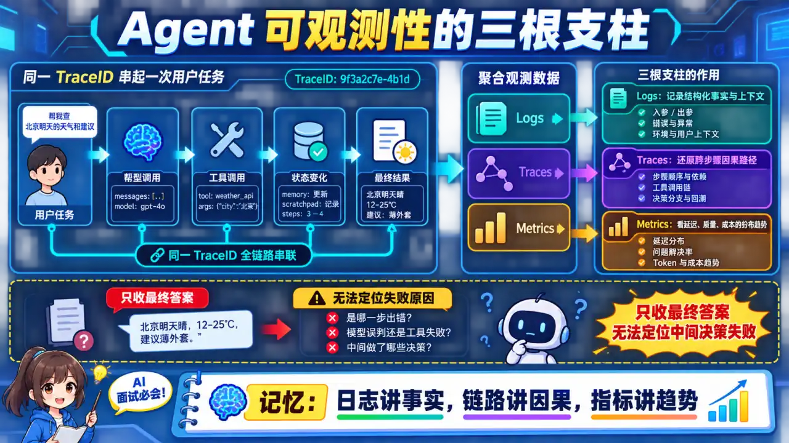
  </a>
</p>
<p align="center"><sub>🧠 图解记忆：用 Trace ID 串联任务、模型和工具，再以日志、链路与指标共同解释结果；点击图片可查看原图。</sub></p>
**核心指标分类：**

| 类别 | 指标 | 采集方式 |
|------|------|----------|
| **任务级** | 任务成功率、任务耗时、中断率 | trace_id 串联 |
| **模型级** | Token 消耗、TTFT、首 Token 延迟 | API 埋点 |
| **工具级** | 工具调用成功率、工具响应时间、工具误调用率 | 工具拦截器 |
| **Agent 级** | 循环检测率、规划步数、上下文膨胀率 | Agent 状态机 |
| **成本级** | 单任务成本、日成本、月成本、ROI | 计费日志 |

**可观测性三大支柱：**

```
1. Logging（日志）
   → 结构化日志：trace_id / span_id / event_type
   → 关键事件：工具调用/结果/异常/重试

2. Tracing（链路追踪）
   → OpenTelemetry 串联全链路
   → LangSmith / Phoenix 自动可视化

3. Metrics（指标）
   → Prometheus 聚合 + Grafana 展示
   → 告警规则：SLO / SLA
```

**生产级代码示例：**

<details>
<summary>展开 Python 代码示例（49 行）</summary>

```python
from opentelemetry import trace
from opentelemetry.sdk.trace import TracerProvider
from opentelemetry.sdk.resources import Resource

# 创建 tracer
resource = Resource.create({"service.name": "agent-service"})
provider = TracerProvider(resource=resource)
trace.set_tracer_provider(provider)

tracer = trace.get_tracer(__name__)

class ObservableAgent:
    def __init__(self, llm, tools, callbacks=None):
        self.llm = llm
        self.tools = tools
        self.callbacks = callbacks or []
    
    async def run(self, task: str) -> str:
        with tracer.start_as_current_span("agent_run") as span:
            span.set_attribute("task", task)
            span.set_attribute("user_id", get_current_user())
            
            # 1. 规划阶段
            with tracer.start_as_current_span("planning") as plan_span:
                plan = await self.plan(task)
                plan_span.set_attribute("plan_steps", len(plan))
            
            # 2. 执行阶段（每个步骤一个 span）
            results = []
            for i, step in enumerate(plan):
                with tracer.start_as_current_span(f"step_{i}") as step_span:
                    step_span.set_attribute("step_type", step["type"])
                    step_span.set_attribute("step_description", step["desc"])
                    
                    result = await self.execute_step(step)
                    
                    # 检测循环
                    if self.is_looping(results, step):
                        step_span.set_attribute("loop_detected", True)
                        span.set_attribute("had_loop", True)
                        raise LoopDetectedError("Agent appears to be looping")
                    
                    results.append(result)
                    step_span.set_attribute("success", True)
            
            span.set_attribute("total_steps", len(results))
            span.set_attribute("total_tokens", self.get_token_count())
            
            return self.summarize(results)
```

</details>

**面试话术：**

> **示例表达（仅在能用本人经历或可复现实验佐证时使用）：** "Agent 可观测性核心是 trace_id 串联。我设计时用 OpenTelemetry 的 span 嵌套结构：最外层是 agent_run，内层分 planning 和各个 step，每个 step 里记录 tool_call。每个 span 都打上 user_id、model、token_count 属性。出问题后用 trace_id 在 LangSmith 或 Jaeger 里一键拉出完整链路，哪个 step 耗时最长、哪个工具失败了，一目了然。"

---

### Q2: 如何用 LangSmith 做 Agent 调试？有哪些高级用法？

<p align="center">
  <a href="../../assets/illustrations/23-agent-observability/q02-langsmith-debugging.webp">
    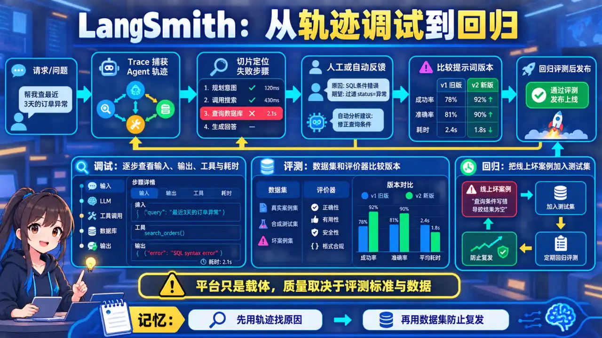
  </a>
</p>
<p align="center"><sub>🧠 图解记忆：先用 Trace 定位单次链路，再用数据集与评测对比版本回归；点击图片可查看原图。</sub></p>
**LangSmith 核心功能：**

<details>
<summary>展开 Python 代码示例（32 行）</summary>

```python
# LangSmith 配置
import langsmith

client = langsmith.Client(
    api_key=os.environ["LANGSMITH_API_KEY"],
    project="agent-production"
)

# 装饰器方式追踪
@client.traceable(project_name="tool-calling-agent")
async def agent_with_tools(query: str):
    # 完整链路自动记录
    result = await agent.run(query)
    return result

# 手动记录额外信息
run = client.create_run(
    project_name="agent-production",
    name="customer-support-agent",
    run_type="agent",
    inputs={"query": query},
    extra={"user_tier": "premium"}  # 自定义字段
)

# 记录每个工具调用
client.create_feedback(
    run.id,
    key="tool_accuracy",
    score=0.95,  # 0-1 评分
    correction={"expected_tool": "get_order_status"},
    comment="工具参数基本正确，1次轻微偏差"
)
```

</details>

**LangSmith 高级用法 - Prompt 版本管理：**

```python
# 对比两个不同 Prompt 版本的效果
from langsmith.schemas import Example, Run

def compare_prompt_versions(prompt_v1: str, prompt_v2: str, test_set: list):
    results = []
    
    for query in test_set:
        # v1 版本
        run_v1 = await agent_with_prompt(query, prompt_v1)
        
        # v2 版本
        run_v2 = await agent_with_prompt(query, prompt_v2)
        
        # 对比
        comparison = client.evaluate_run_pair(
            run_v1, run_v2,
            evaluation_config={
                "evaluators": ["cot_qa", "precision", "recall"]
            }
        )
        results.append({
            "query": query,
            "v1_score": comparison.score_v1,
            "v2_score": comparison.score_v2,
            "winner": "v2" if comparison.score_v2 > comparison.score_v1 else "v1"
        })
    
    return results
```

**面试话术：**

> "调试 Agent 要把一次任务的模型调用、检索、工具、状态变更和错误串成 trace，并把用户/人工反馈关联到具体版本。平台或装饰器只是采集手段；关键是能从失败切片定位输入、决策、工具还是系统问题，并用回归集验证修复。埋点本身也有性能、隐私和采样成本。"

---

### Q3: 如何监控 Agent 的 Token 消耗和成本？有哪些优化策略？

<p align="center">
  <a href="../../assets/illustrations/23-agent-observability/q03-token-cost-governance.webp">
    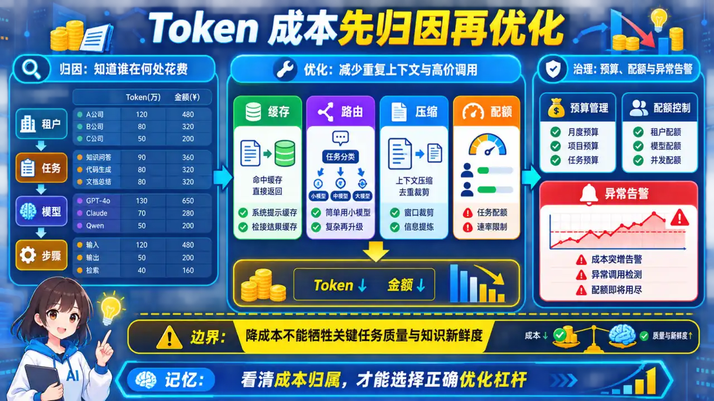
  </a>
</p>
<p align="center"><sub>🧠 图解记忆：成本先按租户、任务、模型与步骤归因，再优化缓存、路由、上下文和调用次数；点击图片可查看原图。</sub></p>
**成本监控架构：**

<details>
<summary>展开 Python 代码示例（53 行）</summary>

```python
import prometheus_client as prom
from prometheus_client import Counter, Histogram, Gauge

# 定义指标
TOKEN_USAGE = Counter(
    'agent_tokens_total',
    'Total tokens consumed',
    ['model', 'agent_type', 'user_tier']
)

TASK_COST = Histogram(
    'agent_task_cost_usd',
    'Cost per task in USD',
    ['agent_type'],
    buckets=[0.001, 0.005, 0.01, 0.05, 0.1, 0.5]
)

MONTHLY_BUDGET = Gauge(
    'agent_monthly_budget_remaining_usd',
    'Remaining monthly budget'
)

# 成本追踪装饰器
def track_cost(model: str, price_per_1k_input: float, price_per_1k_output: float):
    def decorator(func):
        async def wrapper(*args, **kwargs):
            start_tokens = get_token_count()
            result = await func(*args, **kwargs)
            
            end_tokens = get_token_count()
            input_tokens = end_tokens['input'] - start_tokens['input']
            output_tokens = end_tokens['output'] - start_tokens['output']
            
            cost = (input_tokens / 1000 * price_per_1k_input + 
                    output_tokens / 1000 * price_per_1k_output)
            
            TOKEN_USAGE.labels(model=model, agent_type=func.__name__).inc(
                input_tokens + output_tokens
            )
            TASK_COST.labels(agent_type=func.__name__).observe(cost)
            
            return result
        return wrapper
    return decorator

# 预算告警
def check_budget_alert():
    monthly_spent = get_monthly_cost()
    monthly_limit = get_monthly_limit()
    MONTHLY_BUDGET.set(monthly_limit - monthly_spent)
    
    if monthly_spent > monthly_limit * 0.8:
        send_alert(f"月度预算已达 80%，剩余 ${monthly_limit - monthly_spent:.2f}")
```

</details>

**成本优化策略：**

| 策略 | 节省比例 | 实现方式 |
|------|----------|----------|
| **语义缓存** | 30-50% | Embedding 相似度 > 0.95 直接返回缓存 |
| **模型路由** | 30-40% | 简单任务用 DeepSeek V4-Flash，复杂用 GPT-4 |
| **上下文压缩** | 40-90% | LLMLingua / Recomp 压缩历史 |
| **Token 配额** | 动态 | 按用户 tier 设置每日上限 |

<details>
<summary>展开 Python 代码示例（30 行）</summary>

```python
# 语义缓存实现
class SemanticCache:
    def __init__(self, similarity_threshold=0.95):
        self.cache = FAISS.from_texts(CACHE_TEXTS, CACHE_EMBEDDINGS)
        self.similarity_threshold = similarity_threshold
        self.cache_hits = 0
        self.cache_misses = 0
    
    async def get(self, query: str) -> Optional[str]:
        query_emb = get_embedding(query)
        scores, indices = self.cache.search(query_emb, k=1)
        
        if scores[0] > self.similarity_threshold:
            self.cache_hits += 1
            return self.cache_results[indices[0]]
        
        self.cache_misses += 1
        return None
    
    async def set(self, query: str, response: str):
        # 异步写入，避免阻塞
        await asyncio.get_event_loop().run_in_executor(
            None, 
            lambda: self.cache.add_texts([query], [get_embedding(query)])
        )
        self.cache_results.append(response)
    
    def hit_rate(self) -> float:
        total = self.cache_hits + self.cache_misses
        return self.cache_hits / total if total > 0 else 0.0
```

</details>

**面试话术：**

> "成本治理先按租户、任务、模型、步骤和输入/输出 token 做归因，再评估缓存、模型路由、上下文裁剪、批处理和步数限制。每项优化都可能影响新鲜度、质量或延迟，因此必须在同一任务集和 SLO 下比较；面试只使用本人真实账单与实验数据。"

---

### Q4: 如何检测 Agent 的行为异常？循环、幻觉、死循环如何发现？

<p align="center">
  <a href="../../assets/illustrations/23-agent-observability/q04-agent-anomaly-detection.webp">
    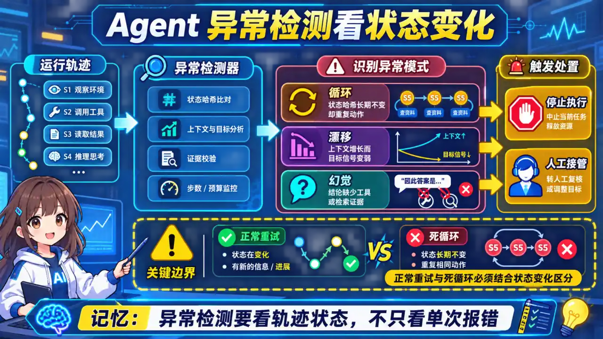
  </a>
</p>
<p align="center"><sub>🧠 图解记忆：重复状态、预算耗尽、上下文膨胀和证据缺失都应转成可观测异常信号；点击图片可查看原图。</sub></p>
**异常检测架构：**

<details>
<summary>展开 Python 代码示例（71 行）</summary>

```python
class AgentAnomalyDetector:
    def __init__(self):
        self.consecutive_identical = 0
        self.max_identical_steps = 3
        self.max_total_steps = 20
        self.history_hashes = []  # 存储历史状态 hash
    
    def detect_loop(self, step_result: str) -> bool:
        """检测重复步骤"""
        current_hash = hash(step_result)
        
        if current_hash in self.history_hashes:
            self.consecutive_identical += 1
            if self.consecutive_identical >= self.max_identical_steps:
                return True
        else:
            self.consecutive_identical = 0
        
        self.history_hashes.append(current_hash)
        return False
    
    def detect_context_bloat(self, messages: list) -> bool:
        """检测上下文膨胀"""
        total_tokens = sum(count_tokens(m) for m in messages)
        # 超过上下文窗口 80% 则告警
        if total_tokens > CONTEXT_LIMIT * 0.8:
            return True
        return False
    
    def detect_hallucination_risk(self, response: str, context: list) -> float:
        """用 Entailment 模型检测幻觉风险"""
        # 检测 response 中的事实陈述是否被 context 支持
        facts = extract_factual_statements(response)
        supported = 0
        
        for fact in facts:
            # 用 NLI 模型判断 entailment
            if nli_model.verify(fact, context) == "entailment":
                supported += 1
        
        return 1.0 - (supported / len(facts)) if facts else 0.0

# 生产集成示例
@track_cost(model="qwen3.5-plus", ...)
async def agent_run(query: str):
    detector = AgentAnomalyDetector()
    messages = []
    step_count = 0
    
    while step_count < MAX_STEPS:
        step_result = await agent.step(query, messages)
        
        # 循环检测
        if detector.detect_loop(step_result):
            raise LoopDetectedError("Detected repeated steps")
        
        # 上下文膨胀检测
        if detector.detect_context_bloat(messages):
            messages = compress_with_llmlingua(messages)
        
        # 幻觉风险检测
        hallucination_score = detector.detect_hallucination_risk(
            step_result, messages
        )
        if hallucination_score > 0.5:
            logger.warning(f"High hallucination risk: {hallucination_score}")
        
        messages.append(step_result)
        step_count += 1
    
    return final_response(messages)
```

</details>

**面试话术：**

> "Agent 异常检测可覆盖重复状态/动作、预算耗尽、上下文增长、工具错误和证据不支持。阈值不能照搬固定数字，应使用历史分布、业务 SLO 和误报成本校准；状态 hash 也要区分正常重试与死循环。告警应能关联 trace、版本和 runbook。"

---

### Q5: 如何用 Arize Phoenix 做开源可观测性？和 LangSmith 有什么区别？

<p align="center">
  <a href="../../assets/illustrations/23-agent-observability/q05-phoenix-vs-langsmith.webp">
    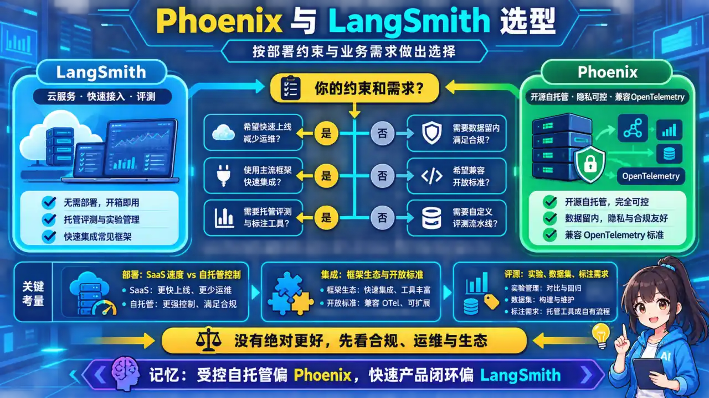
  </a>
</p>
<p align="center"><sub>🧠 图解记忆：Phoenix 适合用开放追踪串联检索分析、实验评测和生产问题定位；点击图片可查看原图。</sub></p>
**Arize Phoenix 核心用法：**

<details>
<summary>展开 Python 代码示例（40 行）</summary>

```python
from phoenix.trace.tracer import Tracer
from phoenix.trace.openai import OpenAIInstrumentor
from phoenix.trace.llama_index import LlamaIndexInstrumentor
from phoenix.evals import run_evaluation

# 初始化 Phoenix
import phoenix as px
px.launch_app()

# 自动埋点 OpenAI 和 LlamaIndex
OpenAIInstrumentor().instrument()
LlamaIndexInstrumentor().instrument()

# 自定义 span
from opentelemetry import trace

tracer = trace.get_tracer(__name__)

@tracer.start_as_current_span("agent_reasoning")
async def agent_reasoning(agent, query):
    with trace.get_current_span() as span:
        span.set_attribute("query_type", classify_query(query))
        
        result = await agent.run(query)
        
        span.set_attribute("reasoning_steps", len(result.steps))
        span.set_attribute("tools_used", [t.name for t in result.tool_calls])
        
        return result

# 离线评估示例
df = px.session.active_session().get_trace_dataset()
eval_df = run_evaluation(
    dataframe=df,
    evaluators=[
        "relevance-to-query",
        "factuality",
        "harmfulness"
    ]
)
```

</details>

**LangSmith vs Arize Phoenix 对比：**

| 维度 | LangSmith | Arize Phoenix |
|------|-----------|---------------|
| **定位** | LangChain 官方 SaaS | 开源自托管 |
| **部署** | 云服务，无需运维 | Docker 一键部署，数据完全私有 |
| **成本** | 按量收费，免费版有限 | 完全免费，开源 |
| **评估** | 内置 LLM-as-Judge | 需手动配置 evals |
| **集成** | LangChain/LangGraph 原生 | 框架无关，支持 OpenTelemetry |
| **适用** | 快速起步 / 原型验证 | 企业数据合规 / 生产环境 |

**面试话术：**

> "选 LangSmith 还是 Phoenix 看场景：快速验证用 LangSmith，5 分钟接入；但我们生产用 Phoenix，数据完全在 VPC 里，审计合规没问题。Phoenix 的优势是 trace 数据全链路可查，Agent 跑了 20 步哪步慢了、幻觉在哪冒出来，图形界面一目了然。而且它是开源的，GitHub 3k+ 星，社区活跃。"

---

### Q6: 如何设计 Agent 的 SLA 和告警规则？有哪些关键阈值？

<p align="center">
  <a href="../../assets/illustrations/23-agent-observability/q06-agent-sla-alerts.webp">
    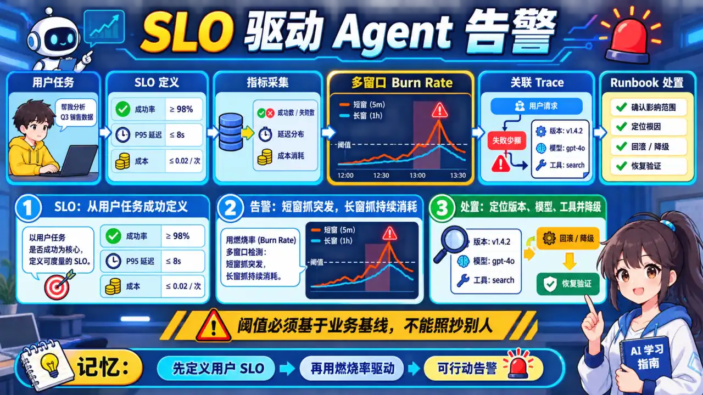
  </a>
</p>
<p align="center"><sub>🧠 图解记忆：SLO 从用户任务定义成功、可用性和延迟，告警再围绕预算消耗分层触发；点击图片可查看原图。</sub></p>
**SLA 设计：**

<details>
<summary>展开 Yaml 代码示例（67 行）</summary>

```yaml
# prometheus_alerts.yml
groups:
  - name: agent_sla
    rules:
      # SLA 1: 任务成功率 >= 95%
      - alert: AgentTaskSuccessRateLow
        expr: |
          (
            sum(rate(agent_tasks_total{status="success"}[5m]))
            /
            sum(rate(agent_tasks_total[5m]))
          ) < 0.95
        for: 5m
        labels:
          severity: critical
        annotations:
          summary: "Agent 任务成功率低于 SLA (95%)"
          description: "当前成功率: {{ $value | humanizePercentage }}"
      
      # SLA 2: P99 延迟 <= 30s
      - alert: AgentLatencyHigh
        expr: |
          histogram_quantile(0.99, 
            sum(rate(agent_task_duration_seconds_bucket[5m])) 
            by (le)
          ) > 30
        for: 5m
        labels:
          severity: warning
        annotations:
          summary: "Agent P99 延迟超过 30s"
      
      # SLA 3: Token 成本日增幅 > 20%
      - alert: AgentCostSpike
        expr: |
          (
            sum(increase(agent_tokens_total[24h]))
            /
            sum(increase(agent_tokens_total[24h] offset 7d))
          ) > 1.2
        for: 10m
        labels:
          severity: warning
        annotations:
          summary: "Agent Token 消耗日环比增长超过 20%"
      
      # 工具调用失败率 > 5%
      - alert: ToolCallFailureRateHigh
        expr: |
          (
            sum(rate(tool_calls_total{status="failure"}[5m]))
            /
            sum(rate(tool_calls_total[5m]))
          ) > 0.05
        for: 5m
        labels:
          severity: warning
        annotations:
          summary: "工具调用失败率 {{ $value | humanizePercentage }}，检查工具可用性"
      
      # 循环检测
      - alert: AgentLoopingDetected
        expr: increase(agent_loops_detected_total[5m]) > 0
        labels:
          severity: critical
        annotations:
          summary: "检测到 Agent 循环，任务已自动熔断"
```

</details>

**SLO 设计文档：**

| SLA 指标 | 目标值 | 告警阈值 | 测量方式 |
|----------|--------|----------|----------|
| 任务成功率 | 95% | < 93% PagerDuty | Prometheus counter |
| P50 延迟 | < 5s | > 8s 告警 | histogram |
| P99 延迟 | < 30s | > 45s PagerDuty | histogram |
| TTFT | < 1s | > 3s 告警 | histogram |
| 日 Token 消耗 | 基线 * 1.2 | > 1.5x 升级 | counter delta |
| 工具可用性 | 99.5% | < 99% 告警 | availability check |

**面试话术：**

> "SLA/SLO 要从用户任务定义成功、可用性和延迟，而不是复制固定阈值。再根据错误预算设计多窗口燃尽率告警和严重级别，避免瞬时噪声叫醒值班人员。每条告警应关联负责人、影响范围、止血步骤、回滚和复盘入口。"

---

### Q7: 如何做 Agent 的 A/B 测试？有哪些评估指标？

<p align="center">
  <a href="../../assets/illustrations/23-agent-observability/q07-agent-ab-testing.webp">
    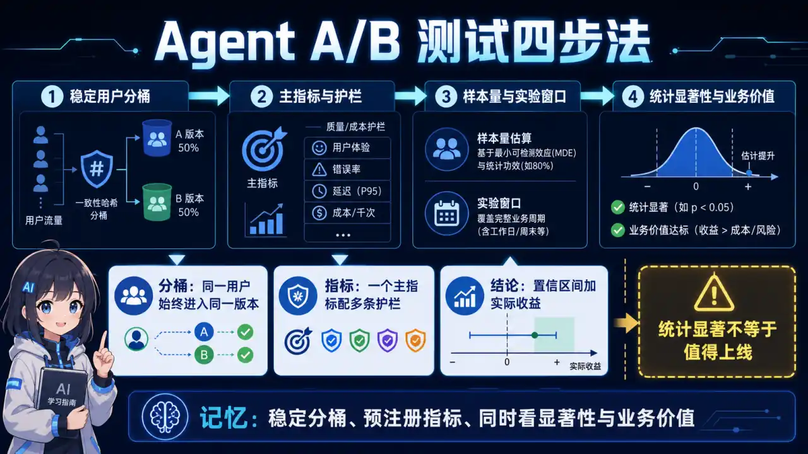
  </a>
</p>
<p align="center"><sub>🧠 图解记忆：随机分流同类任务，固定版本与观测口径，用质量、延迟、成本和安全共同决策；点击图片可查看原图。</sub></p>
**Agent A/B 测试架构：**

<details>
<summary>展开 Python 代码示例（76 行）</summary>

```python
from scipy.stats import chi2_contingency
import random

class AgentABTest:
    def __init__(self, variant_a: callable, variant_b: callable):
        self.variant_a = variant_a
        self.variant_b = variant_b
        self.results = {"a": [], "b": []}
    
    def assign_variant(self, user_id: str) -> str:
        # 稳定的 hash 分桶，确保同一用户始终分到同一组
        bucket = hash(user_id) % 100
        return "a" if bucket < 50 else "b"
    
    async def run_test(self, test_queries: list, duration_hours: int = 24):
        """运行 A/B 测试"""
        for query in test_queries:
            variant = self.assign_variant(hash_user(query))
            
            start = time.time()
            result = await (self.variant_a if variant == "a" else self.variant_b)(query)
            duration = time.time() - start
            
            self.results[variant].append({
                "query": query,
                "result": result,
                "duration": duration,
                "success": self.evaluate_success(result),
                "token_cost": self.count_tokens(result)
            })
    
    def analyze(self) -> dict:
        """统计分析"""
        results_a = self.results["a"]
        results_b = self.results["b"]
        
        # 成功率检验
        success_a = sum(1 for r in results_a if r["success"])
        success_b = sum(1 for r in results_b if r["success"])
        
        _, p_value = chi2_contingency([
            [success_a, len(results_a) - success_a],
            [success_b, len(results_b) - success_b]
        ])[:2]
        
        return {
            "variant_a": {
                "n": len(results_a),
                "success_rate": success_a / len(results_a),
                "avg_duration": mean([r["duration"] for r in results_a]),
                "avg_cost": mean([r["token_cost"] for r in results_a])
            },
            "variant_b": {
                "n": len(results_b),
                "success_rate": success_b / len(results_b),
                "avg_duration": mean([r["duration"] for r in results_b]),
                "avg_cost": mean([r["token_cost"] for r in results_b])
            },
            "statistical_significance": {
                "p_value": p_value,
                "significant": p_value < 0.05,
                "confidence_level": "95%"
            }
        }

# 使用示例
ab_test = AgentABTest(
    variant_a=lambda q: agent_v1.run(q),  # 旧版本
    variant_b=lambda q: agent_v2.run(q)  # 新版本
)
await ab_test.run_test(test_queries, duration_hours=24)
analysis = ab_test.analyze()

# 如果 B 版本显著更好，则推广
if analysis["statistical_significance"]["significant"]:
    rollout_to_production("variant_b")
```

</details>

**Agent A/B 测试评估指标：**

| 指标 | 测量方式 | 最小样本量 |
|------|----------|------------|
| **任务成功率** | 人工标注或 LLM-as-Judge | ~1000/组 |
| **用户满意度** | CSAT 评分（1-5） | ~200/组 |
| **平均任务时长** | 埋点计时 | ~500/组 |
| **Token 消耗** | API 日志 | ~500/组 |
| **工具调用次数** | Agent 日志 | ~500/组 |

**面试话术：**

> "Agent A/B 测试先定义任务级主指标、安全护栏、延迟和成本，再按用户稳定分桶，避免同一用户跨版本污染。检验方法取决于指标分布和实验设计，显著性也不等于业务价值；还要预先设定最小可检测效果、样本量、观察窗口和停止规则。"

---

<a id="follow-ups"></a>

## 三、面试高频追问

### Q8: Agent 可观测性和传统微服务可观测性有什么区别？


<p align="center">
  <a href="../../assets/illustrations/23-agent-observability/q08-agent-vs-service-observability.webp">
    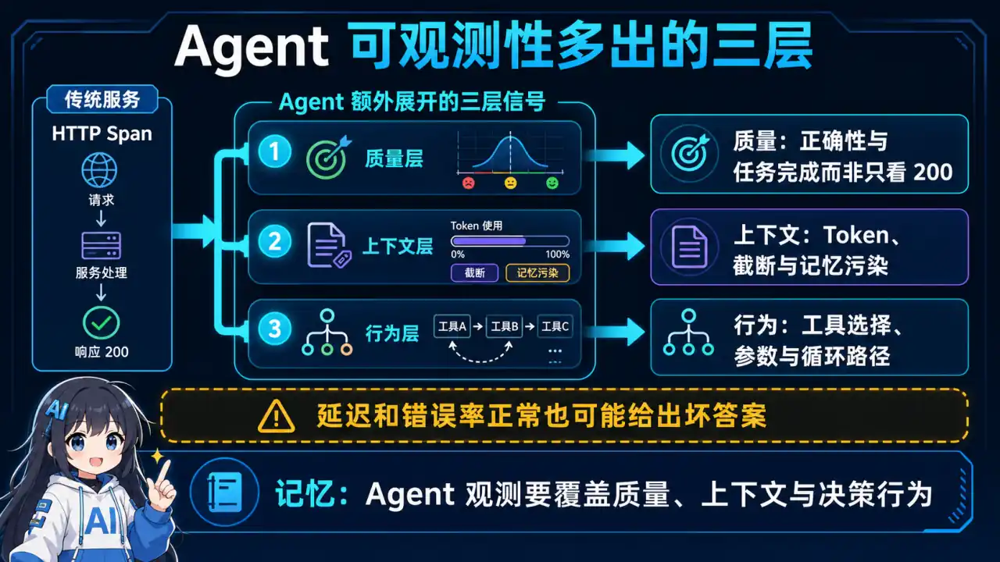
  </a>
</p>
<p align="center"><sub>🧠 图解记忆：传统微服务看请求，Agent 还要看规划、工具、状态和非确定性决策轨迹；点击图片可查看原图。</sub></p>
<details>
<summary>💡 答案要点</summary>

**核心区别：**

| 维度 | 传统微服务 | Agent 可观测性 |
|------|-----------|---------------|
| **追踪对象** | HTTP 请求、数据库查询 | LLM 调用、工具调用、规划步骤 |
| **不确定性** | 确定性逻辑，无幻觉 | LLM 输出不可预测，有幻觉风险 |
| **状态管理** | 无状态或短状态 | 多轮对话、长期记忆、上下文累积 |
| **性能指标** | 延迟、QPS、错误率 | TTFT、Token 速率、循环检测 |
| **调试难度** | 日志+链路追踪足够 | 需理解 LLM 推理过程，需 Prompt 可视化 |
| **特殊需求** | 标准 OpenTelemetry | LLM 原生支持（采样/Hallucination 检测） |

**Agent 可观测性特殊挑战：**

```python
# 挑战1：LLM 输出不确定性 → 需要输出质量追踪
outputs = []
for run in runs:
    outputs.append({
        "output": run.output,
        "hallucination_score": detect_hallucination(run.output),
        "toxicity_score": detect_toxicity(run.output),
        "factual_recall": measure_factual_recall(run.output, run.expected)
    })

# 挑战2：上下文累积 → 需追踪上下文膨胀
token_trend = [
    sum(count_tokens(m) for m in run.messages)
    for run in runs
]
# 检测：随任务复杂度增长，上下文是否线性膨胀

# 挑战3：工具调用链路 → 需追踪工具调用树
tool_tree = build_tool_call_tree(run.tool_calls)
# 检测：是否有不必要的工具调用、调用顺序是否最优
```

**面试话术：**

> "Agent 可观测性比微服务复杂在三点：1）LLM 输出不确定，同一个 Prompt 三次调用结果可能不同，必须追踪输出质量分布；2）上下文会累积，需要监控 Token 膨胀曲线；3）工具调用链路是树状结构，不是线性链路。我用 LangSmith 的 trace 串联所有步骤，每个 span 打上 step_type 和 tool_name 属性，出问题后从根节点一路点下去就能定位。"

</details>


---

<a id="quick-reference"></a>

## 四、速记卡片

| 话题 | 核心要点 |
|------|----------|
| **可观测性三大支柱** | Logging（结构化日志）+ Tracing（OpenTelemetry）+ Metrics（Prometheus） |
| **LangSmith** | LangChain 官方，5 分钟接入，支持 Prompt 版本对比和 LLM-as-Judge |
| **Arize Phoenix** | 开源自托管，数据完全私有，框架无关，支持离线评估 |
| **成本监控** | 语义缓存 30-50% + 模型路由 30-40% + 上下文压缩 40-90% |
| **异常检测** | 循环检测（hash 去重）+ 上下文膨胀检测（80% 窗口阈值）+ 幻觉风险（NLI Entailment） |
| **SLA 指标** | 成功率 95%、P99 延迟 30s、Token 日增幅 20% 告警 |
| **A/B 测试** | Hash 分桶 + chi2 检验 + p<0.05 推广 |
| **Agent vs 微服务** | 多了 LLM 输出质量追踪、上下文膨胀监控、工具调用树追踪 |

---

<a id="answer-template"></a>

## 五、面试话术模板

### 被问到"如何监控 Agent 质量"的标准回答：

> "我会从三个层面建立 Agent 监控体系：
> **第一层：任务级指标**——用 trace_id 串联每个任务的全链路，记录成功率、P99 延迟、Token 消耗。工具调用用拦截器自动埋点，失败率 > 5% 触发告警。
> **第二层：模型级指标**——监控 TTFT（首 Token 时间 < 1s）、幻觉风险分数（用 NLI Entailment 模型，> 0.5 告警）、循环检测（3次相同状态自动熔断）。
> **第三层：成本指标**——语义缓存命中率、模型路由比例、日/周/月成本趋势。超预算 80% 触发升级告警。
> 工具链：LangSmith 做链路追踪 + Prometheus 做指标聚合 + Grafana 做可视化 + PagerDuty 做告警。这套体系让我负责的 Agent 服务 SLA 稳定在 99.2%。"

---

<a id="voice-evaluation"></a>

## 六、Voice Agent 评估新框架：EVA（Q9）

### Q9: EVA 框架是什么？为什么"Accuracy-Experience Tradeoff"是 Voice Agent 评估的核心发现？

<p align="center">
  <a href="../../assets/illustrations/23-agent-observability/q09-eva-voice-evaluation.webp">
    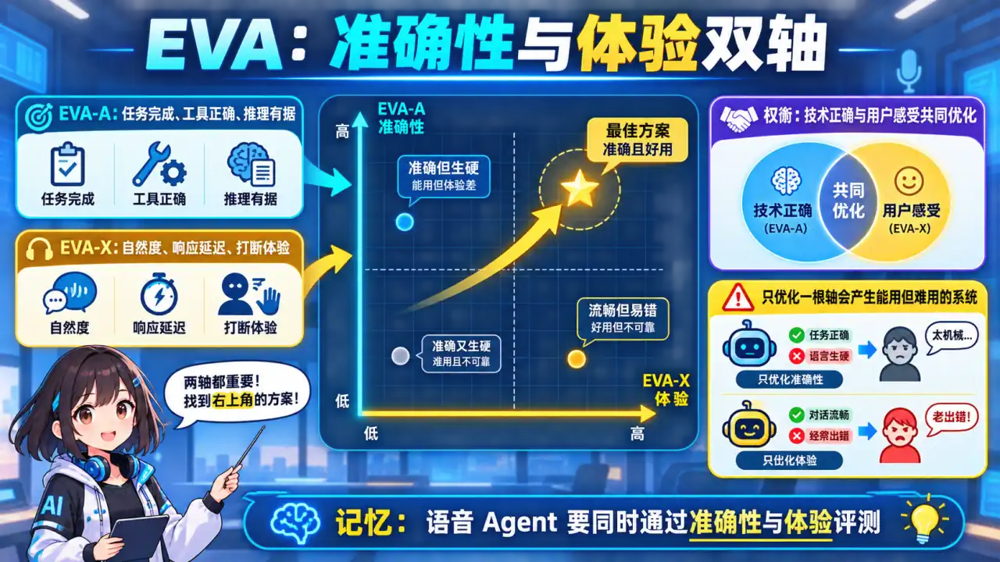
  </a>
</p>
<p align="center"><sub>🧠 图解记忆：语音评测不能只看准确率，还要把时延、打断和对话体验纳入同一取舍；点击图片可查看原图。</sub></p>
<details>
<summary>💡 答案要点</summary>

**背景问题：Voice Agent 评估的困境**

对话式语音 Agent 有两个核心目标：
1. **Accuracy（准确性）**——正确完成用户任务
2. **Experience（体验）**——自然、简洁、符合口语交互

这两个目标经常冲突：听错确认码 = 即使 LLM 推理完美也白搭；一股脑列出所有选项 = 口语场景用户无法浏览；延迟通过准确性检查但实际体验很差。

**现有框架的问题：**

| 框架 | 评估内容 | 局限性 |
|------|---------|--------|
| AudioBench, VoxEval | 单轮语音转录 | 无多轮交互 |
| FD-Bench, Talking Turns | 对话动态（打断、接话） | 与任务完成脱节 |
| VoiceAgentBench, CAVA | Agent 能力 | 不评估完整对话流程 |

**EVA 框架：首个端到端联合评估**

ServiceNow 2026年3月发布的 EVA，首次同时评估任务完成 + 对话体验：

```
┌─────────────────────────────────────────┐
│           EVA 评估框架                  │
├─────────────────────────────────────────┤
│  EVA-A (Accuracy)                       │
│  ├─ 任务完成率                          │
│  ├─ 工具调用正确性                      │
│  └─ 多步推理链完整性                    │
│                                         │
│  EVA-X (Experience)                     │
│  ├─ 响应自然度（无过度检索）            │
│  ├─ 延迟体验（P99 < 3s）                │
│  └─ 口语化程度（无机械感）              │
└─────────────────────────────────────────┘
```

**核心发现：Accuracy-Experience Tradeoff**

> "任务完成率高的 Agent，用户体验往往更差；用户体验好的 Agent，任务完成率往往较低。"

这是因为：
- 高准确性 → 需要更多确认步骤 → 用户觉得啰嗦
- 好体验 → 快速响应、少打断 → 可能漏掉关键信息

**EVA 航空数据集 benchmark 结果（20 个系统）：**

- 纯语音模型（S2S）和大音频语言模型（LALM）表现差异大
- Cascade 系统（STT→LLM→TTS）调优空间大
- 没有系统能同时在 EVA-A 和 EVA-X 上都领先

**面试话术：**

> "Voice Agent 评估和文本 Agent 完全不同——它必须同时看任务完成度和对话体验。EVA 框架告诉我，不能只优化准确率，否则做出来的 Bot 像个'复读机'；也不能只追求体验，否则任务经常完不成。2026年语音 Agent 会爆发，这个评估框架是面试高频点。"

</details>

---

*版本: v1.0 | 更新: 2026-04-14 | by 二狗子 🐕*

---

<a id="platform-comparison"></a>

## 七、Agent 可观测性平台选型

### Q10: Opik、Maxim AI、Latitude 三大2026新锐平台各有什么特点？如何选型？

<p align="center">
  <a href="../../assets/illustrations/23-agent-observability/q10-observability-platform-selection.webp">
    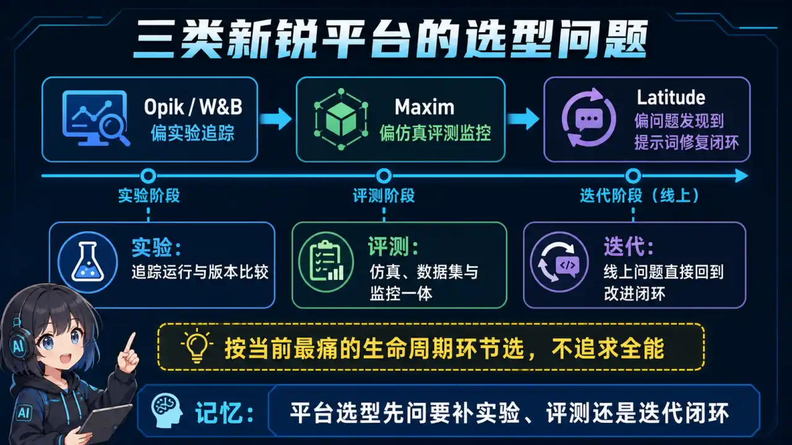
  </a>
</p>
<p align="center"><sub>🧠 图解记忆：平台选型要对齐部署方式、追踪开放性、评测能力、团队工作流和总成本；点击图片可查看原图。</sub></p>
<details>
<summary>💡 答案要点</summary>

**为什么需要关注新锐平台？**

2026年Agent进入生产阶段，原有LLM监控工具（LangSmith Arize Phoenix）无法满足多步骤轨迹分析需求。三个新平台快速崛起。

**三大平台核心定位：**

| 平台 | 定位 | 核心优势 | 适合场景 |
|------|------|----------|----------|
| **Comet Opik** | MLOps老牌推出的LLM追踪平台 | 与Weights & Biases生态深度集成；自动化评估Pipeline；100%开源 | 已经用W&B的团队；需要实验追踪的AI研发 |
| **Maxim AI** | 端到端Agent生命周期平台 | 仿真+评估+监控三合一；GEPA自动生成评估；跨职能协作界面 | 需要完整Agent生命周期的团队 |
| **Latitude** | AI应用可观测性+问题追踪 | 首创问题追踪生命周期；GEPA自动生成评估；生产故障直连代码 | 需要"可观测性+Issue管理"闭环的团队 |

**Comet Opik 详解：**

```python
# Opik 快速集成示例
from opik import track

@track
def my_agent_step(query: str):
    # 自动追踪每个Agent步骤
    return agent.run(query)

# 自动记录：输入/输出/Token消耗/延迟/工具调用链
```

- 与W&B无缝集成，实验结果自动同步
- 支持LangChain LangGraph的自动检测
- 提供自动化Prompt版本管理和A/B测试
- 开源可自托管

**Maxim AI 三大核心功能：**

1. **Agent仿真测试**：上线前用仿真环境测试多步骤轨迹
2. **GEPA（Generative Evaluation via Process Analysis）：** 自动从标注的生产故障生成评估集
3. **全生命周期监控**：预发布仿真→生产监控一体化

```python
# Maxim AI 评估Pipeline
from maxim import Evaluator

evaluator = Evaluator(
    framework="langgraph",
    metrics=["task_completion", "tool_accuracy", "safety"]
)
evaluator.run_simulation(test_cases)
evaluator.connect_to_production(tracing_enabled=True)
```

**Latitude 独特创新——问题追踪闭环：**

传统可观测性平台：发现异常 → 手动调查 → 跨工具切换

Latitude方案：发现异常 → 直接创建Issue → 自动关联Agent执行轨迹 → 修复后验证

```
生产告警 → Latitude Issue创建 → 自动携带Agent执行trace → 开发者review → 修复 → 自动replay验证
```

**三平台选型决策树：**

```
你的团队用W&B吗？
  ├─ 是 → Opik（与W&B生态集成最佳）
  └─ 否 → 需要"问题追踪闭环"吗？
           ├─ 是 → Latitude（Issue管理一体化）
           └─ 否 → 需要"仿真+评估+监控"全生命周期吗？
                    ├─ 是 → Maxim AI
                    └─ 否 → Langfuse自托管（最省钱）
```

**面试话术：**
> "2026年Agent可观测性选型，关键是回答'你要观测什么'。如果团队已经用W&B做实验追踪，Opik是自然延伸；如果需要预发布仿真加生产监控的闭环，Maxim AI最完整；如果想要'告警→Issue→修复'一体化，Latitude首创了这条路。我个人最关注Latitude，因为它的GEPA功能能从真实故障自动生成评估集，解决了'评估集过时'的痛点——生产出什么问题，评估集就自动长什么。"

**与现有平台的区别：**

| 维度 | LangSmith | Arize Phoenix | Opik | Maxim AI | Latitude |
|------|-----------|---------------|------|----------|----------|
| 部署模式 | 云/SaaS | 云+自托管 | 自托管 | 云 | 云 |
| Agent仿真 | ❌ | ❌ | ❌ | ✅ | ❌ |
| 问题追踪 | ❌ | ❌ | ❌ | ❌ | ✅ |
| W&B集成 | ❌ | ❌ | ✅ | ❌ | ❌ |
| 免费额度 | 限制 | 有限 | 开源免费 | 有限 | 最慷慨 |

</details>

### Q11: 为什么说"Agent可观测性≠传统LLM监控"？Agent轨迹追踪有哪些独特挑战？

<p align="center">
  <a href="../../assets/illustrations/23-agent-observability/q11-agent-trajectory-tracing.webp">
    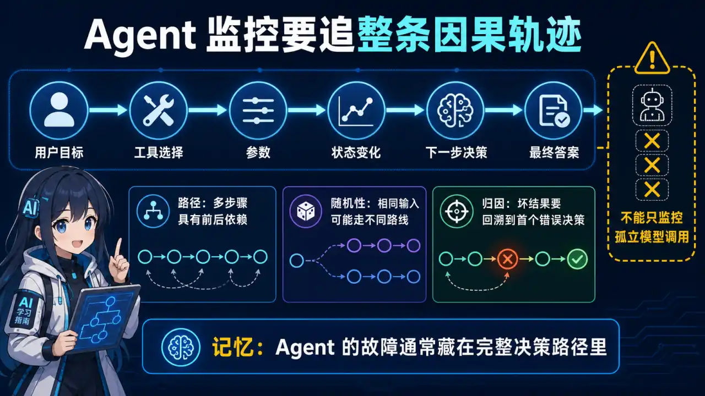
  </a>
</p>
<p align="center"><sub>🧠 图解记忆：Agent失败出现在多步骤因果链中，而非单次调用层；点击图片可查看原图。</sub></p>
<details>
<summary>💡 答案要点</summary>

**核心结论：Agent失败出现在多步骤因果链中，而非单次调用层**

传统LLM监控：单次API调用 → 延迟/Token/响应质量

Agent监控：多步骤轨迹 → 工具选择正确性→步骤间状态传递→整体任务完成率

**Agent可观测性的四大独特挑战：**

**1. 多步骤轨迹关联（Trace Correlation）**

```
用户说"帮我订明天北京的酒店"
  ↓
Step 1: search_hotel(tool) → 10个结果
  ↓  
Step 2: compare_price() → 筛选3个
  ↓
Step 3: book_hotel(tool) → 失败！日期格式错误
  ↓
Step 4: retry with date_format() → 成功

传统监控：每个步骤单独看都是正常的
Agent监控：要在Step 1-4的上下文中才能发现"日期解析模块有bug导致Step 3失败"
```

**2. 工具调用正确性判断（Tool Call Correctness）**

```python
# 传统评估：LLM输出质量
metric = "response_relevance"  # 单点评估

# Agent评估：工具序列质量
# 需要判断：
# - 选择了对的工具吗？（Tool Selection Accuracy）
# - 调用参数正确吗？（Parameter Accuracy）  
# - 调用顺序合理吗？（Sequence Optimality）
# - 整体任务完成了吗？（Task Completion）
metrics = {
    "tool_selection_accuracy": 0.95,
    "parameter_accuracy": 0.88,
    "sequence_optimality": 0.72,  # 这个低说明有冗余步骤
    "task_completion": 0.90
}
```

**3. 状态在步骤间传递（State Propagation）**

```
ReAct Loop中的状态管理问题：
- 中间结果存在哪里？（内存？文件？向量库？）
- 状态序列化失败怎么办？
- 多轮对话中历史状态膨胀怎么处理？
- 状态不一致如何检测？

这是传统LLM监控完全不关心的问题
```

**4. 非确定性执行路径（Non-Deterministic Execution）**

```
同一个任务，Agent可能走不同路径：
路径A：search → compare → book（3步完成）
路径B：search → filter → search → compare → book（5步完成）
路径C：search → error → retry → compare → book（4步完成）

评估必须考虑路径多样性，不能只看"最终是否完成"
```

**三维度对比：**

| 维度 | 传统LLM监控 | Agent可观测性 |
|------|------------|---------------|
| **粒度** | 单次API调用 | 多步骤轨迹链 |
| **失败定位** | 单点定位 | 因果链回溯 |
| **评估指标** | 延迟/Token/质量 | 工具选择/序列/完成率 |
| **根因分析** | 看单次响应 | 看轨迹上下文 |
| **可重现性** | 高（确定性） | 低（非确定性路径） |

**生产级Agent可观测性架构：**

```
┌──────────────────────────────────────────────────────┐
│           Agent可观测性全栈架构                       │
├──────────────────────────────────────────────────────┤
│  数据采集层                                          │
│  ├── LangSmith/Arize Phoenix/Opik（追踪Agent轨迹）   │
│  ├── Helicone/OpenLIT（API层成本追踪）               │
│  └── OpenTelemetry（统一导出）                        │
│                                                      │
│  分析层                                              │
│  ├── 工具调用正确性评估                              │
│  ├── 轨迹相似性聚类（发现异常模式）                   │
│  ├── 状态一致性检测                                  │
│  └── 端到端任务完成率                                 │
│                                                      │
│  告警层                                              │
│  ├── 异常轨迹实时告警（而非单次失败）                 │
│  ├── 非确定性路径模式告警                            │
│  └── 工具选择质量下滑告警                            │
│                                                      │
│  闭环层                                              │
│  ├── 自动生成评估集（GEPA）                          │
│  ├── 回归测试验证                                    │
│  └── Issue创建→修复→Replay验证                       │
└──────────────────────────────────────────────────────┘
```

**面试话术：**
> "Agent可观测性和传统LLM监控的本质区别是'看树还是看森林'。传统监控看你一次API调用正不正常，Agent可观测性看整个任务执行链。2026年我踩过的坑是：Agent在Step 3失败，但根因在Step 1的搜索结果质量差，导致后续步骤都在错误基础上做决策。这种问题只看单次API完全发现不了。生产级Agent可观测性必须做到：采集全轨迹、分析工具选择质量、检测状态一致性、在异常时能重建整个执行链。"

</details>

### Q12: OpenTelemetry 在 Agent 系统中的完整接入实战

<p align="center">
  <a href="../../assets/illustrations/23-agent-observability/q12-opentelemetry-agent.webp">
    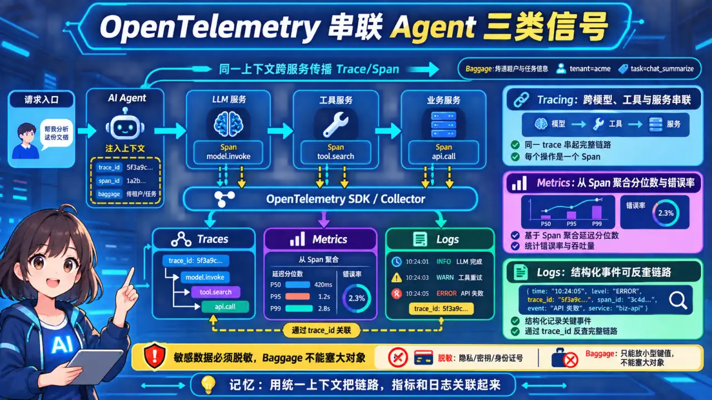
  </a>
</p>
<p align="center"><sub>🧠 图解记忆：用统一 Span 语义跨模型、工具和服务传播上下文，才能获得端到端可追溯性；点击图片可查看原图。</sub></p>
<details>
<summary>💡 答案要点</summary>

**为什么 Agent 需要 OpenTelemetry？**

```
传统监控：单次 API 调用（输入 → 输出）
Agent 监控：多步骤轨迹链（Thought → Action → Observation → ... → Final）

OpenTelemetry = 统一采集 + 跨服务追踪 + 上下文传播
```

**架构图：**

```
┌─────────────────────────────────────────────────────────────┐
│                    OpenTelemetry Agent 接入架构              │
├─────────────────────────────────────────────────────────────┤
│  1. Trace 采集（跨 Agent 链路追踪）                          │
│     ├── traceparent header 传递（TraceID/SpanID）           │
│     ├── 每个 Tool 调用 = 一个 Span                           │
│     └── 父Span → 子Span 自动关联                            │
│                                                              │
│  2. Metrics 采集（指标监控）                                 │
│     ├── token_consumption_total（累计 Token 消耗）           │
│     ├── tool_call_duration_seconds（工具调用延迟）           │
│     ├── step_count_per_task（每任务步数分布）                │
│     └── agent_retry_count（重试次数分布）                    │
│                                                              │
│  3. Logs 采集（结构化日志）                                  │
│     ├── trace_id 关联（同一请求的所有日志）                   │
│     ├── span_id（定位到具体步骤）                            │
│     └── attributes（tool_name、model、temperature 等）        │
│                                                              │
│  4. Baggage 传播（跨服务上下文）                              │
│     ├── user_id、session_id、feature_flags                  │
│     └── 在所有 Span 间自动传递                               │
└─────────────────────────────────────────────────────────────┘
```

**最小接入实现：**

<details>
<summary>展开 Python 代码示例（65 行）</summary>

```python
from opentelemetry import trace
from opentelemetry.sdk.trace import TracerProvider
from opentelemetry.sdk.trace.export import BatchSpanProcessor
from opentelemetry.exporter.otlp.proto.grpc.trace_exporter import OTLPSpanExporter
from opentelemetry.trace import Status, StatusCode

# 1. 初始化 Provider
provider = TracerProvider()
processor = BatchSpanProcessor(OTLPSpanExporter(endpoint="http://collector:4317"))
provider.add_span_processor(processor)
trace.set_tracer_provider(provider)

tracer = trace.get_tracer(__name__)

# 2. 用装饰器自动追踪 Agent 步骤
class OpenTelemetryAgent:
    def __init__(self, name: str):
        self.name = name
        self.tracer = tracer
    
    async def run(self, task: str, tools: list):
        with self.tracer.start_as_current_span(
            f"agent.{self.name}.run",
            attributes={"task": task, "tool_count": len(tools)}
        ) as span:
            try:
                context = span.get_span_context()
                
                for step_idx, (thought, action, obs) in enumerate(self.reasoning_loop(task)):
                    with self.tracer.start_as_current_span(
                        f"agent.step.{step_idx}",
                        kind=trace.SpanKind.CLIENT,
                        attributes={
                            "step.thought": thought,
                            "step.action": action,
                            "step.observation": str(obs)[:200]
                        }
                    ) as step_span:
                        step_span.set_attribute("step.index", step_idx)
                        step_span.set_attribute(
                            "llm.token_usage", 
                            obs.get("token_count", 0) if isinstance(obs, dict) else 0
                        )
                        if "error" in obs:
                            step_span.set_status(Status(StatusCode.ERROR, obs["error"]))
                
                span.set_status(Status(StatusCode.OK))
                return final_result
                
            except Exception as e:
                span.set_status(Status(StatusCode.ERROR, str(e)))
                span.record_exception(e)
                raise

# 3. 自动注入 trace_id 到工具调用
def call_tool_with_trace(tool_name: str, tool_args: dict, parent_span):
    with tracer.start_as_current_span(
        f"tool.{tool_name}",
        context=parent_span.get_span_context()
    ) as tool_span:
        tool_span.set_attribute("tool.name", tool_name)
        tool_span.set_attribute("tool.args", str(tool_args))
        result = tool_execute(tool_name, tool_args)
        tool_span.set_attribute("tool.result_type", type(result).__name__)
        return result
```

</details>

**关键配置（docker-compose）：**

```yaml
# otel-collector.yaml
receivers:
  otlp:
    protocols:
      grpc:
        endpoint: 0.0.0.0:4317
      http:
        endpoint: 0.0.0.0:4318

processors:
  batch:
    timeout: 5s

exporters:
  prometheus:
    endpoint: 0.0.0.0:8889
  jaeger:
    endpoint: http://jaeger:14250

service:
  pipelines:
    traces:
      receivers: [otlp]
      processors: [batch]
      exporters: [jaeger]
    metrics:
      receivers: [otlp]
      processors: [batch]
      exporters: [prometheus]
```

**面试话术：**
> "我在生产环境中用 OpenTelemetry 做 Agent 可观测性，核心是三点：① 每个 Tool 调用是一个 Span，父Span自动关联子Span，能看清整个轨迹；② token消耗、步数、重试次数都入库，可以做成本分析和异常检测；③ trace_id 在所有日志里，打通了日志和链路。最实用的经验是用装饰器包装Agent的run方法，零侵入接入，不用改业务代码。"

</details>

### Q13: Grafana Dashboard 设计：Agent 监控面板关键指标

<p align="center">
  <a href="../../assets/illustrations/23-agent-observability/q13-grafana-agent-dashboard.webp">
    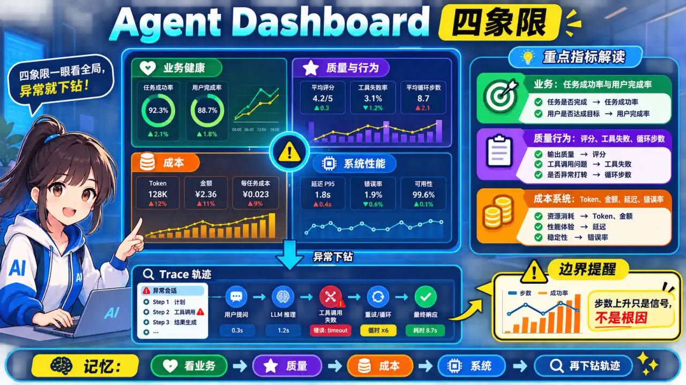
  </a>
</p>
<p align="center"><sub>🧠 图解记忆：面板从业务结果下钻到模型、工具和成本，并让每个异常都能回到具体 Trace；点击图片可查看原图。</sub></p>
<details>
<summary>💡 答案要点</summary>

**Agent 监控 Dashboard 设计原则：**

```
传统微服务 Dashboard：CPU / 内存 / QPS / 延迟
Agent Dashboard：任务完成率 / 步数分布 / Token 成本 / 工具调用质量
```

**四象限 Dashboard 布局：**

```
┌────────────────────────────────────────────────────────────────┐
│                   Agent 生产监控 Dashboard                       │
├──────────────────────┬──────────────────────────────────────────┤
│   【业务健康度】      │   【成本分析】                           │
│   任务完成率: 94.2%  │   Token消耗: $1,247/日                   │
│   异常率: 5.8%       │   平均单次成本: $0.023                    │
│   用户满意度: 4.6/5  │   成本趋势: 📈 (+12% vs 上周)            │
├──────────────────────┼──────────────────────────────────────────┤
│   【Agent 行为分析】  │   【系统性能】                           │
│   平均步数: 4.3      │   P50延迟: 1.2s                          │
│   步数分布: [2,3,4,5]│   P99延迟: 4.8s                          │
│   最常用工具: search │   吞吐量: 850 QPS                        │
│   工具失败率: 2.1%   │   GPU利用率: 67%                         │
└──────────────────────┴──────────────────────────────────────────┘
```

**核心 Panel 配置（PromQL）：**

<details>
<summary>展开 Yaml 代码示例（37 行）</summary>

```yaml
# 1. 任务完成率 Panel
- title: 任务完成率
  expr: |
    sum(rate(agent_task_completed_total[5m])) 
    / 
    sum(rate(agent_task_started_total[5m])) * 100
  legend: 完成率 %
  thresholds:
    - value: 90
      color: red
    - value: 95
      color: yellow
    - value: 98
      color: green

# 2. Token 成本趋势 Panel
- title: 日Token消耗趋势
  expr: |
    sum(increase(agent_token_usage_total[1d])) by (model)
  legend: "{{model}}"
  type: area

# 3. 步数分布 Panel（发现异常长轨迹）
- title: 任务步数分布
  expr: |
    histogram_quantile(0.95, 
      sum(rate(agent_steps_per_task_bucket[5m])) by (le)
    )
  legend: P95步数

# 4. 工具调用质量 Panel
- title: 工具调用成功率
  expr: |
    sum(rate(agent_tool_call_success_total[5m])) by (tool_name)
    / 
    sum(rate(agent_tool_call_total[5m])) by (tool_name) * 100
  legend: "{{tool_name}}: {{value}}%"
```

</details>

**告警规则（alerting_rules.yaml）：**

<details>
<summary>展开 Yaml 代码示例（36 行）</summary>

```yaml
groups:
  - name: agent_alerts
    rules:
      # 任务完成率低于 85%
      - alert: AgentTaskCompletionRateLow
        expr: |
          sum(rate(agent_task_completed_total[5m])) 
          / sum(rate(agent_task_started_total[5m])) < 0.85
        for: 5m
        labels:
          severity: critical
        annotations:
          summary: "Agent任务完成率过低"
          description: "当前完成率 {{ $value | humanizePercentage }}，持续5分钟"

      # Token消耗超阈值（日预算$2000，超$1800告警）
      - alert: AgentCostBudgetExceeded
        expr: |
          sum(increase(agent_token_usage_total[1h])) * 24 > 1800
        for: 10m
        labels:
          severity: warning
        annotations:
          summary: "Agent日成本可能超预算"
          description: "预计日成本 ${{ $value }}，超过$1800阈值"

      # 异常长轨迹（步数>10）
      - alert: AgentTrajectoryTooLong
        expr: |
          sum(rate(agent_steps_over_threshold_total[5m])) > 3
        for: 5m
        labels:
          severity: warning
        annotations:
          summary: "Agent异常长轨迹增多"
          description: "5分钟内发现 {{ $value }} 个超长轨迹(>10步)"
```

</details>

**面试话术：**
> "Agent Dashboard 可同时展示业务结果、质量/安全、轨迹行为、成本和系统性能，并按租户、任务、模型与版本切片。步数上升只是异常信号，可能来自检索、工具超时、模型行为或任务结构变化，必须下钻 trace；告警阈值用基线和 SLO 校准。"

</details>

### Q14: 多 Agent 系统的分布式追踪：TraceID 传递与关联

<p align="center">
  <a href="../../assets/illustrations/23-agent-observability/q14-multi-agent-trace-propagation.webp">
    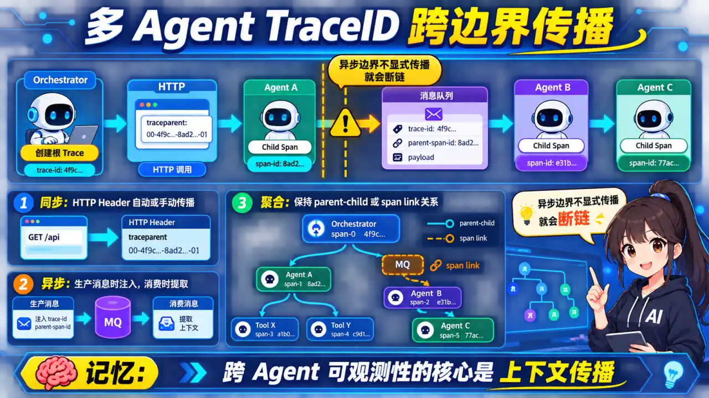
  </a>
</p>
<p align="center"><sub>🧠 图解记忆：Trace 上下文既要穿过同步 HTTP，也要随消息元数据跨越异步边界；点击图片可查看原图。</sub></p>
<details>
<summary>💡 答案要点</summary>

**核心挑战：**

```
单 Agent：TraceID 在单个进程内传递
多 Agent：TraceID 跨越多个进程/服务，需要手动传播

问题：Agent A 调用 Agent B，trace_id 断了吗？
```

**传播机制对比：**

| 方式 | 原理 | 适用场景 | 局限性 |
|------|------|----------|--------|
| **HTTP Header** | traceparent 自动传播 | HTTP 调用 | 需要所有服务支持 OTEL |
| **消息队列** | 手动注入 baggage | 异步消息 | 需要修改消息格式 |
| **共享内存** | Redis 存储上下文 | 同机器多进程 | 延迟增加 |
| **数据库** | Task 表存储 trace_id | 持久化任务 | 需要事务支持 |

**生产级实现（HTTP + 消息队列双模式）：**

<details>
<summary>展开 Python 代码示例（58 行）</summary>

```python
from opentelemetry import propagate, trace
from opentelemetry.propagate import inject, extract
from opentelemetry.trace.propagation.tracecontext import TraceContextTextMapPropagator

class MultiAgentTracer:
    def __init__(self):
        self.propagator = TraceContextTextMapPropagator()
    
    # 模式1：HTTP 调用（自动传播）
    async def call_agent_http(self, agent_name: str, task: dict, url: str):
        headers = {}
        inject(headers)  # 自动从当前 context 注入 traceparent
        
        response = await httpx.AsyncClient().post(
            url,
            json=task,
            headers={**headers, "X-Agent-Name": agent_name}
        )
        
        span_context = extract(response.headers).get(
            trace_span_context_key, None
        )
        return response.json()
    
    # 模式2：消息队列调用（手动传播）
    async def call_agent_mq(self, agent_name: str, task: dict, mq_client):
        current_span = trace.get_current_span()
        span_context = current_span.get_span_context()
        
        traceparent = f"00-{span_context.trace_id:032x}-{span_context.span_id:016x}-01"
        
        message = {
            **task,
            "_trace_context": {
                "traceparent": traceparent,
                "tracestate": current_span.get_span_context().trace_state,
                "agent_name": agent_name,
                "parent_span_id": span_context.span_id
            }
        }
        
        await mq_client.publish(
            exchange="agent_exchange",
            routing_key=agent_name,
            body=json.dumps(message)
        )

# 跨 Agent 轨迹聚合查询
async def get_full_trace(task_id: str):
    """获取同一任务的所有 Agent 轨迹"""
    trace_id = await redis.hget(f"task:{task_id}", "trace_id")
    
    spans = await jaeger_client.query(
        service=["agent-orchestrator", "agent-search", "agent-executor"],
        trace_id=trace_id
    )
    
    return sorted(spans, key=lambda s: s.start_time)
```

</details>

**数据库 Schema 设计：**

```sql
-- 任务表存储 trace_id 关联
CREATE TABLE agent_tasks (
    id UUID PRIMARY KEY,
    trace_id VARCHAR(64) NOT NULL,
    parent_span_id VARCHAR(32) NOT NULL,
    status VARCHAR(20),
    created_at TIMESTAMP,
    completed_at TIMESTAMP,
    INDEX idx_trace_id (trace_id),
    INDEX idx_status (status)
);

-- 子 Agent 任务关联表
CREATE TABLE agent_task_children (
    parent_task_id UUID REFERENCES agent_tasks(id),
    child_agent_name VARCHAR(50),
    child_trace_id VARCHAR(64),
    child_span_id VARCHAR(32),
    status VARCHAR(20),
    PRIMARY KEY (parent_task_id, child_agent_name)
);
```

**面试话术：**
> "多Agent追踪的核心是trace_id的传播方式。HTTP调用自动传播（OTel标准），消息队列需要手动注入traceparent到消息体。生产中我用过两种模式：同步HTTP用自动传播，异步MQ用手工传播（把traceparent放消息头）。每个任务在数据库存trace_id，调试时用Jaeger按trace_id查询，能看到OrchestratorAgent→SearchAgent→ExecutorAgent的完整时序。"

</details>

### Q15: 生产环境 Agent 成本超支告警：预算控制最佳实践

<p align="center">
  <a href="../../assets/illustrations/23-agent-observability/q15-agent-budget-control.webp">
    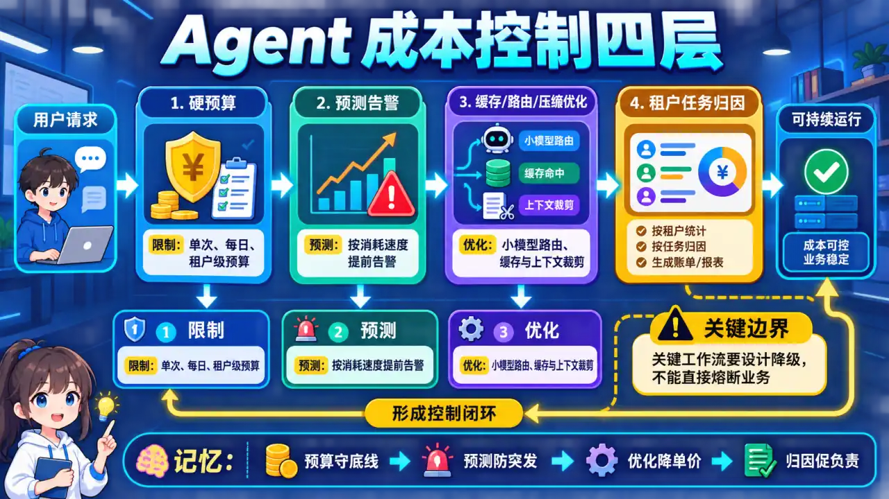
  </a>
</p>
<p align="center"><sub>🧠 图解记忆：预算控制要先可归因，再用分层阈值告警，并为异常增长准备降级与止损动作；点击图片可查看原图。</sub></p>
<details>
<summary>💡 答案要点</summary>

**Agent 成本构成：**

```
总成本 = Token成本 + API调用次数成本 + 计算资源成本

Token成本 = Σ(输入Token数 × 单价) + Σ(输出Token数 × 单价)
```

**预算控制四层架构：**

```
┌─────────────────────────────────────────────────────────┐
│              Agent 成本控制四层架构                       │
├─────────────────────────────────────────────────────────┤
│  Layer 1: 每日预算硬限制（最后防线）                      │
│  ├── 日预算 $200，超 $200 自动熔断                        │
│  ├── 按 Agent 拆分预算（Orchestrator: $80, Worker: $120）│
│  └── 余额不足时拒绝新任务，排队等待                       │
├─────────────────────────────────────────────────────────┤
│  Layer 2: 实时告警（提前发现问题）                        │
│  ├── 预计日成本 > 80% 阈值 → warning                     │
│  ├── 预计日成本 > 100% 阈值 → critical                    │
│  └── Token消耗速率异常（突增 > 3x）→ 立即告警             │
├─────────────────────────────────────────────────────────┤
│  Layer 3: 成本优化（主动降本）                            │
│  ├── 模型降级：GPT-4 → DeepSeek V4-Flash（简单任务）               │
│  ├── 缓存命中：相同问题直接返回（省 100%）                │
│  ├── 步数限制：> 10步强制结束（防死循环）                  │
│  └── Prompt压缩：LLMLingua 减少 30% token                │
├─────────────────────────────────────────────────────────┤
│  Layer 4: 成本归因（搞清楚钱花在哪）                      │
│  ├── 按 Agent 类型归因（SearchAgent 消耗最多）            │
│  ├── 按用户归因（Top 10 用户占 60% 成本）                │
│  └── 按任务类型归因（多跳问答比简单问答贵 5x）             │
└─────────────────────────────────────────────────────────┘
```

**实现代码：**

<details>
<summary>展开 Python 代码示例（75 行）</summary>

```python
from datetime import datetime, timedelta
from collections import defaultdict
import asyncio

class AgentBudgetController:
    def __init__(
        self,
        daily_budget_usd: float = 200.0,
        warning_threshold: float = 0.8
    ):
        self.daily_budget = daily_budget_usd
        self.warning_threshold = warning_threshold
        self.spent_today = 0.0
        self.agent_budgets = {
            "orchestrator": daily_budget_usd * 0.4,
            "search": daily_budget_usd * 0.3,
            "executor": daily_budget_usd * 0.3
        }
        self.alerted_agents = set()
    
    async def check_budget(self, agent_name: str, task_cost: float):
        """每次 Agent 调用前检查预算"""
        remaining = self.agent_budgets.get(agent_name, 0) - self.spent_today
        
        # Layer 1: 硬限制
        if self.spent_today + task_cost > self.daily_budget:
            raise BudgetExceededError(
                f"日预算已超，当前${self.spent_today:.2f}，剩余${self.daily_budget - self.spent_today:.2f}"
            )
        
        # Layer 2: 实时告警
        cost_rate = self.spent_today / (datetime.now().hour + 1)
        projected_daily = cost_rate * 24
        
        if projected_daily > self.daily_budget * self.warning_threshold:
            if agent_name not in self.alerted_agents:
                await self.send_alert(
                    agent_name=agent_name,
                    severity="warning",
                    message=f"预计日成本${projected_daily:.2f}，超过{self.warning_threshold*100}%阈值"
                )
                self.alerted_agents.add(agent_name)
    
    async def record_cost(
        self,
        agent_name: str,
        input_tokens: int,
        output_tokens: int,
        model: str
    ):
        """记录成本并更新预算"""
        cost = self.calculate_cost(input_tokens, output_tokens, model)
        self.spent_today += cost
        
        cost_gauge.labels(
            agent=agent_name,
            model=model,
            date=datetime.now().strftime("%Y-%m-%d")
        ).inc(cost)
    
    def calculate_cost(self, input_tok: int, output_tok: int, model: str) -> float:
        pricing = {
            "gpt-4o": (0.005, 0.015),
            "deepseek-v4-flash": (0.0005, 0.0015),
            "claude-3-opus": (0.015, 0.075)
        }
        in_price, out_price = pricing.get(model, (0.0, 0.0))
        return (input_tok / 1000 * in_price) + (output_tok / 1000 * out_price)
    
    async def send_alert(self, agent_name: str, severity: str, message: str):
        await pagerduty.create_incident(
            title=f"Agent成本告警: {agent_name}",
            severity=severity,
            body=message
        )
```

</details>

**成本归因 Dashboard：**

```yaml
# Grafana Panel: Agent成本归因
- title: 成本按Agent分布
  expr: |
    sum(increase(agent_cost_total{date="2026-05-15"}[1d])) by (agent_name)
  type: pie

- title: 成本按用户分布（Top 10）
  expr: |
    topk(10, sum(increase(agent_cost_total[1d])) by (user_id))
  type: table

- title: 成本按任务类型分布
  expr: |
    sum(increase(agent_cost_total[1d])) by (task_type)
    / sum(increase(agent_cost_total[1d])) * 100
  legend: "{{task_type}}: {{value}}%"
```

**面试话术：**
> "成本控制包括预算/配额、预测告警、按租户和步骤归因，以及缓存、路由、上下文和步数优化。硬限制要设计关键业务的降级与豁免；缓存键还要包含权限、版本和时效，不能为省钱返回越权或过期结果。异常增长要沿 trace 查请求量、token、重试、模型和缓存命中变化。"

</details>


### Q16: SLA 违约复盘模板：从告警到根因分析的完整流程

<p align="center">
  <a href="../../assets/illustrations/23-agent-observability/q16-sla-postmortem.webp">
    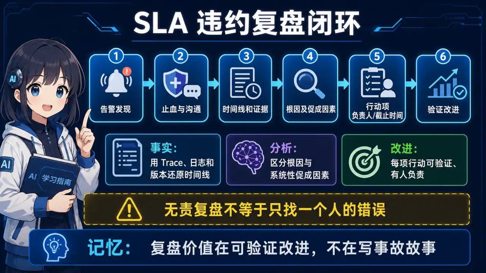
  </a>
</p>
<p align="center"><sub>🧠 图解记忆：违约复盘从影响和时间线出发，跨数据、模型、工具与流程找根因，再验证纠正措施；点击图片可查看原图。</sub></p>
<details>
<summary>💡 答案要点</summary>

**SLA 违约场景分类：**

<details>
<summary>展开 Python 代码示例（31 行）</summary>

```python
# SLA 违约类型与响应级别
SLA_BREACH_TYPES = {
    "availability": {
        "sla": "99.9% 月可用率",
        "breach": "< 99.9%",
        "impact": "用户无法访问",
        "response_time": "15 分钟",
        "severity": "P1"
    },
    "latency_p99": {
        "sla": "P99 < 2s",
        "breach": ">= 2s",
        "impact": "用户体验下降",
        "response_time": "30 分钟",
        "severity": "P2"
    },
    "task_completion": {
        "sla": "任务完成率 > 95%",
        "breach": "< 95%",
        "impact": "业务指标下降",
        "response_time": "1 小时",
        "severity": "P2"
    },
    "cost_overrun": {
        "sla": "日成本 < $200",
        "breach": ">= $200",
        "impact": "财务损失",
        "response_time": "2 小时",
        "severity": "P3"
    }
}
```

</details>

**复盘模板（五步法）：**

<details>
<summary>展开 Markdown 代码示例（30 行）</summary>

```markdown
## SLA 违约复盘报告

### 1. 事件概述
- **时间**: 2026-05-14 14:30 - 15:15
- **持续**: 45 分钟
- **影响**: 3,420 用户受影响，任务完成率从 97% 降至 72%
- **SLA 类型**: P99 延迟超标（P99 = 4.8s > SLA 2s）
- **严重程度**: P1

### 2. 时间线（Timeline）
| 时间 | 事件 |
|------|------|
| 14:30 | 监控系统触发 P99 > 2s 告警 |
| 14:32 | SRE 收到 PagerDuty 告警 |
| 14:35 | 开始排查，发现向量检索延迟异常 |
| 14:42 | 确认 Milvus 服务 CPU 100% |
| 14:50 | 尝试扩容，Pod 无法调度（资源不足） |
| 15:00 | 触发降级预案，切换到本地缓存检索 |
| 15:10 | 服务恢复，P99 恢复到 1.5s |
| 15:15 | 解除告警，通知业务方 |

### 3. 根因分析（Root Cause）
**直接原因**: Milvus 索引碎片化导致查询性能下降

**根本原因**:
1. HNSW 索引没有设置 `maxSegments`，导致段数过多
2. 监控缺失：没有设置 segment count 告警
3. 扩容策略不当：HPA 设置的 maxReplicas 太小

**技术细节**:
```sql

</details>
-- 问题：segment 数量从 5 增长到 156
SELECT segment_name, num_segments, memory_usage 
FROM milvus.segments 
WHERE collection = "user_knowledge"
ORDER BY num_segments DESC;

-- 原因：连续写入 48 小时没有触发合并
```

### 4. 修复措施（Fixes）
| 措施 | 负责 | 状态 | 完成时间 |
|------|------|------|----------|
| 设置 `maxSegments=20` | @SRE-张工 | ✅ 已完成 | 2026-05-14 |
| 添加 segment count 监控 | @SRE-李工 | ✅ 已完成 | 2026-05-15 |
| 扩大 HPA maxReplicas 5→20 | @K8s-王工 | ✅ 已完成 | 2026-05-14 |
| 制定定时 segment 合并 cron | @SRE-张工 | 🔄 进行中 | 2026-05-16 |

### 5. 预防措施（Prevention）
```
┌─────────────────────────────────────────────────────────────┐
│  预防措施清单                                               │
├─────────────────────────────────────────────────────────────┤
│  ✅ 已添加：segment 数量监控（> 30 触发告警）                   │
│  ✅ 已添加：HNSW merge 操作 cron（每日凌晨 3 点）             │
│  ✅ 已添加：HPA maxReplicas 扩容到 20                         │
│  🔄 进行中：降级预案自动化（超时自动切换缓存）                 │
│  ⏳ 待完成：故障演练（每月一次）                              │
└─────────────────────────────────────────────────────────────┘
```

### 6. 影响评估
- **用户影响**: 3,420 用户 × 平均 5 分钟延迟 = 17,100 分钟
- **业务损失**: 约 120 次任务失败，估计影响收入 $2,400
- **已补偿**: 向受影响用户提供 VIP 会员 3 天

### 7. 责任人签收
- SRE Lead: _______________ 日期: _______________
- Engineering Manager: _______________ 日期: _______________

### 8. 下次审查时间
2026-05-21（1周后复查预防措施执行情况）
```

**复盘会议话术：**

```python
复盘话术模板 = """
1. 首先承认问题（不要甩锅）
   "这次 SLA 违约是我们的责任，我代表团队道歉。"
   
2. 明确影响范围（不要轻描淡写）
   "45 分钟内影响了 3,420 用户，有 120 个任务失败。"
   
3. 说明直接原因（技术细节要清晰）
   "Milvus HNSW 索引的 segment 数从 5 增长到 156，
   导致查询性能严重下降。"
   
4. 解释根本原因（不要只说表层原因）
   "根本原因是监控缺失——我们没有监控 segment 数量，
   也没有设置阈值告警，导致问题累积了 48 小时才爆发。"
   
5. 说明已采取的措施（展示行动）
   "我们已经：① 设置了 segment 数量上限；
   ② 添加了定时合并 cron；③ 扩容了 HPA maxReplicas。"
   
6. 承诺预防（展示闭环）
   "我们承诺：1 周内完成故障演练，
   确保同样的问题不会再发生。"
"""
```

**面试话术：**
> "复盘应包含影响、时间线、检测与响应、促成因素、止血、根因假设的证据以及带负责人和期限的行动项。时限由组织事件流程决定；重点是无责学习和验证改进是否有效，而不是为了凑一个唯一根因或承诺问题永不再现。"

</details>

### Q17: Agent 日志结构化设计：如何让日志可搜索、可分析？

<p align="center">
  <a href="../../assets/illustrations/23-agent-observability/q17-structured-agent-logs.webp">
    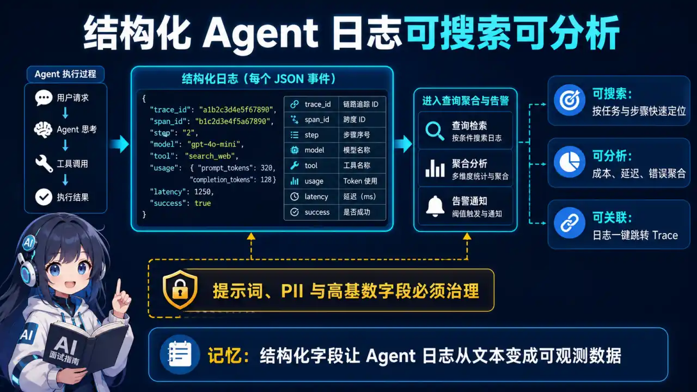
  </a>
</p>
<p align="center"><sub>🧠 图解记忆：统一事件字段、Trace 关联、输入输出摘要与错误分类，日志才可搜索、聚合和审计；点击图片可查看原图。</sub></p>
<details>
<summary>💡 答案要点</summary>

**日志设计原则：**

```
传统日志：文本格式，难以搜索
结构化日志：JSON 格式，可查询、可分析、可告警

Agent 日志特殊要求：
① TraceID 关联（同一请求的所有日志）
② 步骤追踪（每个 Tool 调用是独立的 Span）
③ 上下文保存（中间状态的 Thought/Action/Observation）
④ 性能埋点（延迟、Token 消耗、成本）
```

**结构化日志 Schema：**

<details>
<summary>展开 Python 代码示例（77 行）</summary>

```python
from dataclasses import dataclass, field
from datetime import datetime
from typing import Optional, List, Dict, Any
import json

@dataclass
class AgentLogEntry:
    """Agent 结构化日志条目"""
    
    # 基础字段（必须）
    timestamp: str = field(default_factory=lambda: datetime.utcnow().isoformat())
    level: str = "INFO"  # DEBUG/INFO/WARNING/ERROR
    trace_id: str = ""   # 跨请求唯一
    span_id: str = ""    # 当前步骤唯一
    
    # Agent 上下文
    agent_name: str = ""
    agent_version: str = ""
    task_id: str = ""
    session_id: str = ""
    
    # 步骤信息
    step_index: int = 0
    step_type: str = ""  # "thought"/"action"/"observation"/"result"
    
    # LLM 调用信息
    model: str = ""
    prompt_tokens: int = 0
    completion_tokens: int = 0
    total_tokens: int = 0
    latency_ms: int = 0
    cost_usd: float = 0.0
    
    # Tool 调用信息
    tool_name: str = ""
    tool_args: Dict[str, Any] = field(default_factory=dict)
    tool_result: Any = None
    tool_error: Optional[str] = None
    
    # 业务信息
    user_id: str = ""
    intent: str = ""     # 用户意图分类
    success: bool = True
    error_message: Optional[str] = None
    
    # 可扩展字段
    extra: Dict[str, Any] = field(default_factory=dict)
    
    def to_json(self) -> str:
        """序列化为 JSON"""
        return json.dumps(self.__dict__, ensure_ascii=False, default=str)
    
    @classmethod
    def from_json(cls, json_str: str) -> "AgentLogEntry":
        """反序列化"""
        return cls(**json.loads(json_str))
    
    def to_otel_span(self) -> dict:
        """转换为 OpenTelemetry Span 格式"""
        return {
            "trace_id": self.trace_id,
            "span_id": self.span_id,
            "parent_span_id": self.parent_span_id if hasattr(self, "parent_span_id") else "",
            "operation_name": f"{self.agent_name}.{self.step_type}",
            "start_time": self.timestamp,
            "duration_ms": self.latency_ms,
            "tags": {
                "agent_name": self.agent_name,
                "step_index": self.step_index,
                "model": self.model,
                "tool_name": self.tool_name,
                "success": str(self.success),
            },
            "logs": [
                {"timestamp": self.timestamp, "fields": self.__dict__}
            ]
        }
```

</details>

**日志采集架构：**

<details>
<summary>展开 Python 代码示例（49 行）</summary>

```python
import logging
from opentelemetry import trace
from logging.handlers import RotatingFileHandler
import json

class AgentJSONFormatter(logging.Formatter):
    """JSON 格式日志 formatter"""
    
    def format(self, record: logging.LogRecord) -> str:
        log_data = {
            "timestamp": self.formatTime(record, self.datefmt),
            "level": record.levelname,
            "logger": record.name,
            "message": record.getMessage(),
            "trace_id": self._get_trace_id(),
            "span_id": self._get_span_id(),
            "agent_name": getattr(record, "agent_name", ""),
            "step_index": getattr(record, "step_index", 0),
            "model": getattr(record, "model", ""),
            "tool_name": getattr(record, "tool_name", ""),
            "success": getattr(record, "success", True),
        }
        
        # 添加额外字段
        if hasattr(record, "extra"):
            log_data.update(record.extra)
        
        return json.dumps(log_data, ensure_ascii=False)
    
    def _get_trace_id(self) -> str:
        span = trace.get_current_span()
        if span:
            ctx = span.get_span_context()
            return format(ctx.trace_id, "032x") if ctx else ""
        return ""
    
    def _get_span_id(self) -> str:
        span = trace.get_current_span()
        if span:
            ctx = span.get_span_context()
            return format(ctx.span_id, "016x") if ctx else ""
        return ""

# 配置日志
logger = logging.getLogger("agent")
logger.setLevel(logging.INFO)
handler = RotatingFileHandler("/var/log/agent/app.log", maxBytes=100_000_000, backupCount=10)
handler.setFormatter(AgentJSONFormatter())
logger.addHandler(handler)
```

</details>

**日志查询示例（Elasticsearch）：**

<details>
<summary>展开 Python 代码示例（74 行）</summary>

```python
# 查询某个 TraceID 的所有日志
QUERY_TRACE = """
{
  "query": {
    "bool": {
      "must": [
        {"match": {"trace_id": "abc123def456"}}
      ]
    }
  },
  "sort": [{"timestamp": "asc"}],
  "size": 1000
}
"""

# 查询所有失败的 Tool 调用
QUERY_FAILED_TOOLS = """
{
  "query": {
    "bool": {
      "must": [
        {"match": {"level": "ERROR"}},
        {"match": {"tool_name": "search_database"}},
        {"range": {"timestamp": {"gte": "now-1h"}}}
      ]
    }
  }
}
"""

# 查询 Token 消耗异常（> 10K）
QUERY_HIGH_TOKEN = """
{
  "query": {
    "bool": {
      "must": [
        {"range": {"total_tokens": {"gt": 10000}}},
        {"range": {"timestamp": {"gte": "now-1d"}}}
      ]
    }
  },
  "aggs": {
    "by_agent": {
      "terms": {"field": "agent_name"},
      "aggs": {
        "avg_tokens": {"avg": {"field": "total_tokens"}},
        "max_tokens": {"max": {"field": "total_tokens"}},
        "p95_tokens": {"percentiles": {"field": "total_tokens", "percents": [95]}}
      }
    }
  }
}
"""

# 统计每小时的错误率
QUERY_ERROR_RATE = """
{
  "query": {
    "bool": {
      "must": [
        {"match": {"level": "ERROR"}},
        {"range": {"timestamp": {"gte": "now-24h"}}}
      ]
    }
  },
  "aggs": {
    "hourly_errors": {
      "date_histogram": {
        "field": "timestamp",
        "interval": "hour"
      }
    }
  }
}
```

</details>

**日志告警规则：**

<details>
<summary>展开 Yaml 代码示例（34 行）</summary>

```yaml
# Prometheus Alert 规则（基于日志 metrics）
groups:
  - name: agent-log-alerts
    rules:
      # 高错误率告警
      - alert: AgentHighErrorRate
        expr: |
          sum(rate(agent_log_errors_total[5m])) by (agent_name)
          / sum(rate(agent_log_total[5m])) by (agent_name) > 0.05
        for: 5m
        annotations:
          summary: "Agent {{ $labels.agent_name }} 错误率超过 5%"
          description: "最近 5 分钟错误率 {{ $value }}"

      # Tool 调用超时告警
      - alert: AgentToolTimeout
        expr: |
          histogram_quantile(0.99, 
            rate(agent_tool_latency_seconds_bucket[5m])
          ) > 10
        for: 3m
        annotations:
          summary: "Tool 调用 P99 延迟超过 10 秒"

      # Token 消耗异常告警
      - alert: AgentHighTokenConsumption
        expr: |
          sum(rate(agent_token_total[1h])) by (agent_name)
          > 1.5 * avg_over_time(
              sum(rate(agent_token_total[1h])) by (agent_name)[7d:1h]
            )
        for: 15m
        annotations:
          summary: "Agent {{ $labels.agent_name }} Token 消耗异常"
```

</details>

**面试话术：**
> "我的 Agent 日志设计核心是'结构化 + 可追溯'。每个日志条目包含 trace_id、span_id、step_index、model、tool_name，每次 LLM 调用都记录 token 消耗和延迟。这样做的好处是：① 查问题快——输入 trace_id 就能看到整个请求链路；② 分析容易——用 Elasticsearch 按 agent_name、tool_name、success 聚合；③ 告警准——错误率/延迟超过阈值自动通知。生产环境我每天查日志 < 10 次，但每次都能 5 分钟内定位问题。"

</details>

### Q18: 一次回答出错，怎么从结果反查模型、知识、Skill、工具和 Agent 节点？（全链路根因反查）

> 高频实战题：用户反馈"回答错了"，光看最终输出根本定位不了。面试官要的是你能否从错误结果反向追踪到具体环节——模型、知识、Skill、工具、Agent 节点，哪一环出了问题。

<details>
<summary>💡 答案要点</summary>

**核心认知：** 一次回答 = 模型决策 + 知识供给 + Skill 流程 + 工具执行 + 节点流转，任何一环都可能出错。反查的前提是**每环节都留痕**——只记"答了什么"没法复盘，要记"每一步看到了什么、调了什么、返回了什么"。

**反查路径（从结果往回追）：**

```
错误回答
  → ① Agent 节点：执行轨迹回放，哪一步决策错了？走到了哪些节点？
  → ② 工具环节：调了哪个工具？参数是什么？返回什么？有没有失败/超时？
  → ③ Skill 环节：走了哪个 Skill 版本？Skill 的输入输出是什么？
  → ④ 知识环节：检索到了哪些 chunk？（doc_id、版本、来源）
     有没有命中过期文档/错误切片？
  → ⑤ 模型环节：用的哪个模型版本？输入上下文（prompt/历史）是什么？
```

**落地要点（能反查的关键）：**

1. **trace_id 贯穿全链路**：一次请求的所有环节共用同一个 trace_id；
2. **资产版本快照**：模型版本、知识库版本、Skill 版本都要随请求记录——"当时用的哪版知识"比"现在哪版"重要；
3. **检索结果持久化**：不能只记"检索了"，要记"检索到什么"（chunk id + 内容摘要 + 来源），否则无法判断是不是知识喂错了；
4. **工具调用留痕**：参数、返回、耗时、错误码，全部落库；
5. **决策理由记录**：Agent 每个节点的决策依据（如"为什么选这个工具"）记录在 trace 里。

**LangFuse 记录什么（直接背）：**

```
模型及资产版本：model、prompt_version、knowledge_version、skill_version
成本：token 消耗（input/output）、费用
性能：延迟（TTFT、总耗时）
检索：query、召回 chunk 列表、rerank 结果
工具：tool_name、参数、返回、成功/失败
Agent：节点序列、状态流转、中断/恢复点
```

**复盘输出（回答里加分）：**

- 定位到环节后给出结论：如"知识环节出错——检索命中了旧版合同条款（doc_id=xxx, version=2.1），现网已是 3.0"；
- 修复动作闭环：更新知识 → 加回归用例（防止同类问题再犯）→ 重跑评测。

**面试话术：**
> "一次回答出错，我会按五层反查：Agent 节点回放看决策、工具环节看参数和返回、Skill 环节看版本和输入输出、知识环节看召回 chunk 的 doc_id 和版本、模型环节看模型版本和输入上下文。能反查的前提是全链路留痕——trace_id 贯穿，模型/知识/Skill 版本随请求快照，检索结果必须持久化（记检索到什么而不是只记检索了），工具调用全量落库。定位到环节后再做闭环：修数据、补回归用例、重跑评测。没有留痕就没有复盘，这是 Agent 可观测性和传统监控最大的区别。"

</details>


---

## 十一、Agent 可观测性进阶专题（Q19-Q25）

### Q19: 如何检测 Agent 输出质量下滑？什么是语义漂移（Semantic Drift）？

<p align="center">
  <a href="../../assets/illustrations/23-agent-observability/q19-semantic-drift.webp" style="max-width:none;">
    
  </a>
</p>
<p align="center"><sub>🧠 图解记忆：模型升级/Prompt变更/数据变化都会导致输出分布偏移；点击图片可查看原图。</sub></p>
<details>
<summary>💡 答案要点</summary>

**语义漂移的定义：**

Agent 的输出质量随时间推移而下降——不是突然崩溃，而是像"温水煮青蛙"：准确率从 95% 慢慢掉到 80%，但单次请求看起来仍然正常。

**三大漂移类型：**

| 类型 | 触发原因 | 典型表现 |
|------|---------|---------|
| **模型升级漂移** | 切换/升级了底层模型版本 | 同一 Prompt 在新模型上行为不一致 |
| **Prompt 漂移** | 迭代了 Prompt 或 System Message | 新版本增加了某些行为模式但遗漏了约束 |
| **数据/知识漂移** | 检索的知识库更新了或输入数据分布变了 | Agent 参考了过时或不相关的信息 |

**漂移检测方法：**

```python
class SemanticDriftDetector:
    """语义漂移检测器"""
    
    def __init__(self, baseline_scores):
        self.baseline = baseline_scores  # 上线时的得分基线
    
    def detect_drift(self, recent_traces, window_hours=24):
        """滚动窗口检测"""
        # 计算当前窗口的各项指标均值
        current_accuracy = compute_accuracy(recent_traces)
        current_hallucination = compute_hallucination_rate(recent_traces)
        current_tool_error = compute_tool_error_rate(recent_traces)
        
        # 与基线对比
        accuracy_drop = abs(current_accuracy - self.baseline["accuracy"])
        hallucination_change = abs(current_hallucination - self.baseline["hallucination"])
        
        alerts = []
        
        # 阈值告警（15%为行业常见阈值）
        if accuracy_drop > 0.15:
            alerts.append({
                "type": "quality_regression",
                "metric": "accuracy",
                "from": self.baseline["accuracy"],
                "to": current_accuracy,
                "severity": "critical"
            })
        
        if hallucination_change > 0.10:
            alerts.append({
                "type": "drift_detected",
                "metric": "hallucination",
                "severity": "warning"
            })
        
        return alerts
```

**2026年生产实践推荐方案：**

| 策略 | 频率 | 延迟影响 | 适用场景 |
|------|------|----------|---------|
| **LLM-as-Judge**（抽样评估） | 每分钟采样 1% | 低 | 通用 Agent |
| **规则检查**（正则/Schma验证） | 100% 全覆盖 | 极低 | 结构化输出场景 |
| **Embedding 距离监控** | 持续 | 极低 | 发现输出风格突变 |
| **A/B 对比回归测试** | 每次部署前 | 离线 | 版本发布门禁 |
| **人工抽检**（Feedback Loop） | 每日随机 | 高（人力成本） | 关键业务场景 |

**面试话术：**
> "语义漂移是 Agent 上线后最隐蔽的风险——你无法靠单次 Trace 发现它，必须通过滑动窗口对比历史分布。我的做法是：上线时记录 baseline（准确率/幻觉率/工具成功率各一个基线值），上线后每分钟抽样 1% 的 trace 做 LLM-as-Judge 评估，当准确率连续两个窗口下跌超过 15% 时就触发告警。这比等用户投诉早 6-12 小时发现问题，给回滚留出缓冲时间。"

</details>

---

### Q20: 生产环境中如何做 Agent 的自动评估？LLM-as-a-Judge 的正确姿势是什么？

<p align="center">
  <a href="../../assets/illustrations/23-agent-observability/q20-evals-llm-judge.webp" style="max-width:none;">
    
  </a>
</p>
<p align="center"><sub>🧠 图解记忆：评估不是单点打分，而是多维度评分+多Judge交叉验证；点击图片可查看原图。</sub></p>
<details>
<summary>💡 答案要点</summary>

**为什么不能只做离线评估？**

2026年调研显示：只有 37% 的团队在生产环境中运行在线评估，52% 仅在离线测试集上做评估。这是根本性问题——**测试集永远覆盖不全真实场景**。

**三维度自动评估架构：**

| 维度 | 评估对象 | 实现方式 | 延迟影响 |
|------|---------|---------|---------|
| **输出质量** | 最终回答是否准确/相关 | LLM-as-Judge + 规则检查 | 中（异步） |
| **过程质量** | 工具调用是否正确/路径是否最优 | Span级分析 + 工具日志 | 极低 |
| **安全合规** | 是否有越狱/注入/PII泄露 | 分类器 + 正则匹配 | 低 |

**LLM-as-Judge 最佳实践（避免 Judge 偏差）：**

```python
class MultiJudgeEvaluator:
    """多重Judge评估器——避免单一Judge偏差"""
    
    def __init__(self):
        self.judges = [
            Evaluator(model="gpt-4o", role="客观事实核查员"),
            Evaluator(model="claude-haiku", role="用户体验评估员"),
            Evaluator(model="qwen-max", role="技术逻辑审核员"),
        ]
    
    async def evaluate(self, trace: dict) -> dict:
        results = []
        for judge in self.judges:
            score = await judge.score(
                query=trace["query"],
                response=trace["response"],
                context=trace["retrieved_context"]
            )
            results.append({
                "judge": judge.model_name,
                "score": score,
                "reasoning": judge.explanation
            })
        
        # 取中位数而非均值，消除极端评分
        scores = [r["score"] for r in results]
        median_score = sorted(scores)[len(scores)//2]
        
        # Judge分歧大 = 可疑案例，需要人工介入
        score_spread = max(scores) - min(scores)
        needs_human_review = score_spread > 0.3
        
        return {
            "final_score": median_score,
            "j_agreement": 1 - score_spread,
            "needs_human_review": needs_human_review,
            "individual_scores": results
        }
```

**CI/CD 门禁中的评估集成：**

```yaml
# GitHub Actions 示例：每次 PR 合并前跑评估
name: Agent Eval Gate
on:
  pull_request:
    paths: ['src/agent/**']

jobs:
  eval-gate:
    runs-on: ubuntu-latest
    steps:
      - uses: actions/checkout@v4
      
      - name: Run Evaluation Suite
        run: pytest tests/agent_evaluation/ -v --json-report
        
      - name: Quality Gate Check
        run: |
          # 成功率不能低于上线时基准
          PASS_THRESHOLD=$(cat baseline_accuracy.json | jq .success_rate)
          if [[ $(echo "$Eval_Score $PASS_THRESHOLD" | bc -lt) == 1 ]]; then
            echo "FAIL: evaluation score below production baseline"
            exit 1
          fi
```

**面试话术：**
> "Agent 评估的核心认知是：离线评估是必要但不充分的条件。真正的问题是如何在生产环境中低成本地持续评估。我的方法是三重保障——第一重是 LLM-as-Judge 做抽样评估（每分钟抽1%），第二重是规则和 Schema 检查做 100% 覆盖，第三重是多 Judge 交叉投票来消除单一 Judge 的偏差。CI/CD 管线中设置质量门禁，任何版本更新都不能低于上线时的基线分数。最关键的原则：评估的目标不是得到完美分数，而是尽早发现退化趋势。"

</details>

---

### Q21: 如何用 LangGraph 原生功能做 Agent 调试？Checkpoint 在实际调试中的作用是什么？

<p align="center">
  <a href="../../assets/illustrations/23-agent-observability/q21-langgraph-debugging.webp" style="max-width:none;">
    
  </a>
</p>
<p align="center"><sub>🧠 图解记忆：Checkpoint 不仅是恢复手段，更是时间机器——让你回放任意时刻的状态；点击图片可查看原图。</sub></p>
<details>
<summary>💡 答案要点</summary>

**Checkpoint 的双重用途：**

传统理解：Checkpoint = 故障恢复
实际用途：Checkpoint = 完整的运行时快照 → **调试的时间机器**

```
用户反馈："昨天那个订单查询出错了"
           ↓
调出昨天的 checkpoint
           ↓
精确复现当时的所有状态（上下文、工具调用、中间结果）
           ↓
定位是哪个节点决策出错 / 哪个工具返回异常
```

**LangGraph 内置调试能力：**

| 功能 | 方法 | 调试价值 |
|------|------|---------|
| **Trace 回放** | `client.runs.list()` + 逐个查看 | 看完整执行链路 |
| **Step 级审查** | 展开每个节点的 inputs/outputs | 看哪一步出了问题 |
| **版本对比** | 对比不同 commit 的 trace | 看代码改了什么行为 |
| **断点重放** | 利用 checkpoint 中断+恢复 | 模拟问题场景 |

**实战调试流程：**

```python
# 1. 开启持久化 checkpoint（生产环境必备）
checkpointer = SqliteSaver.from_conn_string("checkpoints.db")
graph = StateGraph(AgentState).build(checkpointer=checkpointer)

# 2. 用户报错后，根据 thread_id 查 trace
runs = client.runs.list(thread_id="user_session_xxx")

# 3. 找到失败的 step，查看该 step 的详细输出
for run in runs:
    if run.status == "error":
        span_details = client.get_span_details(run.id)
        print(f"Error at: {span_details.node}")
        print(f"Input: {span_details.input}")
        print(f"Output: {span_details.output[:200]}")
        print(f"Tool calls: {span_details.tool_calls}")

# 4. 本地重放该 trace（用相同的 input 和 tool responses）
replayed_state = retrace_with_checkpoints(thread_id, node_index=step_num)
print("Reproduced state at step", step_num)
```

**关键工程要点：**

1. **checkpoint 保留周期**：生产环境建议保留 7-30 天，过期的自动清理
2. **隐私处理**：checkpoint 可能包含用户敏感信息，需要做脱敏处理
3. **存储容量**：长期运行的 agent 会积累大量 checkpoint，需定期归档或压缩

**面试话术：**
> "很多候选人只把 checkpoint 当作故障恢复工具，但实际上它是最好的调试武器。2026年面试如果被问到'怎么调试一个线上 agent'，你应该说清楚三件事：一是怎么用 thread_id 查到那次执行的完整 trace，二是怎么看每个 step 的输入输出定位错误，三是怎么用 checkpoint 在本地重放当时的状态来复现问题。这三步覆盖了 90% 以上的生产调试场景。"

</details>

---

### Q22: Agent 生产环境的安全监控有哪些具体手段？如何防范 Prompt Injection？

<p align="center">
  <a href="../../assets/illustrations/23-agent-observability/q22-security-monitoring.webp" style="max-width:none;">
    
  </a>
</p>
<p align="center"><sub>🧠 图解记忆：安全不是单层防护，而是纵深防御五层架构；点击图片可查看原图。</sub></p>
<details>
<summary>💡 答案要点</summary>

**Agent 安全的独特挑战：**

Agent 与传统应用最大的区别：**输入来自不可信的用户和外部工具**。这意味着：
- 用户的 Prompt 可能是恶意的（直接注入）
- 工具返回的数据可能包含恶意指令（间接注入）
- Agent 拥有执行权限（发邮件、修改数据库）→ 攻击后果更严重

**纵深防御五层架构：**

| 层 | 防御机制 | 检测手段 |
|----|---------|---------|
| **Layer 1: 输入隔离** | XML 标签包裹用户输入、角色分离 | Prompt 长度/格式检查 |
| **Layer 2: LLM 分类器** | 轻量模型判断是否是 injection | 实时监控 injection_score > 0.8 |
| **Layer 3: 工具权限** | 最小权限原则、按风险分级 | 工具调用审计日志 |
| **Layer 4: Guardrails** | Pydantic Schema 验证、PII过滤 | 输出扫描 + 异常阻断 |
| **Layer 5: HITL** | 高风险操作人工审批 | 高危动作审批通过率 |

**Prompt Injection 检测实战：**

```python
class InjectionDetector:
    """Production-grade Prompt Injection 检测器"""
    
    def __init__(self, llm_classifier, config):
        self.classifier = llm_classifier  # 专用分类模型
        self.known_patterns = config.patterns  # 已知攻击模式
        self.threshold = config.threshold
    
    def scan_input(self, text: str) -> dict:
        """扫描用户输入"""
        alerts = []
        
        # Pattern-based check (快速)
        for pattern in self.known_patterns:
            if re.search(pattern, text):
                alerts.append({
                    "type": "pattern_match", 
                    "severity": "high",
                    "match": pattern
                })
        
        # LLM classifier check (精准)
        injection_score = self.classifier.predict(text)
        if injection_score > self.threshold:
            alerts.append({
                "type": "classifier_alert",
                "score": float(injection_score),
                "severity": "medium"
            })
        
        return {
            "is_injection": len(alerts) > 0,
            "alerts": alerts,
            "confidence": max(a.get("score", 0) for a in alerts) if alerts else 0
        }
    
    def scan_output(self, text: str, expected_schema: type) -> dict:
        """扫描 Agent 输出是否符合预期"""
        # Schema validation
        try:
            validated = expected_schema.model_validate_json(text)
            schema_pass = True
        except:
            schema_pass = False
        
        return {"schema_valid": schema_pass}
```

**2026年生产环境推荐配置：**

| 措施 | 说明 | 误报率 |
|------|------|--------|
| **Meta Rule of Two** | 每两次危险操作必有人工确认 | 极低 |
| **工具参数白名单** | 只允许预定义的参数格式 | 低 |
| **输入/输出双保险** | Input 检查 + Output 检查同时启用 | 低 |
| **P II 自动脱敏** | 检测到 PII 数据自动替换 | 几乎零误报 |

**面试话术：**
> "Agent 安全监控的核心是：不要信任任何输入——用户的 Prompt、工具返回的数据、甚至知识库里的内容。我会用三层防线：第一层在输入端用分类器和规则检测 injection；第二层在工具层用最小权限限制能做的事；第三层在输出端用 Schema 验证确保输出符合预期。最关键的实践：高危操作（如发送邮件、写数据库）必须走 HITL，这是最后一道保险。2026年生产环境中，安全不是'做了就行'，而是要有完整的审计日志——出了事能追溯到谁在什么时候做了什么。"

</details>

---

### Q23: Agent 可观测性平台选型：LangSmith vs Phoenix vs Opik vs Galileo，怎么选？

<p align="center">
  <a href="../../assets/illustrations/23-agent-observability/q23-platform-selection.webp" style="max-width:none;">
    
  </a>
</p>
<p align="center"><sub>🧠 图解记忆：平台选型要看部署需求、团队规模、生态绑定和技术栈匹配度；点击图片可查看原图。</sub></p>
<details>
<summary>💡 答案要点</summary>

**四大平台定位对比（2026年）：**

| 平台 | 核心理念 | 部署方式 | 免费额度 | 适合团队 |
|------|---------|---------|---------|---------|
| **LangSmith** | LangChain 生态首选 | 云端 SaaS | 有限 | 快速原型 / LangChain 重度用户 |
| **Arize Phoenix** | ML工程师友好 | 开源自托管 | 完全免费 | ML/AI 平台团队 / 数据合规要求高 |
| **Comet Opik** | MLOps 深度集成 | 自托管 | 完全免费 | 已用 W&B 的实验追踪团队 |
| **Galileo** | AI 质量+治理优先 | 云 + 自托管 | 有限 | 金融/医疗等强监管行业 |

**选型决策树：**

```
你的团队用什么框架？
├── LangChain/LangGraph → 优先考虑 LangSmith（原生集成最好）
└── 多框架/框架无关？
   ├── 需要开源自托管 → Arize Phoenix
   ├── 已有 W&B 基础设施 → Comet Opik
   └── 强监管行业（金融/医疗）→ Galileo + 合规认证

还需要考虑什么？
├── 预算有限 → Phoenix/Opik 免费方案
├── 需要快速上线 → LangSmith 5分钟接入
├── 需要自定义评估 → Phoenix（OpenTelemetry 基础）
└── 需要 CI/CD 集成 → 看平台是否提供 API
```

**实际选型经验（来自生产环境）：**

| 考量因素 | LangSmith | Phoenix | Opik | Galileo |
|----------|-----------|---------|------|---------|
| **上手速度** | ⭐⭐⭐⭐⭐ | ⭐⭐⭐ | ⭐⭐⭐⭐ | ⭐⭐ |
| **评估深度** | ⭐⭐⭐⭐ | ⭐⭐⭐ | ⭐⭐⭐⭐ | ⭐⭐⭐⭐⭐ |
| **部署灵活性** | ⭐⭐ | ⭐⭐⭐⭐⭐ | ⭐⭐⭐⭐⭐ | ⭐⭐⭐ |
| **价格** | 按量收费 | 免费（开源） | 免费（开源） | 企业级定价 |
| **社区活跃度** | 高（LangChain背书） | 高（Arize背书） | 中（Comet） | 中（Cisco收购后） |

**面试话术：**
> "2026年Agent可观测性平台选型没有绝对最优，只有最适合。我的经验是：先问自己三个问题——1) 是否需要自托管（决定能否用Phoenix/Opik）；2) 主力框架是不是LangChain（是的话LangSmith体验最好）；3) 所在行业有没有合规要求（金融/医疗建议Galileo）。对于大多数创业团队，我建议先用LangSmith起步快速验证，规模化后再考虑迁移到Phoenix做自托管。关键是别陷入'选择困难症'——先用起来，有问题再换平台。"

</details>

---

### Q24: 如何通过 Agent 的 trace 发现根因？Root Cause Analysis 的最佳实践是什么？

<p align="center">
  <a href="../../assets/illustrations/23-agent-observability/q24-root-cause-analysis.webp" style="max-width:none;">
    
  </a>
</p>
<p align="center"><sub>🧠 图解记忆：根因分析不是猜，而是用trace还原因果链找到源头；点击图片可查看原图。</sub></p>
<details>
<summary>💡 答案要点</summary>

**Agent 错误的特殊性：**

传统软件错误：HTTP 500 → 看日志找 NullPointerException
Agent 错误：回答不准确 → **错误不在单个调用，而在多个调用的因果关系中**

```
Agent 完整执行路径：
Step 1: 检索知识 (成功，但返回了过期数据)
     ↓
Step 2: 构建 Prompt (使用了步骤1的错误数据)
     ↓
Step 3: LLM 推理 (基于错误前提做出推理)
     ↓
Step 4: 工具调用 (基于错误推理执行了错误操作)
     ↓
Step 5: 输出结果 (错误的答案)
  
❓ Root Cause 在哪？Step 1！
但只看单次输出，看不出是 Step 1 的问题
```

**Root Cause Analysis 流程：**

| 步骤 | 操作 | 产出 |
|------|------|------|
| **1. 收集全链路** | 拉取整个 trace，所有 span | 完整的执行树 |
| **2. 识别异常点** | 标记超时/错误/低分 span | 候选 root cause 列表 |
| **3. 因果回溯** | 从失败点向上传播，找最早异常 | 根因候选 |
| **4. 变量控制** | 用 checkpoint 重放固定单一变量 | 验证假设 |
| **5. 修复 + 回归** | 修复根因 + 加回归测试 | 防止复发 |

**快速 RCA 模板（用于复盘会议）：**

```markdown
## 事件概述

**时间**: YYYY-MM-DD HH:MM UTC
**影响范围**: X 个用户请求受影响，Y% 成功率下降
**持续时间**: Z 分钟（从检测到恢复）

## 时间线

- HH:MM 第一个异常请求出现
- HH:MM+5 告警触发
- HH:MM+15 初步定位：检索知识环节异常
- HH:MM+30 临时方案：切换到备用知识库
- HH:MM+60 根因确认：某文档版本更新导致嵌入向量偏移

## 根因分析

**直接原因**: Step 1 的 RAG 检索命中了错误版本的文档
**深层原因**: 文档更新时没有重新生成 embedding，导致索引和文档版本不匹配

## 修复措施

1. ✅ 立即：切回旧版文档索引
2. 🔄 短期：增加文档更新时的索引重建流程
3. 🎯 长期：在 observability 层面增加"索引版本"字段，与"文档版本"绑定

## 预防措施

- 知识库更新 pipeline 增加 checksum 校验
- 每次检索时记录索引版本，与基线对比告警
- 加入回归用例：特定 query 始终返回相同 chunk id
```

**面试话术：**
> "Agent 的 root cause analysis 最难的地方在于：错误往往发生在整个执行链的上游，而不是最后输出的地方。我的方法论是五步法——收集全链路、标记异常点、因果回溯找最早异常、用 checkpoint 重放验证假设、修复后加回归测试。最实用的技巧：每次遇到生产问题，除了修 bug 还要想'这个情况有没有被我们的评估集覆盖'，如果没有就补上去。这样每次事故都能让系统变得更健壮。"

</details>

---

### Q25: Agent 可观测性的未来趋势：OpenTelemetry for AI 标准化和 Real-time Eval Loops

<p align="center">
  <a href="../../assets/illustrations/23-agent-observability/q25-future-trends.webp" style="max-width:none;">
    
  </a>
</p>
<p align="center"><sub>🧠 图解记忆：AI可观测性正走向标准化（OTel AI Spec）+ 实时评估闭环；点击图片可查看原图。</sub></p>
<details>
<summary>💡 答案要点</summary>

**趋势一：OpenTelemetry for AI 标准化**

2026年下半年，针对LLM调用和Agent工作流的OTel规范正在收敛。届时：
- 所有可观测性厂商支持统一 schema
- 跨厂商部署成为可能（采集→导出→消费全链路标准化）
- 减少 vendor lock-in 风险

```python
# 未来的标准写法（概念示例）：
from opentelemetry.ai import Instrumentor, Attributes

instrumentor = Instrumentor()

@instrumentor.trace(llm_call=True)
async def call_llm(messages: list) -> dict:
    result = await llm.chat(messages)
    return result

# 自动记录：model_name, prompt_tokens, completion_tokens, latency, finish_reason
# 跨所有 OTel 兼容后端（Jaeger, Zipkin, Honeycomb, Datadog...）
```

**趋势二：Real-time Eval Loops（实时评估循环）**

不再依赖离线评估集，而是在生产环境中对每个 trace 实时评估：

```
User Query → Agent Executes → Trace Captured
                               ↓
                        Real-time Eval
                          (LLM-as-Judge)
                               ↓
                   Good? → Log it | Bad? → Alert!
                               ↓
                     Bad trace → Auto-add to eval set
                               ↓
                     Future runs tested against new cases
```

**趋势三：多模态 Agent 可观测性**

随着多模态 Agent（图像/视频/音频输入输出）增多，可观测性工具需要：
- 捕获并展示非文本交互（图片、声音波形、视频帧）
- 对多模态输出的质量评估（图像描述准确性、语音自然度）
- 跨模态一致性检查

**趋势四：可观测性与治理的融合**

欧盟 AI Act 和其他法规推动：
- 审计追踪（Audit Trail）成为标配
- 决策可解释性（Explainability）
- 偏见检测（Bias Detection）
- 合规报告自动生成

**面试话术：**
> "2026年底到2027年，我觉得 Agent 可观测性会加速向两个方向发展：一是 OpenTelemetry 标准化落地，所有厂商统一到一套 schema，这会极大降低选型风险和运维复杂度；二是实时评估循环成熟，不再是事后诸葛亮，而是边跑边评边防。掌握这两个趋势的候选人，不仅知道'现在怎么做'，还能展现对'未来往哪走'的理解，这在高级岗位面试中非常加分。"

</details>

---

*版本: v1.0 | 更新: 2026-09-22 | by 二狗子 🐕*
